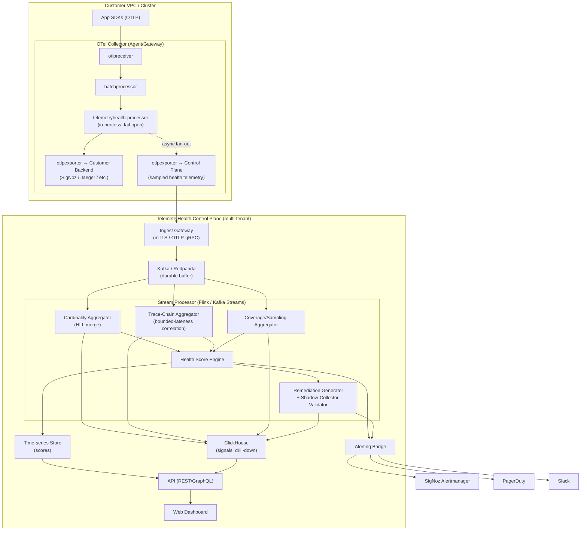

# TelemetryHealth — Production PRD
### OpenTelemetry Pipeline Health Monitor & Auto-Healer

**Document owner:** Platform Observability Team
**Status:** Draft for review
**Version:** 2.0 (Production) — supersedes hackathon PRD v1.0
**Target GA:** Q1 (13-week build, 3 milestones)

---

## 1. Background & Context

The hackathon prototype validated the core idea: telemetry pipelines fail silently (cardinality explosions, broken trace chains, sampling gaps, coverage holes), and teams have no automated way to detect or fix this. The prototype proved the concept with an in-process OTel Collector processor and a single SigNoz dashboard.

This PRD scopes the **production build**: a multi-tenant, horizontally scalable service that can be deployed as (a) an OTel Collector processor/connector for self-hosted pipelines, and (b) a standalone control-plane service that ingests pipeline metadata and telemetry samples from many collectors across an organization. It must meet production bars for reliability, security, multi-tenancy, and operability — because a tool that monitors observability infrastructure cannot itself become a source of outages.

---

## 2. Problem Statement

Teams running OpenTelemetry pipelines at scale experience:

1. **Cardinality explosions** — unbounded attribute values (user IDs, session IDs, raw URLs) blow up backend storage costs and query latency.
2. **Broken trace chains** — spans lose their parent due to context propagation bugs, sampling mismatches, or SDK misconfig, producing fragmented, untrustworthy traces.
3. **Sampling gaps** — head/tail sampling misconfiguration silently drops critical error traces.
4. **Coverage holes** — services or code paths that should emit telemetry stop doing so (crashed sidecar, misconfigured SDK, network partition to collector) and nobody notices until an incident.
5. **No single health signal** — engineers only discover these problems reactively, during an incident retro, when it's too late to prevent the impact.

There is no existing "meta-observability" product that treats the telemetry pipeline itself as a monitored system with SLOs, alerts, and auto-remediation.

---

## 3. Goals

| # | Goal | Metric |
|---|------|--------|
| G1 | Detect the four failure classes automatically, in near-real-time | Detection latency ≤ 60s p95 |
| G2 | Provide one composite Telemetry Health Score per service/environment | Score computed every 30s, ≤ 5s staleness |
| G3 | Generate safe, valid, ready-to-apply remediation configs | 100% of generated YAML passes OTel Collector config validation |
| G4 | Run as a first-class production service: HA, multi-tenant, RBAC, auditable | 99.9% control-plane uptime SLO |
| G5 | Scale to enterprise telemetry volume | Sustain 500k spans/sec ingest per region without backpressure on customer pipelines |
| G6 | Ship without becoming a blast-radius risk to the customer's primary pipeline | Fail-open design — processor never blocks or drops customer telemetry on internal error |
| G7 | Strict processor overhead bounds | In-process processor adds ≤ 5ms p99 latency to the primary customer export path, uses ≤ 256MB RAM, and ≤ 5% CPU under 500k spans/sec load |
| G8 | Zero-trust tenant isolation | 100% of ingested control-plane telemetry cryptographically verified against client mTLS certificates before entering the stream pipeline |

### Non-Goals (v1 Production)

- Not a full APM/tracing backend replacement (SigNoz, Jaeger, etc. remain the system of record for trace storage/query).
- Not an automated *executor* of remediation in v1 — it proposes config, a human (or a gated auto-apply pipeline in v2) applies it.
- No support for non-OTel telemetry formats (StatsD, Prometheus remote-write ingestion is v2).
- No cost-allocation/billing product (chargeback dashboards) in v1 — only cost *estimation* signals.

---

## 4. Personas

- **Platform/SRE Observability Engineer** — owns the collector fleet, cares about cardinality cost and pipeline reliability, is the primary buyer/operator.
- **Service-owning Developer** — receives alerts about their service's coverage/orphan-rate, wants a one-line fix, not a debugging session.
- **Engineering Manager / Observability Cost Owner** — wants a dashboard-level view of health trend and dollar impact to justify tooling investment.

---

## 5. Production Architecture Overview

Two deployable surfaces, sharing a common detection core.

### 5.1 Architecture Diagram (Mermaid)



> Render note: GitHub, GitLab, and most Markdown viewers render Mermaid natively. If pasted into a tool that doesn't support Mermaid, use the ASCII fallback below.

### 5.2 ASCII Fallback

```
                     ┌──────────────────────────────────────────────┐
                     │            Customer VPC / Cluster             │
                     │                                                │
  App SDKs ─OTLP──▶  │  OTel Collector (Agent/Gateway)                │
                     │   ├─ otlpreceiver                              │
                     │   ├─ batchprocessor                            │
                     │   ├─ telemetryhealth-processor  (in-process)   │
                     │   │     • local cardinality LRU                │
                     │   │     • local orphan-window buffer           │
                     │   │     • emits internal health metrics        │
                     │   ├─ otlpexporter → customer backend (SigNoz)  │
                     │   └─ otlpexporter → TelemetryHealth Control     │
                     │            Plane (sampled health telemetry)    │
                     └──────────────────────┬─────────────────────────┘
                                            │ mTLS / OTLP-gRPC
                                            ▼
                     ┌──────────────────────────────────────────────┐
                     │        TelemetryHealth Control Plane (SaaS     │
                     │        or self-hosted, multi-tenant)           │
                     │                                                │
                     │  Ingest Gateway ─▶ Stream Processor (Flink/    │
                     │                     Kafka Streams)             │
                     │        │                                       │
                     │        ├─ Cardinality Aggregator                │
                     │        ├─ Trace-Chain Aggregator                │
                     │        ├─ Coverage/Sampling Aggregator          │
                     │        ├─ Health Score Engine                  │
                     │        └─ Remediation Generator                 │
                     │        │                                       │
                     │        ▼                                       │
                     │   Time-series Store (metrics) + OLAP store     │
                     │   (ClickHouse) for score history & drill-down  │
                     │        │                                       │
                     │        ▼                                       │
                     │   API (GraphQL/REST) ── Web UI (dashboard)     │
                     │        │                                       │
                     │        ▼                                       │
                     │   Alerting Bridge → SigNoz / PagerDuty / Slack │
                     └──────────────────────────────────────────────┘
```

### 5.3 Key Production Decisions vs. the Hackathon Prototype

- Detection logic runs **both** locally (in the collector processor, for low-latency fail-open scoring) **and** centrally (for cross-collector aggregation, multi-region rollups, and long-term trend storage). The processor never blocks the customer's primary pipeline — it operates as a **fan-out branch**, never inline on the critical path to the customer's exporter.
- The in-process processor is stateless-safe: if its internal buffers overflow or panic, it must recover without dropping or delaying the customer's own OTLP export.
- Central control plane is horizontally scalable and multi-tenant from day one (tenant_id on every record, row-level isolation in ClickHouse).

---

## 6. Tech Stack

| Layer | Choice | Rationale |
|---|---|---|
| Collector processor/connector | Go 1.23, `go.opentelemetry.io/collector/processor` (pinned minor version, upgraded quarterly) | Native OTel integration, matches upstream Collector release cadence |
| Stream ingestion | Kafka (or Redpanda for lower ops overhead) | Durable buffering between collector fleet and stream processor; absorbs bursts |
| Stream processing | Kafka Streams (Go/Java) or Apache Flink | Windowed aggregation (cardinality, orphan rate) at scale; exactly-once semantics |
| Time-series metrics store | Prometheus-compatible remote-write store (Mimir/Thanos) or SigNoz's ClickHouse metrics tables | Reuse existing customer stack where possible; avoid a second TSDB to operate |
| Analytical/event store | ClickHouse | High-cardinality drill-down queries (per-attribute, per-service) at low cost |
| Control-plane API | Go, gRPC + REST gateway (grpc-gateway), GraphQL optional for dashboard queries | Consistent with Collector's Go ecosystem; strong typing |
| Web dashboard | React + TypeScript, Vite, Recharts/ECharts for score visualizations | Standard, maintainable frontend stack |
| AuthN/AuthZ | OIDC (customer IdP) + internal RBAC service; SPIFFE/SPIRE or mTLS for collector→control-plane identity | Enterprise SSO requirement; zero-trust service identity |
| Config/remediation validation | `otelcol` config unmarshaling + `confmap` validation library, dry-run against a shadow Collector instance in CI | Guarantees generated YAML is actually loadable before it's shown to a user |
| Alerting integrations | SigNoz Alertmanager-compatible webhook, PagerDuty Events API v2, Slack Web API | Meets customers where they already are |
| Deployment | Kubernetes (Helm chart), Terraform modules for cloud infra | Standard enterprise deployment target |
| CI/CD | GitHub Actions → Argo CD (GitOps) | Reproducible, auditable deploys |
| Observability of TelemetryHealth itself | Self-instrumented with OTel (dogfooding), exported to an isolated "meta" pipeline separate from customer data | Prevents circular dependency / blast radius if TelemetryHealth's own pipeline degrades |
| Secrets | Vault or cloud KMS | Required for mTLS certs, IdP client secrets |

---

## 7. Repository / File Structure

```
telemetryhealth/
├── README.md
├── ARCHITECTURE.md
├── SECURITY.md
├── LICENSE
├── AGENT_RULES.md                      # source of truth for AI agent + commit conventions (§14)
│
├── app/DOCS/                            # LIVE tracking folder — see §14/§15
│   ├── TelemetryHealth_PRD.md           # copy/symlink of this PRD, kept in-repo for agent lookup
│   ├── Implementation_Status.md         # per-PRD-section completion tracker, bot + agent maintained
│   ├── CHANGELOG.md                     # auto-generated from commit prefixes, one entry per merged PR
│   ├── Build_Issue_Report.md            # BUG commits tied to compile/runtime/env issues
│   └── commit-log/                      # one file per day, appended by the bot on every passing commit
│       └── YYYY-MM-DD.md
│
├── processor/                         # In-Collector processor (Go module)
│   ├── go.mod
│   ├── factory.go                     # CreateProcessor(), component.Factory
│   ├── config.go                      # typed config struct + validation
│   ├── traces_consumer.go             # ConsumeTraces() — orphan/coverage detection
│   ├── metrics_consumer.go            # ConsumeMetrics() — pass-through + emission
│   ├── logs_consumer.go               # ConsumeLogs() — coverage correlation
│   ├── cardinality/
│   │   ├── lru_tracker.go
│   │   └── window.go
│   ├── tracechain/
│   │   ├── span_buffer.go
│   │   └── orphan_detector.go
│   ├── coverage/
│   │   └── service_registry.go
│   ├── failopen/
│   │   └── circuit_breaker.go         # panics/overload → bypass, never block pipeline
│   └── processor_test.go
│
├── connector/                          # Optional OTel connector for cross-signal correlation
│   └── ...
│
├── control-plane/
│   ├── cmd/
│   │   ├── ingest-gateway/main.go
│   │   ├── stream-worker/main.go
│   │   └── api-server/main.go
│   ├── internal/
│   │   ├── ingest/                    # gRPC OTLP receiver, tenant auth
│   │   ├── streaming/                 # Kafka Streams / Flink job definitions
│   │   │   ├── cardinality_job.go
│   │   │   ├── tracechain_job.go
│   │   │   ├── coverage_job.go
│   │   │   └── healthscore_job.go
│   │   ├── remediation/
│   │   │   ├── generator.go
│   │   │   ├── templates/
│   │   │   │   ├── cardinality_redaction.yaml.tmpl
│   │   │   │   ├── sampling_adjustment.yaml.tmpl
│   │   │   │   └── coverage_enable.yaml.tmpl
│   │   │   └── validator.go           # dry-run against shadow otelcol
│   │   ├── alerting/
│   │   │   ├── signoz_bridge.go
│   │   │   ├── pagerduty_bridge.go
│   │   │   └── slack_bridge.go
│   │   ├── storage/
│   │   │   ├── clickhouse/
│   │   │   └── tsdb/
│   │   ├── authz/                     # RBAC, tenant isolation middleware
│   │   └── api/
│   │       ├── rest/
│   │       └── graphql/
│   └── deployments/
│       ├── helm/
│       │   ├── Chart.yaml
│       │   ├── values.yaml
│       │   ├── values-prod.yaml
│       │   └── templates/
│       ├── terraform/
│       │   ├── modules/kafka/
│       │   ├── modules/clickhouse/
│       │   └── modules/k8s-cluster/
│       └── docker-compose.dev.yml     # local dev only, not production topology
│
├── dashboard/                           # React/TypeScript web UI
│   ├── package.json
│   ├── src/
│   │   ├── pages/HealthOverview.tsx
│   │   ├── pages/CardinalityDrilldown.tsx
│   │   ├── pages/TraceChainDrilldown.tsx
│   │   ├── pages/RemediationCenter.tsx
│   │   └── components/HealthScoreGauge.tsx
│   └── vite.config.ts
│
├── dashboards-as-code/
│   └── signoz/telemetry-health-dashboard.json
│
├── sdk-clients/                        # optional thin client libs for status polling
│   ├── go/
│   └── python/
│
├── test/
│   ├── unit/
│   ├── integration/                    # spins up real otelcol + control-plane in CI
│   ├── load/                           # k6 / vegeta scripts, 500k spans/sec target
│   └── chaos/                          # kill ingest-gateway pods mid-stream, verify no data loss
│
├── docs/
│   ├── runbooks/
│   │   ├── ingest-gateway-lag.md
│   │   ├── clickhouse-disk-pressure.md
│   │   └── processor-circuit-breaker-tripped.md
│   ├── api-reference.md
│   └── onboarding-guide.md
│
├── .github/workflows/
│   ├── ci.yml
│   ├── release.yml
│   ├── security-scan.yml
│   └── docs-bot.yml                    # runs after ci.yml succeeds — see §15
│
├── tools/
│   └── docs-bot/                       # standalone Go binary, see §15.4
│       ├── main.go
│       ├── changelog.go
│       ├── commitlog.go
│       └── docs-bot_test.go
│
└── ops/
    ├── slo-definitions.yaml
    └── alerting-rules/
```

---

## 8. Functional Requirements by Component

### 8.1 Cardinality Detector (production hardening vs. hackathon)

- LRU cache bounded per attribute key **and** globally bounded in total memory (configurable max, default 256MB per processor instance) to prevent the detector itself from causing OOM.
- Rolling window aggregation must be **centrally reconciled**: a single collector instance only sees its shard of traffic, so per-key cardinality must be approximated locally (HyperLogLog sketch) and exact-merged centrally in the stream processor.
- Use **HyperLogLog (HLL)** sketches instead of raw LRU sets for the values shipped to the control plane, to bound network/memory cost at high cardinality while preserving accurate estimates centrally.
- Threshold configurable per attribute key and per service (not just a single global threshold).
- **Key-space explosion protection** (HLL alone only bounds *value* explosion, not *key* explosion): maintain a hard cap on tracked attribute keys, default max 100 distinct keys per service/span. If dynamic key generation is detected (e.g., JSON payload keys or dynamic IDs used as attribute *names*, such as `user_id_1042: active`), the detector must emit a key-space anomaly alert, fall back to key truncation/normalization, and cease tracking newly-seen keys beyond the cap to prevent LRU thrashing.

### 8.2 Broken Trace-Chain Detector

- Local 5s window detection remains for fast local signal, but **cross-collector orphan detection** requires the control plane to correlate span buffers across all collectors receiving a shard of a distributed trace — a span may appear orphaned locally but have its parent on a different collector instance entirely. This is a critical correctness fix vs. the hackathon version, which assumed a single-process view.
- False-positive suppression: spans arriving out-of-order within a bounded lateness window (default 30s) must not be flagged until the lateness window expires.
- **Sampling correlation paradox**: naive independent sampling per collector causes quadratic loss of correlated spans across collectors (if two collectors each independently sample 10% of a distributed trace's spans, the probability both retain the *same* trace collapses far faster than 10%). To keep cross-collector orphan correlation valid under sampling, collectors must do one of:
  - (a) enforce **deterministic, hash-based head sampling on `trace_id`**, so every collector in the fleet makes an identical keep/drop decision for a given trace; or
  - (b) extract lightweight **structural trace tuples** (`[trace_id, span_id, parent_span_id]`) in the processor *prior to* sampling and ship those tuples to EXP2 regardless of the sampling decision applied to the full span payload, so orphan correlation has complete structural coverage even when span *bodies* are sampled away.
- **Clock skew mechanics**: the stream-processing correlation jobs (Flink/Kafka Streams) must key windowing on **event-time watermarks** with a bounded out-of-orderness allowance (30s), not wall-clock/processing time, and must explicitly tolerate up to 5s of NTP clock skew across customer collector instances — processing-time windowing was implicitly assumed in the hackathon version and does not hold across a fleet of independently-clocked collectors.

### 8.3 Coverage / Sampling Gap Detector (new for production; was stubbed in hackathon)

- Maintain a **service registry** — services expected to emit telemetry, derived from a rolling baseline of the last 7/30 days.
- Alert when a previously-active service stops emitting spans/metrics/logs for > configurable grace period (default 10 min).
- Detect sampling-rate drift: compare configured sampling rate against observed error-span retention rate; alert if error traces are being dropped disproportionately.

### 8.4 Health Score Engine

- Same weighted formula as prototype, generalized and made configurable per tenant:

```
HealthScore = 100 − Σ(weight_i × normalized_signal_i)
```

- Default weights: cardinality breach severity 20%, orphan rate 30%, coverage gap 50% — but exposed as tenant-level config since different orgs weight these differently.
- Score computed **per service**, **per environment**, and rolled up to an **org-level** composite. All three levels stored for drill-down.
- Emitted every 30s with ≤ 5s staleness SLO from the underlying signal.

### 8.5 Remediation Generator

- Every generated config snippet is validated in CI and at runtime via a **shadow Collector dry-run** (load the proposed config into an ephemeral, sandboxed `otelcol` process with no real exporters, confirm it starts cleanly) before being shown to the user. This eliminates the hackathon-era risk of shipping syntactically-plausible-but-broken YAML.
- **Hardened shadow-collector sandboxing**: because the dry-run instance loads arbitrary generated config, it must be treated as a potential SSRF / arbitrary-file-read vector and isolated accordingly:
  - Executes inside a hardened sandbox (gVisor, or a strict seccomp/eBPF profile) — not a bare container on the same node as production workloads.
  - **Zero network egress** from the sandbox — no exporter in a dry-run config may reach a real network destination, even the customer's own backend.
  - Strict cgroup resource limits: 500m CPU, 128MB RAM, so a malformed or adversarial config cannot exhaust shared host resources.
  - An explicit **component allowlist** for the dry-run, blocking any receiver/exporter capable of filesystem or host access (e.g., `filelog` receiver, host-mount-based exporters) — the sandbox validates *config shape*, not arbitrary component behavior.
- v1: propose-only, with a "Copy config" and "Open PR" action (generates a PR against the customer's IaC repo housing collector config, via GitHub/GitLab API, gated behind an explicit opt-in integration).
- v2 (future): gated auto-apply via a customer-approved automation policy.

### 8.6 Alerting

- Alerts must include: current score, contributing signals, affected service/attribute, remediation snippet, and a link to the drilldown dashboard.
- Deduplication and suppression: identical alert conditions should not re-fire more than once per configurable cooldown (default 15 min) to avoid alert fatigue — a gap in the hackathon design.

---

## 9. Data Model (summary)

| Entity | Store | Key fields |
|---|---|---|
| `cardinality_signal` | ClickHouse | tenant_id, service, attribute_key, hll_sketch, window_start, unique_estimate |
| `orphan_signal` | ClickHouse | tenant_id, trace_id, span_id, parent_span_id, collector_id, detected_at |
| `coverage_signal` | ClickHouse | tenant_id, service, last_seen_at, baseline_expected (bool) |
| `health_score` | TSDB | tenant_id, scope (service/env/org), score, ts |
| `remediation_event` | ClickHouse | tenant_id, issue_type, generated_yaml, validated (bool), applied (bool), ts |
| `alert_event` | ClickHouse | tenant_id, alert_id, score_at_fire, suppressed (bool), delivered_to[] |

All tables partitioned by `tenant_id` + time; row-level access enforced at the API layer, not just query-time filtering, to prevent tenant data leakage.

### 9.1 ClickHouse Engine & TTL Specifications

The summary table above is intentionally schematic; at enterprise ingest volume, unspecified ClickHouse engine choices and missing TTLs are a direct path to disk-pressure incidents (see §10 Scalability, §12 Risks). Production DDL must specify engine, ordering key, and TTL explicitly — for example:

```sql
CREATE TABLE telemetry_health.cardinality_signal (
    tenant_id UUID,
    service LowCardinality(String),
    attribute_key LowCardinality(String),
    window_start DateTime64(3),
    unique_estimate UInt64,
    hll_sketch AggregateFunction(uniqCombined, String)
) ENGINE = AggregatingMergeTree()
PARTITION BY toYYYYMM(window_start)
ORDER BY (tenant_id, service, attribute_key, window_start)
TTL window_start + INTERVAL 30 DAY;
```

Applies to all six tables in the summary above:

- `LowCardinality(String)` for bounded-vocabulary columns (`service`, `attribute_key`, `issue_type`, and similar) — these are exactly the columns that are cheap to dictionary-encode and expensive to leave as plain `String` at scale.
- `AggregatingMergeTree` (or `SummingMergeTree` where appropriate) for any table storing a sketch or a rolling aggregate, so merges combine partial states instead of duplicating rows.
- Explicit `TTL` on every table: 30 days for raw per-window signals (`cardinality_signal`, `orphan_signal`, `coverage_signal`, `alert_event`), 12 months for `health_score` roll-ups (per the retention target in §10 Scalability), and 90 days for `remediation_event` (audit/compliance window, extendable per tenant contract).
- `PARTITION BY toYYYYMM(...)` (or finer, e.g. daily, for the highest-volume tables) so TTL expiry drops whole partitions instead of issuing row-level deletes, which is prohibitively expensive in ClickHouse at this scale.

---

## 10. Non-Functional Requirements

### Reliability
- Control plane: 99.9% API/dashboard uptime SLO; ingest path: 99.95% (data durability prioritized over dashboard availability).
- In-process processor: **fail-open** — any internal error, panic, or resource exhaustion must degrade to a no-op pass-through, never block or drop the customer's primary telemetry export. Enforced via a circuit breaker (`failopen/circuit_breaker.go`) with unit + chaos tests.
- **Outbound health exporter (EXP2) backpressure isolation**: the health telemetry exporter must run on a strict, bounded in-memory sending queue (`queue_size: 1000`) with an explicit drop-on-overflow policy, fully independent of the customer's primary export queue (EXP1). If the TelemetryHealth Control Plane is unreachable or degraded, EXP2 samples are dropped immediately rather than buffered — this guarantees zero risk of the health-monitoring side-channel causing an OOM or backpressure stall on the customer's own collector process, directly satisfying Goal G7's overhead bound.

### Scalability
- Ingest gateway must sustain 500k spans/sec per region with horizontal autoscaling (HPA on Kafka consumer lag).
- ClickHouse cluster sharded by tenant_id hash; capacity-planned for 12-month data retention on aggregated signals, 30-day retention on raw sketches.

### Security & Compliance
- mTLS between every collector and the ingest gateway; SPIFFE identities for internal service-to-service calls.
- **Cryptographic tenant verification (Goal G8)**: the Ingest Gateway must validate that the `tenant_id` claim in incoming OTLP metadata cryptographically matches the Subject Alternative Name (SAN) or SPIFFE ID embedded in the client's mTLS certificate — mTLS transport encryption alone is not sufficient, since it doesn't by itself prevent a validly-authenticated collector from claiming a different tenant's ID. Any payload asserting a `tenant_id` not authorized by the presented certificate is rejected at the gateway with a `403 PERMISSION_DENIED` gRPC status before it reaches the stream pipeline, satisfying the "100% cryptographically verified" bar in G8.
- OIDC SSO for dashboard; RBAC roles: Org Admin, Service Owner (scoped to their services only), Read-Only.
- No raw span payloads or PII persisted centrally — only aggregated signals (cardinality sketches, counts, IDs needed for orphan correlation). Data minimization is a hard requirement given this product ingests a sample of customer telemetry.
- SOC 2 Type II control mapping required before GA (audit logging of all remediation-generation and config-access events).

### Observability of TelemetryHealth Itself
- Fully self-instrumented (OTel SDK) exporting to an **isolated meta-pipeline**, physically separate infra from customer-facing ingest, so an incident in the customer-facing path cannot blind the team to its own outage.
- Runbooks required pre-GA for: ingest gateway consumer lag, ClickHouse disk pressure, processor circuit-breaker trips, Kafka partition rebalance storms.

### Testing Strategy
- Unit tests per detector (cardinality, orphan, coverage) with synthetic fixtures, target ≥ 90% coverage on `processor/` and `control-plane/internal/streaming`.
- Integration tests: real `otelcol` binary + `telemetrygen` + full control-plane stack in CI (docker-compose based).
- Load tests: k6/vegeta scripts validating the 500k spans/sec target and p95 detection-latency SLO under load.
- Chaos tests: kill ingest-gateway pods, Kafka brokers, and ClickHouse nodes mid-stream; verify zero data loss and bounded recovery time.

---

## 11. Rollout Plan

| Milestone | Weeks | Scope |
|---|---|---|
| **M1 — Core Detection (Alpha)** | 1–4 | Processor (cardinality + orphan, in-process only, no control plane yet), fail-open circuit breaker, unit/integration tests, single-tenant deploy |
| **M2 — Control Plane & Multi-Tenant (Beta)** | 5–9 | Ingest gateway, stream processing jobs, ClickHouse storage, health score engine, coverage detector, RBAC/OIDC, dashboard v1 |
| **M3 — Remediation, Alerting, Hardening (GA)** | 10–13 | Remediation generator + shadow-validation, alert bridges (SigNoz/PagerDuty/Slack), load + chaos test pass, SOC 2 control mapping, runbooks, Helm chart + Terraform modules published |

### Success Criteria for GA
- All four detectors operating centrally across a multi-tenant fleet with no cross-tenant data leakage (verified via pen test).
- p95 detection-to-alert latency ≤ 60s under 500k spans/sec load.
- Zero incidents in load/chaos testing where the TelemetryHealth processor caused customer telemetry loss or added > 5ms p99 latency to the customer's export path.
- 100% of remediation YAML validated via shadow-Collector dry-run before display.

---

## 12. Risks

| Risk | Impact | Mitigation |
|---|---|---|
| Processor adds latency/failure risk to customer's critical telemetry path | High | Fail-open circuit breaker; async fan-out only, never inline before customer exporter; latency budget enforced in load tests |
| Cross-collector orphan detection requires distributed correlation, not just local buffer | High | Central stream-processing correlation with bounded lateness window; documented as a required redesign from the hackathon's single-process assumption |
| Cardinality sketches at scale (memory/network cost) | Medium | HyperLogLog instead of raw value sets for cross-collector shipment |
| Multi-tenant data isolation failure | High (compliance) | Row-level tenant enforcement at API layer + shard-per-tenant hashing + pen test before GA |
| Alert fatigue from duplicate/flapping alerts | Medium | Deduplication + cooldown window, not present in hackathon design |
| Remediation YAML invalid or unsafe when applied | High | Shadow-Collector dry-run validation gate; propose-only (no auto-apply) in v1 |
| Sampling causes quadratic loss of correlated spans across collectors, silently breaking orphan detection accuracy under sampling (§8.2) | High | Deterministic hash-based head sampling on `trace_id`, or ship pre-sampling structural tuples to EXP2 |
| Unbounded attribute *key* growth (dynamic/JSON-derived keys) causes LRU thrashing even with HLL value bounding (§8.1) | Medium | Hard cap on tracked keys per service/span; key-space anomaly alert + truncation fallback |
| Shadow-Collector dry-run sandbox is itself an SSRF / arbitrary-file-read vector, since it loads user-influenced config (§8.5) | High | gVisor/seccomp sandbox, zero network egress, cgroup limits, component allowlist blocking filesystem-capable components |
| A validly-authenticated collector claims a different tenant's `tenant_id`, causing cross-tenant data corruption at ingest (§8, §10) | High (compliance) | Ingest Gateway cryptographically matches `tenant_id` claim to mTLS SAN/SPIFFE ID; reject on mismatch (Goal G8) |
| Health-monitoring side-channel (EXP2) itself causes memory pressure or stalls on the customer's collector during a control-plane outage | Medium | Bounded EXP2 send queue with drop-on-overflow, fully isolated from the primary EXP1 export queue |
| ClickHouse tables without explicit engine/TTL/partition specs degrade under enterprise ingest volume (disk pressure, slow merges) | Medium | `AggregatingMergeTree` + `LowCardinality` + explicit per-table TTL and monthly/daily partitioning (§9.1) |

---

## 13. Open Questions

To avoid engineering guessing at these mid-build, each carries a recommended default stance below; treat as the working assumption unless a stakeholder overrides it before end of M2 (§11).

1. **Should the control plane be offered self-hosted only, SaaS only, or both at GA?** (Affects multi-tenancy urgency and infra cost model.)
   - **Recommendation: SaaS Control Plane + Self-Hosted Collector Processor for GA.** Supporting a fully self-hosted control plane (Kafka + ClickHouse + Flink multi-tenant topology, operated by the customer) doubles operational and support burden and would delay GA past the 13-week target. Self-hosted control plane remains a candidate for a post-GA enterprise tier once the SaaS path has proven the detection accuracy and SLOs in §10–§11.
2. **What is the customer's tolerance for sampled vs. exhaustive telemetry shipped to the control plane, given data-minimization requirements?**
   - Still open — needs input from design partners during M2; no default recommended here since it's a customer-trust question rather than an engineering-tradeoff question.
3. **Do we need a native Prometheus remote-write ingestion path at GA, or can that be deferred to v2 alongside StatsD?**
   - **Recommendation: defer Prometheus remote-write to v2.** Focus 100% of v1 engineering bandwidth on OTLP-native metrics/traces so the core detectors (§8.1–§8.3) hit their accuracy and performance targets (§8, §10) before broadening ingestion formats — consistent with the Non-Goals already stated in §3.
4. **What is the target pricing/packaging model (per-span, per-service, flat)?** Not covered in this PRD but affects rate-limiting and quota design in the ingest gateway.
   - Still open — owned by product/business, not engineering; flagged here only because the ingest gateway's quota/rate-limit design (§6, §10) needs an answer before GA hardening in M3.

---

## 14. AI Agent Guidelines & Documentation Rules

This section is the in-repo source of truth for how AI coding agents (and humans) work in this codebase, and lives verbatim as `AGENT_RULES.md` at repo root so agents can find it without being told where to look.

### 15.1 Commit Message Conventions

All commits must use one of these prefixes, so the documentation bot (§15) can categorize changes automatically:

| Prefix | Meaning |
|---|---|
| `FEATURE: {description}` | New features or capabilities |
| `BUG: {description}` | Fixes for bugs or build errors |
| `UI: {description}` | Visual changes, layout fixes, styling updates (dashboard/) |
| `PERF: {description}` | Performance optimizations |
| `SEC: {description}` | Security-related changes |
| `DOCS: {description}` | Changes to documentation files |
| `REFACTOR: {description}` | Code changes that neither fix a bug nor add a feature |
| `TEST: {description}` | Adding or correcting tests |
| `CHORE: {description}` | Build scripts, dependency bumps, tooling |

Commits that touch anything under `processor/` or `control-plane/internal/remediation/` and are **not** tagged `TEST` must reference the risk section (§12) they relate to, if any, in the commit body — this is enforced by a commit-lint check in `ci.yml`, since these are the two packages with direct blast-radius risk to customer pipelines.

### 15.2 Required AI Agent Behavior

Before starting any task, an AI agent working in this repo must:

1. **Read `app/DOCS/TelemetryHealth_PRD.md`** (this document) for requirements and constraints — in particular §8 (functional requirements), §10 (non-functional requirements), and §12 (risks) before touching detection logic.
2. **Read `app/DOCS/Implementation_Status.md`** for current progress, so it doesn't re-implement a completed milestone or contradict a documented design decision (e.g., HLL sketches vs. raw LRU — see §8.1).
3. **Never bypass the fail-open circuit breaker** (`processor/failopen/circuit_breaker.go`) or reduce its test coverage, regardless of what a task description asks for — this maps directly to Goal G6 and Risk row 1 in §12.
4. **Never mark a remediation template as safe to auto-apply** without adding a corresponding shadow-Collector validation test (§8.5) — remediation stays propose-only until a human explicitly changes that policy in `Implementation_Status.md`.
5. **Update `app/DOCS/Implementation_Status.md`** whenever a PRD-listed feature (by section number, e.g. "§8.3 Coverage Detector") moves from in-progress to complete, including which milestone (§11) it satisfies.

### 15.3 Documentation Maintenance Responsibilities

The AI agent and the GitHub bot (§15) jointly maintain `app/DOCS/`:

- **`CHANGELOG.md`** — updated after every merged, CI-passing commit (see §15 for the automated mechanism). Mapping:
  - `FEATURE` → `### Added`
  - `BUG`, `UI` → `### Fixed`
  - `REFACTOR`, `PERF`, `SEC`, `DOCS` → `### Changed`
  - `TEST`, `CHORE` → `### Internal` (not customer-facing, kept for audit trail per §10 SOC 2 requirement)
- **`Build_Issue_Report.md`** — any `BUG` commit whose body or diff touches CI config, `Dockerfile`, `go.mod`/`go.sum`, or Helm/Terraform files gets a corresponding entry here, distinct from ordinary application bugs, since these map to the "Demo fails live" / infra-risk category in §12.
- **`Implementation_Status.md`** — the canonical cross-reference between PRD §8 functional requirements and actual shipped code; the agent updates the row for a feature the same commit that completes it, not in a later cleanup pass.

---

## 15. GitHub Documentation Bot (Live Tracking)

### 16.1 Purpose

A GitHub Action that keeps `app/DOCS/` continuously accurate without relying on humans or agents remembering to update it by hand, and that produces an **immutable, append-only log of every commit that passed CI on `main`** — this is the "live tracking folder" referenced in onboarding and audit reviews.

### 16.2 Trigger & Guarantee

- Workflow: `.github/workflows/docs-bot.yml`.
- Trigger: `workflow_run` on completion of `ci.yml` targeting `main`, filtered to `conclusion == 'success'`. This is the key production hardening vs. a naive "on every push" bot: **a commit is only logged once CI has actually passed**, not merely once it's been pushed. A commit that fails CI never gets a changelog or status-tracker entry, and is instead surfaced as a failed check on the PR.
- If `ci.yml` fails, the bot takes no documentation action — failing builds must not pollute the live tracking folder or the changelog.

### 16.3 What It Does, Per Passing Commit

1. Parses the commit message prefix (§14.1) via regex (`^(FEATURE|BUG|UI|PERF|SEC|DOCS|REFACTOR|TEST|CHORE):`). Commits that don't match are flagged as a required-format failure on the PR (enforced at PR-open time by a separate commit-lint step, not just at merge time).
2. Appends a dated entry to `app/DOCS/CHANGELOG.md` under the mapped heading (§14.3).
3. Appends an entry to `app/DOCS/commit-log/YYYY-MM-DD.md` (created if it doesn't exist for that day) containing: commit SHA, author, prefix/category, one-line description, PR number, and CI run link. This file is never edited or rewritten after creation — only appended to — so it functions as an audit trail.
4. If the commit is prefixed `BUG` and its diff touches CI/build/infra files (per §14.3), also appends to `app/DOCS/Build_Issue_Report.md`.
5. If the commit body contains a `Closes-PRD-Section: §X.Y` trailer, updates the corresponding row in `Implementation_Status.md` to mark that section complete and links the commit SHA as evidence.
6. Commits the documentation changes back to `main` as a single bot commit tagged `DOCS: automated changelog/status update for {sha}`, authored by a dedicated `telemetryhealth-docs-bot` machine account (not a personal token), so these commits are clearly distinguishable in `git blame` / audit review from human or agent-authored changes.

### 16.4 Example Workflow Skeleton

```yaml
name: docs-bot
on:
  workflow_run:
    workflows: ["ci"]
    types: [completed]
    branches: [main]

jobs:
  update-docs:
    if: ${{ github.event.workflow_run.conclusion == 'success' }}
    runs-on: ubuntu-latest
    steps:
      - uses: actions/checkout@v4
        with:
          ref: main
          token: ${{ secrets.DOCS_BOT_TOKEN }}

      - name: Parse commit + update docs
        run: go run ./tools/docs-bot --sha ${{ github.event.workflow_run.head_sha }}

      - name: Commit changes
        run: |
          git config user.name "telemetryhealth-docs-bot"
          git config user.email "docs-bot@telemetryhealth.internal"
          git add app/DOCS
          git commit -m "DOCS: automated changelog/status update for ${{ github.event.workflow_run.head_sha }}" || echo "no changes"
          git push
```

The `tools/docs-bot` Go program (lives under `telemetryhealth/tools/docs-bot/`, added to the file structure in §7) is intentionally a small, testable, standalone binary rather than inline shell/YAML scripting, so its changelog-mapping and section-linking logic can be unit tested like any other component in this repo — consistent with the ≥90% coverage bar in §10.

### 16.5 Failure Handling

- If the bot's own commit-back step fails (e.g., branch protection conflict, concurrent push), the workflow retries once with a rebase, then opens an issue tagged `CHORE` rather than silently dropping the update — a docs-bot failure must never be a silent gap in the audit trail.
- The bot never force-pushes and never rewrites history in `commit-log/`; only new files/appends are permitted, enforced by the bot's own logic and a branch-protection rule that blocks force-pushes to `main`.

---

## 16. Appendix: Traceability to Hackathon Prototype

| Hackathon Phase | Production Equivalent | Key Change |
|---|---|---|
| Phase 1 (Foundation) | §7 processor/ module, §6 tech stack | Same core Go/OCB approach, hardened with fail-open circuit breaker |
| Phase 2 (Cardinality) | §8.1 | LRU → HLL sketches for cross-collector shipment |
| Phase 3 (Broken Traces) | §8.2 | Single-process buffer → distributed, bounded-lateness correlation |
| Phase 4 (Health Score + Dashboard) | §8.4, dashboard/ | Same formula, now multi-scope (service/env/org) and tenant-configurable weights |
| Phase 5 (Remediation) | §8.5 | Added shadow-Collector validation gate before showing YAML to users |
| Phase 6 (Polish/Demo) | §11 Rollout Plan | Replaced with real milestone/GA plan, SOC 2 mapping, runbooks, load/chaos testing |
