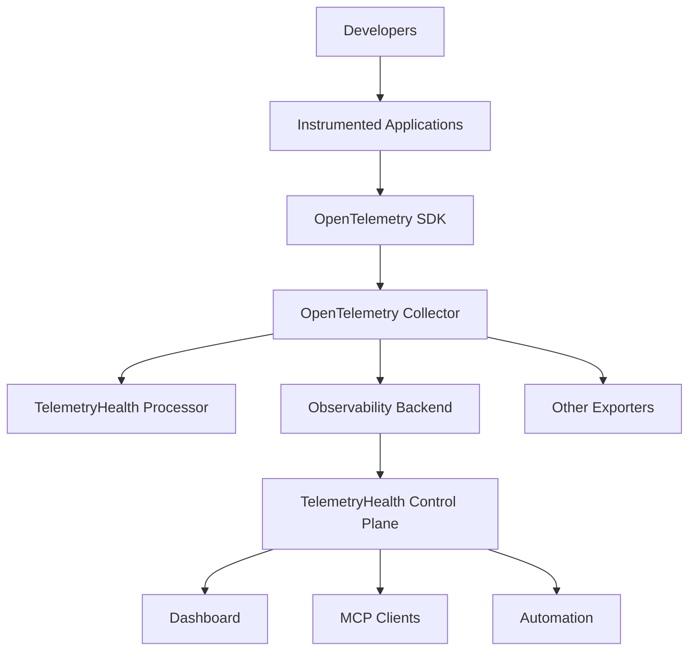
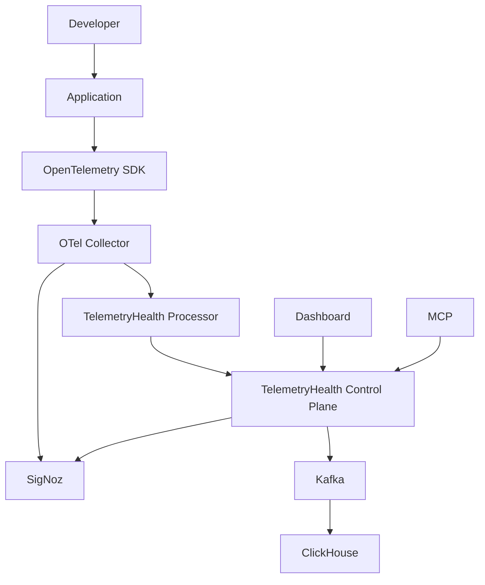

# TelemetryHealth Architecture Documentation

**Document ID:** TH-ARCH-002  
**Title:** System Context  
**Status:** Approved  
**Version:** 3.0  
**Owner:** TelemetryHealth Core Team  
**Authors:** Shubham Pawar & Contributors  
**Last Updated:** July 2026

---

# 1. Purpose

This document defines the external environment in which TelemetryHealth operates.

It identifies:

- Users
- External systems
- Trust boundaries
- Data producers
- Data consumers
- Communication protocols
- Deployment relationships

This document corresponds to **C4 Model – Level 1 (System Context)**.

It intentionally does **not** describe internal implementation details. Those are covered in later architecture documents.

---

# 2. Overview

TelemetryHealth is an **OpenTelemetry Intelligence Platform**.

It does not replace an observability backend.

Instead, it continuously analyzes the health and quality of telemetry pipelines while integrating with existing OpenTelemetry ecosystems.

The platform acts as an intelligence layer positioned between telemetry generation and operational decision making.

---

# 3. High-Level Context



---

# 4. System Boundary

TelemetryHealth owns:

- Telemetry Quality Analysis
- Health Scoring
- Root Cause Analysis
- Behavior Analysis
- Replay Analysis
- Decision Engine
- Auto Remediation
- MCP Interface
- Dashboard

TelemetryHealth does **not** own:

- Trace storage
- Metric storage
- Log storage
- Instrumentation SDKs
- Collector implementation
- Application runtime

---

# 5. External Actors

## 5.1 Developers

Developers instrument applications using OpenTelemetry.

TelemetryHealth assists them by identifying:

- Missing spans
- Instrumentation gaps
- Incorrect attributes
- Telemetry regressions

---

## 5.2 Platform Engineers

Responsible for:

- Collector deployment
- Configuration
- Scaling
- Reliability

TelemetryHealth provides:

- Pipeline health
- Configuration analysis
- Recommended fixes

---

## 5.3 Site Reliability Engineers

SREs consume:

- Health Scores
- Root Cause Graphs
- Replay Reports
- Alert recommendations

---

## 5.4 AI Agents

AI systems interact with TelemetryHealth using:

- MCP
- REST
- Future Event Streams

Agents can request:

- Root Cause Analysis
- Replay
- Health Reports
- Configuration Recommendations

---

# 6. External Systems

---

## OpenTelemetry SDK

Purpose:

Generate telemetry.

TelemetryHealth never replaces SDKs.

Communication:

OTLP

---

## OpenTelemetry Collector

Purpose:

Telemetry routing.

TelemetryHealth integrates using:

- Processor
- Exporter
- Extensions

---

## SigNoz

Purpose:

Reference observability backend.

Responsibilities:

- Trace storage
- Metric storage
- Dashboarding

TelemetryHealth augments SigNoz with intelligence.

---

## ClickHouse

Purpose:

Analytical storage.

Used for:

- Aggregated telemetry
- Health metrics
- Replay metadata
- Historical analysis

ClickHouse is considered an infrastructure dependency.

---

## Kafka / Redpanda

Purpose:

Streaming transport.

Responsibilities:

- Buffering
- Event transport
- Backpressure isolation

Future implementations may replace Kafka without affecting the domain.

---

## Kubernetes

Purpose:

Deployment environment.

Responsibilities:

- Scaling
- Scheduling
- High availability

Kubernetes is optional.

TelemetryHealth should remain deployable outside Kubernetes.

---

## GitOps Platform

Future integration.

Examples:

- ArgoCD
- FluxCD

Purpose:

Apply remediation patches automatically.

---

# 7. Communication Protocols

| Component | Protocol |
|------------|----------|
| SDK → Collector | OTLP |
| Collector → Processor | Collector API |
| Processor → Ingest | gRPC |
| Ingest → Kafka | TCP |
| Worker → ClickHouse | Native Driver |
| Dashboard → API | HTTP/REST |
| MCP Client → MCP Server | MCP |
| API → Dashboard | JSON |

Future protocols:

- WebSockets
- SSE
- gRPC

---

# 8. Trust Boundaries

The platform contains multiple trust boundaries.

```mermaid
graph TD;
    "Internet" --> "Dashboard";
    "Dashboard" --> "API Gateway";
    "API Gateway" --> "======================";
    "======================" --> "Internal Cluster";
    "Internal Cluster" --> "Application Services";
    "Application Services" --> "Infrastructure";
    "Infrastructure" --> "======================";
    "======================" --> "Database Layer";
```

Authentication should occur whenever data crosses a trust boundary.

---

# 9. Data Ownership

| Data | Owner |
|-------|------|
| Traces | Observability Backend |
| Metrics | Observability Backend |
| Logs | Observability Backend |
| Health Score | TelemetryHealth |
| Behavior Graph | TelemetryHealth |
| Replay | TelemetryHealth |
| Root Cause Graph | TelemetryHealth |
| Remediation | TelemetryHealth |

---

# 10. Responsibilities

TelemetryHealth SHALL:

✔ Analyze telemetry quality

✔ Explain telemetry failures

✔ Generate remediation

✔ Produce health metrics

✔ Integrate with OpenTelemetry

TelemetryHealth SHALL NOT:

✘ Store raw telemetry permanently

✘ Replace APM systems

✘ Replace tracing databases

✘ Replace logging systems

✘ Replace metrics backends

---

# 11. Quality Attributes

The architecture is optimized for:

### Availability

Telemetry collection continues even if TelemetryHealth fails.

---

### Scalability

Independent horizontal scaling of:

- API
- Workers
- Ingest
- Dashboard

---

### Extensibility

Backends may be replaced via adapters.

---

### Performance

Streaming architecture minimizes latency.

---

### Reliability

Failures remain isolated through asynchronous processing.

---

### Security

Zero Trust.

Mutual TLS.

Least privilege.

Secure defaults.

---

# 12. Context Diagram



---

# 13. Architectural Constraints

The following constraints govern future evolution.

- OpenTelemetry SHALL remain the primary telemetry standard.

- SigNoz SHALL remain the reference backend.

- Infrastructure implementations SHALL remain replaceable.

- Domain logic SHALL remain backend agnostic.

- Communication SHOULD be asynchronous where practical.

- Production telemetry SHALL never be interrupted.

---

# 14. Future Context

Future integrations include:

- Grafana Tempo

- Jaeger

- Elastic

- Honeycomb

- Datadog

- Prometheus

- OpenSearch

without modifying the core domain model.

---

# 15. Summary

TelemetryHealth occupies a unique position within the observability ecosystem.

Rather than competing with existing OpenTelemetry platforms, it complements them by providing intelligence, explanation, reasoning, and automated remediation.

This architectural position allows TelemetryHealth to evolve independently while remaining compatible with the broader OpenTelemetry ecosystem.

---

**Related Documents**

- TH-ARCH-000 Project Vision
- TH-ARCH-001 Architecture Principles
- TH-ARCH-003 Bounded Contexts
- TH-ARCH-004 Domain Model

---

**End of Document**