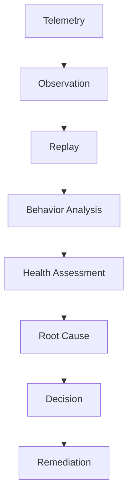
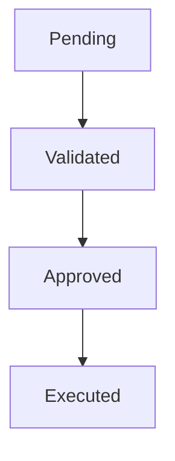
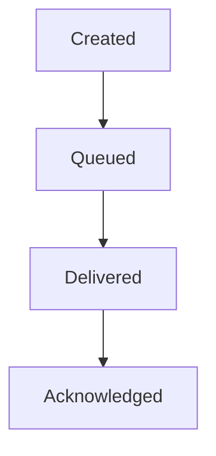
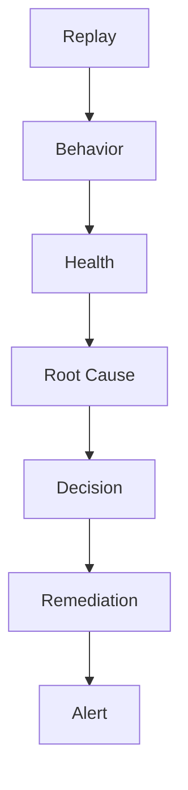
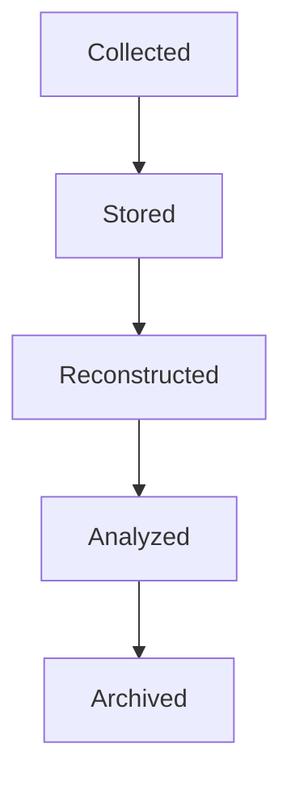
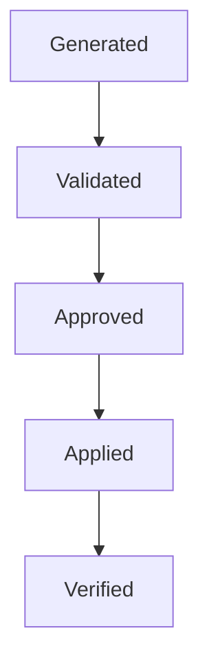
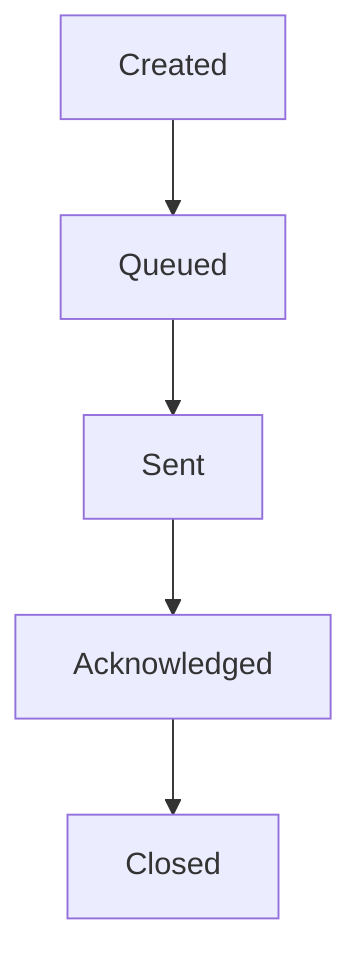

# TelemetryHealth Architecture Documentation

**Document ID:** TH-ARCH-004  
**Title:** Domain Model  
**Status:** Approved  
**Version:** 3.0  
**Owner:** TelemetryHealth Core Team  
**Authors:** Shubham Pawar & Contributors  
**Last Updated:** July 2026

---

# 1. Purpose

This document defines the core business model of TelemetryHealth.

The domain model is the heart of the platform.

It describes:

- Business concepts
- Entities
- Value Objects
- Aggregates
- Domain Services
- Domain Events
- Repositories
- Business Invariants

Every implementation should conform to this model.

If implementation conflicts with the domain model, the implementation should be reconsidered.

---

# 2. Ubiquitous Language

The following terms have precise meanings within TelemetryHealth.

| Term | Definition |
|------|------------|
| Telemetry | A trace, metric or log generated by an instrumented system |
| Replay | Historical reconstruction of telemetry execution |
| Health Score | Numerical assessment of telemetry quality |
| Behavior Graph | Runtime interaction graph between services |
| Root Cause | Most probable explanation of a failure |
| Decision | Operational recommendation derived from analysis |
| Remediation | Executable corrective action |
| Detector | Component that evaluates telemetry quality |
| Evidence | Supporting observations used during reasoning |
| Observation | Atomic fact derived from telemetry |

These definitions should be used consistently throughout the project.

---

# 3. Domain Overview

TelemetryHealth transforms raw telemetry into operational intelligence.

The high-level business flow is:



Every stage enriches the understanding of the system.

---

# 4. Core Aggregates

The platform consists of seven primary aggregates.

```
Replay

Health

Behavior

Root Cause

Decision

Remediation

Alert
```

Each aggregate owns its consistency boundary.

---

# 5. Replay Aggregate

## Aggregate Root

Replay

### Purpose

Represents a reconstructed execution timeline.

### Responsibilities

- Session reconstruction
- Timeline generation
- Span correlation
- Historical playback

### Child Entities

- ReplayFrame
- TimelineEvent
- SpanReference

### Invariants

A replay:

- MUST belong to exactly one tenant
- MUST have a unique identifier
- MUST have chronological ordering
- MUST never reference spans from another tenant

---

# 6. Health Aggregate

## Aggregate Root

HealthScore

### Purpose

Represents telemetry quality.

### Child Objects

- CoverageScore
- CardinalityScore
- SamplingScore
- PipelineScore

### Invariants

Health Score:

- MUST remain between 0 and 100
- MUST contain a timestamp
- MUST contain contributing evidence
- MUST be reproducible from the same input

No other aggregate may modify HealthScore.

---

# 7. Behavior Aggregate

## Aggregate Root

BehaviorGraph

### Purpose

Represents observed runtime behavior.

### Entities

- ServiceNode
- BehaviorEdge

### Value Objects

- Latency
- Throughput
- Confidence

### Invariants

Behavior Graph:

- MUST be acyclic unless cyclic behavior is explicitly detected
- MUST maintain graph consistency
- MUST contain evidence for every edge

---

# 8. Root Cause Aggregate

## Aggregate Root

RootCauseGraph

### Purpose

Explains failures.

### Entities

- RootCause
- Evidence
- CausalLink

### Value Objects

- Confidence
- Severity
- Probability

### Invariants

Every Root Cause:

- MUST reference evidence
- MUST contain confidence
- MUST explain a measurable degradation

---

# 9. Decision Aggregate

## Aggregate Root

Decision

### Purpose

Represents an operational recommendation.

### Child Objects

- Recommendation
- DecisionPolicy

### States



### Invariants

Every Decision:

- MUST reference analysis
- MUST reference evidence
- MUST reference affected systems

---

# 10. Remediation Aggregate

## Aggregate Root

Remediation

### Purpose

Represents an executable operational fix.

### Child Objects

- Patch
- Validator
- Rollback

### Invariants

Every remediation:

- MUST be reversible
- MUST be validated
- MUST target a known system
- MUST reference the originating Decision

---

# 11. Alert Aggregate

## Aggregate Root

Alert

### Purpose

Represents notification delivery.

### States



Alerting owns communication, not business decisions.

---

# 12. Value Objects

The following concepts are immutable.

- HealthScoreValue
- Confidence
- Severity
- Latency
- Throughput
- TenantID
- TraceID
- ReplayID
- Timestamp
- Version

Value Objects are compared by value rather than identity.

---

# 13. Domain Services

Some operations do not naturally belong to an entity.

These become Domain Services.

Examples:

- HealthCalculator
- BehaviorAnalyzer
- RootCauseAnalyzer
- DecisionEngine
- PatchGenerator
- ReplayBuilder

Domain Services contain business rules.

They MUST NOT access infrastructure directly.

---

# 14. Repository Interfaces

Repositories provide persistence.

Examples:

```
ReplayRepository

HealthRepository

BehaviorRepository

DecisionRepository

RootCauseRepository

RemediationRepository
```

Repositories are interfaces.

Infrastructure implements them.

---

# 15. Domain Events

Every aggregate emits events.

Examples:

```
ReplayCreated

HealthCalculated

BehaviorDiscovered

RootCauseDetected

DecisionGenerated

RemediationValidated

AlertPublished
```

Events describe facts that have already occurred.

They should be immutable.

---

# 16. Aggregate Relationships



Each aggregate consumes information from previous aggregates.

None should bypass the chain without architectural justification.

---

# 17. Business Rules

The following rules define platform behavior.

1. Health Score is derived—not manually assigned.
2. Root Cause requires supporting evidence.
3. Recommendations require confidence scoring.
4. Remediation requires validation.
5. Alerts require approved remediation or policy.
6. Cross-tenant data access is prohibited.
7. Historical data is immutable.

---

# 18. State Machines

## Replay



---

## Remediation



---

## Alert



---

# 19. Repository Ownership

Each aggregate owns its own repository.

No repository may expose another aggregate's persistence model.

Cross-aggregate queries should be implemented through Application Services rather than repository coupling.

---

# 20. Future Evolution

Potential future aggregates include:

- Fleet Intelligence
- Cost Intelligence
- Security Intelligence
- AI Learning
- Policy Engine
- Capacity Forecasting

These should integrate through new bounded contexts without modifying existing aggregates.

---

# 21. Summary

The Domain Model defines the business language and consistency boundaries of TelemetryHealth.

It is intentionally independent of:

- HTTP
- Kafka
- ClickHouse
- SigNoz
- Kubernetes
- MCP

Technology will evolve.

The domain should remain stable.

---

## Related Documents

- TH-ARCH-000 Project Vision
- TH-ARCH-001 Architecture Principles
- TH-ARCH-002 System Context
- TH-ARCH-003 Bounded Contexts
- TH-ARCH-005 Clean Architecture

---

**End of Document**