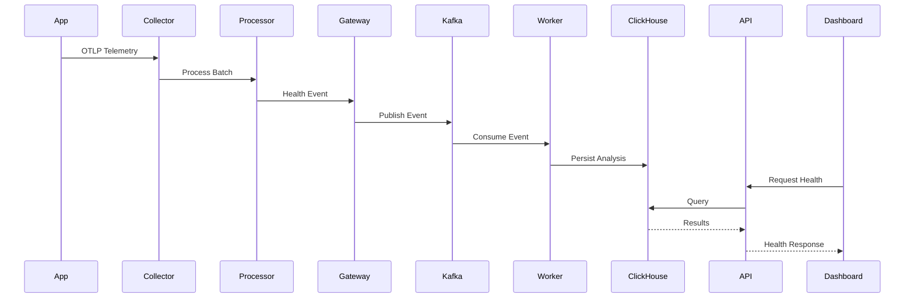

# TelemetryHealth Architecture Documentation

**Document ID:** TH-ARCH-007
**Title:** System Workflow
**Status:** Approved
**Version:** 1.0
**Owner:** TelemetryHealth Core Team
**Related Documents:**
- TH-ARCH-002 System Context
- TH-ARCH-003 Bounded Contexts
- TH-ARCH-004 Domain Model
- TH-ARCH-005 Clean Architecture

---

# 1. Purpose

This document describes the runtime execution workflow of TelemetryHealth.

While previous documents define the system architecture, this document explains how telemetry flows through the platform from ingestion to actionable intelligence.

It serves as the bridge between architectural design and implementation.

---

# 2. Overview

TelemetryHealth is an intelligence layer built on top of the OpenTelemetry ecosystem.

Its responsibility is to observe telemetry, analyze its quality and behavior, determine operational health, identify probable root causes, and generate remediation recommendations.

At a high level, the workflow is:

```mermaid
graph TD;
    "Telemetry" --> "Collection";
    "Collection" --> "Inspection";
    "Inspection" --> "Storage";
    "Storage" --> "Analysis";
    "Analysis" --> "Decision";
    "Decision" --> "Remediation";
    "Remediation" --> "Visualization";
```

---

# 3. End-to-End Processing Pipeline

```
┌────────────────────┐
│ Instrumented Apps  │
└──────────┬─────────┘
           │
           ▼
┌────────────────────┐
│ OpenTelemetry SDK  │
└──────────┬─────────┘
           │
           ▼
┌────────────────────┐
│ OTel Collector     │
└──────────┬─────────┘
           │
           ▼
┌────────────────────┐
│ TH Processor       │
└──────────┬─────────┘
           │
           ▼
┌────────────────────┐
│ Ingest Gateway     │
└──────────┬─────────┘
           │
           ▼
┌────────────────────┐
│ Kafka / Redpanda   │
└──────────┬─────────┘
           │
           ▼
┌────────────────────┐
│ Worker Services    │
└──────────┬─────────┘
           │
           ▼
┌────────────────────┐
│ ClickHouse         │
└──────────┬─────────┘
           │
           ▼
┌────────────────────┐
│ Analysis Engine    │
└──────────┬─────────┘
           │
           ▼
┌────────────────────┐
│ Decision Engine    │
└──────────┬─────────┘
           │
           ▼
┌────────────────────┐
│ Remediation Engine │
└──────────┬─────────┘
           │
     ┌─────┴────────────┐
     ▼                  ▼
Dashboard            MCP Server
```

---

# 4. Workflow Stages

The platform operates as a sequence of independent processing stages.

| Stage | Responsibility |
|--------|----------------|
| Collection | Receive telemetry |
| Inspection | Validate and inspect telemetry |
| Ingestion | Accept telemetry into the platform |
| Streaming | Buffer and distribute events |
| Persistence | Store analysis data |
| Analysis | Compute health and behavior |
| Decision | Generate recommendations |
| Remediation | Produce executable fixes |
| Presentation | Deliver insights |

Each stage has a single responsibility and communicates through well-defined interfaces.

---

# 5. Stage 1 – Telemetry Collection

Telemetry originates from instrumented applications using the OpenTelemetry SDK.

Supported signal types include:

- Traces
- Metrics
- Logs

The SDK exports telemetry to the OpenTelemetry Collector using the OTLP protocol.

---

# 6. Stage 2 – Collector Processing

The OpenTelemetry Collector acts as the first processing layer.

Responsibilities:

- Receive OTLP traffic
- Batch telemetry
- Apply processors
- Forward telemetry

TelemetryHealth integrates as a Collector Processor.

The processor performs lightweight inspection without interrupting telemetry flow.

Examples:

- Missing span detection
- Attribute validation
- Cardinality estimation
- Instrumentation coverage analysis

The processor must remain fail-open.

---

# 7. Stage 3 – Ingestion

Validated telemetry health events are accepted by the Ingest Gateway.

Responsibilities:

- Authentication
- Tenant identification
- Request validation
- Rate limiting
- Event normalization

Business analysis is intentionally excluded from this stage.

---

# 8. Stage 4 – Event Streaming

After validation, events are published to the streaming layer.

Current implementation:

- Kafka
- Redpanda

Responsibilities:

- Decoupling producers and consumers
- Buffering
- Retry
- Ordering
- Backpressure handling

Streaming ensures downstream components remain isolated from ingestion spikes.

---

# 9. Stage 5 – Persistence

Worker services consume events from the stream.

Responsibilities:

- Data transformation
- Aggregation
- Persistence

Primary analytical storage:

- ClickHouse

Persistent data includes:

- Health snapshots
- Replay metadata
- Behavior graphs
- Root cause evidence
- Historical metrics

---

# 10. Stage 6 – Intelligence Pipeline

Once telemetry has been persisted, the intelligence pipeline begins.

The pipeline consists of multiple independent analysis engines.

```mermaid
graph TD;
    "Replay" --> "Behavior";
    "Behavior" --> "Health";
    "Health" --> "Root Cause";
    "Root Cause" --> "Decision";
    "Decision" --> "Remediation";
```

Each engine enriches the information produced by the previous stage.

---

# 11. Replay Generation

Replay reconstructs historical execution.

Responsibilities:

- Timeline reconstruction
- Span ordering
- Session grouping
- Historical playback

Replay provides the temporal context required for subsequent analysis.

---

# 12. Behavior Analysis

Behavior analysis constructs runtime interaction graphs.

Responsibilities:

- Service relationship discovery
- Dependency mapping
- Latency analysis
- Flow visualization

Output:

Behavior Graph.

---

# 13. Health Analysis

Health analysis evaluates telemetry quality.

Inputs include:

- Coverage
- Cardinality
- Sampling
- Pipeline integrity

Output:

Health Score.

Health Scores are deterministic and reproducible.

---

# 14. Root Cause Analysis

The Root Cause Engine correlates evidence to identify the most probable explanation for observed issues.

Inputs:

- Replay
- Behavior Graph
- Health Metrics

Outputs:

- Root Cause Graph
- Confidence Score
- Supporting Evidence

---

# 15. Decision Generation

The Decision Engine transforms analysis into actionable recommendations.

Responsibilities:

- Evaluate policies
- Assess operational risk
- Prioritize findings
- Produce recommendations

Output:

Decision objects.

---

# 16. Remediation Generation

Remediation converts decisions into executable actions.

Examples:

- Collector configuration updates
- YAML patches
- Instrumentation recommendations

Every remediation must be:

- Validated
- Reversible
- Traceable

---

# 17. Dashboard Workflow

The Dashboard interacts only with the public API.

Workflow:

```mermaid
graph TD;
    "Dashboard" --> "REST API";
    "REST API" --> "Application Service";
    "Application Service" --> "Repository";
    "Repository" --> "ClickHouse";
```

The Dashboard never communicates directly with infrastructure components.

---

# 18. MCP Workflow

AI systems interact through the MCP Server.

Typical workflow:

```mermaid
graph TD;
    "AI Client" --> "MCP Server";
    "MCP Server" --> "Application Service";
    "Application Service" --> "Domain";
    "Domain" --> "Repository";
    "Repository" --> "Response";
```

Supported operations include:

- Health reports
- Replay analysis
- Root cause summaries
- Remediation generation

---

# 19. Background Processing

The platform executes several asynchronous worker processes.

Examples:

- Replay Worker
- Health Worker
- Behavior Worker
- Root Cause Worker
- Cleanup Worker

These workers consume events independently and may scale horizontally.

---

# 20. Failure Handling

Failures are isolated at each processing stage.

Examples:

- Collector failures do not interrupt application telemetry.
- Kafka retries transient delivery failures.
- Workers retry recoverable tasks.
- Invalid events are quarantined for inspection.

The platform is designed to fail gracefully while preserving telemetry flow.

---

# 21. Sequence Diagram



---

# 22. Design Principles

The workflow adheres to the following principles:

- Each stage has a single responsibility.
- Stages communicate through defined interfaces.
- Analysis is deterministic where possible.
- Long-running work is asynchronous.
- Telemetry collection is never blocked by downstream failures.
- Intelligence is layered, with each stage building on previous analysis.

---

# 23. Summary

The TelemetryHealth workflow transforms raw telemetry into operational intelligence through a series of independent, composable processing stages.

This staged architecture enables scalability, resilience, and extensibility while ensuring that the platform remains compatible with the broader OpenTelemetry ecosystem.

---

## Related Documents

- TH-ARCH-002 System Context
- TH-ARCH-003 Bounded Contexts
- TH-ARCH-004 Domain Model
- TH-ARCH-005 Clean Architecture
- TH-ARCH-006 Repository Structure

---

**End of Document**