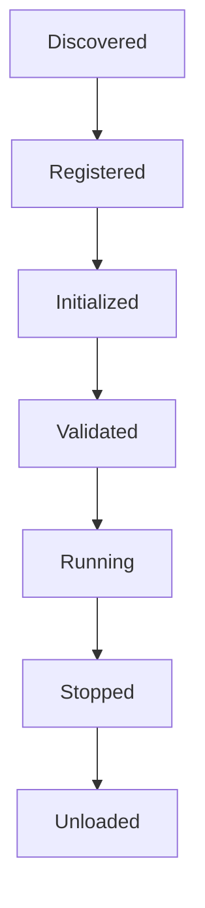
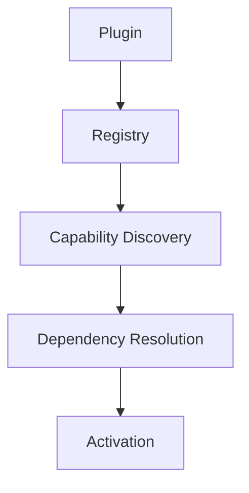
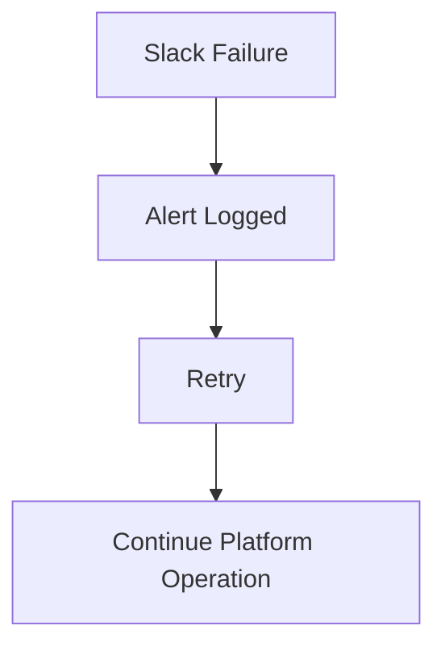
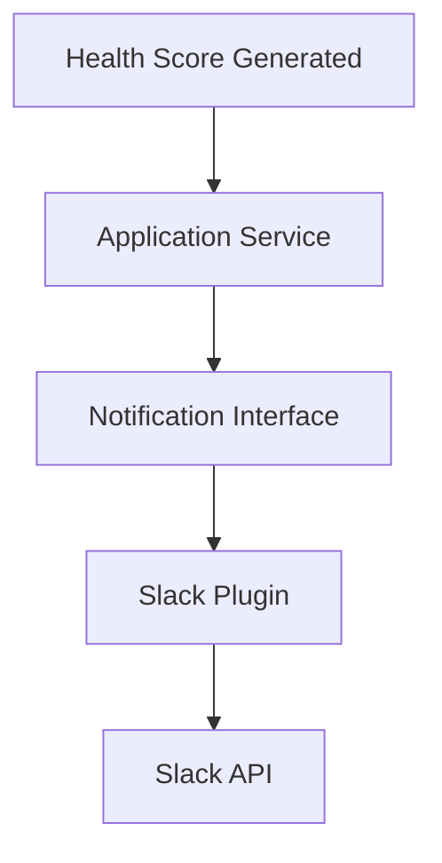

# TelemetryHealth Architecture Documentation

**Document ID:** TH-ARCH-008
**Title:** Plugin Architecture
**Status:** Approved
**Version:** 1.0
**Owner:** TelemetryHealth Core Team
**Related Documents:**
- TH-ARCH-005 Clean Architecture
- TH-ARCH-006 Repository Structure
- TH-ARCH-007 System Workflow

---

# 1. Purpose

This document defines the extensibility model of TelemetryHealth.

Rather than embedding support for every backend, notification provider, or AI integration directly into the core platform, TelemetryHealth adopts a plugin-based architecture.

The plugin system enables independent development, testing, deployment, and replacement of integrations without modifying the Domain Layer.

---

# 2. Design Goals

The Plugin Architecture SHALL provide:

- Extensibility
- Vendor neutrality
- Independent lifecycle
- Backward compatibility
- Runtime discoverability
- Loose coupling

The Plugin Architecture SHALL NOT:

- Contain business logic
- Modify domain entities directly
- Bypass Application Services

---

# 3. Architecture Overview

```
                    TelemetryHealth Core

                             │

     ┌───────────────────────┼────────────────────────┐

     ▼                       ▼                        ▼

 Backend Plugins      Notification Plugins     AI Plugins

     ▼                       ▼                        ▼

 SigNoz                Slack                 MCP

 Jaeger                PagerDuty            Claude

 Tempo                 Webhook              OpenAI

 Prometheus            Email                Gemini
```

The Core owns business rules.

Plugins provide capabilities.

---

# 4. Plugin Categories

The platform defines four plugin categories.

## 4.1 Backend Plugins

Responsible for interacting with observability platforms.

Examples:

- SigNoz
- Jaeger
- Grafana Tempo
- Elastic APM
- Honeycomb

---

## 4.2 Notification Plugins

Responsible for delivering alerts.

Examples:

- Slack
- PagerDuty
- Email
- Discord
- Microsoft Teams
- Generic Webhooks

---

## 4.3 AI Plugins

Responsible for exposing intelligence to AI systems.

Examples:

- MCP Server
- OpenAI
- Claude
- Gemini
- Local LLM

---

## 4.4 Export Plugins

Responsible for exporting reports.

Examples:

- JSON
- CSV
- PDF
- Markdown

---

# 5. Plugin Lifecycle

Every plugin follows the same lifecycle.



Plugins SHALL cleanly release all resources during shutdown.

---

# 6. Plugin Registration

Plugins register themselves through a registry.



Registration MUST occur during application startup.

---

# 7. Plugin Interface

Every plugin SHALL implement a common interface.

Example:

```go
type Plugin interface {
    Name() string
    Version() string
    Initialize(context.Context) error
    Shutdown(context.Context) error
}
```

Category-specific interfaces extend the base Plugin interface.

---

# 8. Backend Plugin Contract

Backend plugins provide telemetry access.

Example:

```go
type BackendPlugin interface {
    Plugin

    QueryTraces()
    QueryMetrics()
    QueryLogs()
}
```

The Domain never communicates directly with backend implementations.

---

# 9. Notification Plugin Contract

Example:

```go
type NotificationPlugin interface {
    Plugin

    Send(Alert) error
}
```

The Alerting Context depends only on this interface.

---

# 10. AI Plugin Contract

Example:

```go
type AIPlugin interface {
    Plugin

    Execute(Context) (Response, error)
}
```

This enables multiple AI providers without changing application logic.

---

# 11. Plugin Repository Structure

```
plugins/

backend/

signoz/

tempo/

jaeger/

notification/

slack/

pagerduty/

webhook/

ai/

mcp/

openai/

claude/

gemini/

export/

json/

csv/

pdf/
```

Each plugin resides in its own package.

---

# 12. Dependency Rules

Plugins may depend on:

- Application Services
- Public Interfaces
- Infrastructure Libraries

Plugins SHALL NOT:

- Import Domain internals
- Modify aggregates directly
- Access another plugin's internals

---

# 13. Configuration

Plugins are configured through declarative configuration.

Example:

```yaml
plugins:

  backend:
    provider: signoz

  notifications:
    provider: slack

  ai:
    provider: mcp
```

The core should not require recompilation when plugin configuration changes.

---

# 14. Version Compatibility

Each plugin declares:

- Name
- Version
- Supported API Version
- Required Features

Example:

```
Plugin: SigNoz

Version: 2.0.0

Compatible API:

v1.x
```

---

# 15. Error Isolation

Plugin failures SHALL remain isolated.

Example:



Core services must continue operating.

---

# 16. Security

Plugins execute with least privilege.

Requirements:

- No unrestricted filesystem access
- No direct database access unless explicitly granted
- No modification of Domain state
- Secure configuration handling

Future versions may introduce plugin sandboxing.

---

# 17. Future Runtime Loading

Future releases may support:

- Dynamic plugin loading
- Hot reloading
- Remote plugin repositories
- Signed plugins
- WebAssembly (WASM) plugins

The architecture should remain compatible with these capabilities.

---

# 18. Example Workflow



The Application Service remains unaware of Slack-specific implementation details.

---

# 19. Benefits

The plugin architecture provides:

- Vendor independence
- Easier maintenance
- Independent testing
- Community-developed integrations
- Simplified upgrades
- Future extensibility

---

# 20. Summary

The Plugin Architecture enables TelemetryHealth to evolve as an extensible platform rather than a monolithic application.

By separating integrations from business logic, the core platform remains stable while plugins can evolve independently to support new backends, AI providers, notification channels, and export formats.

---

## Related Documents

- TH-ARCH-005 Clean Architecture
- TH-ARCH-006 Repository Structure
- TH-ARCH-007 System Workflow
- TH-ARCH-009 Event-Driven Architecture

---

**End of Document**