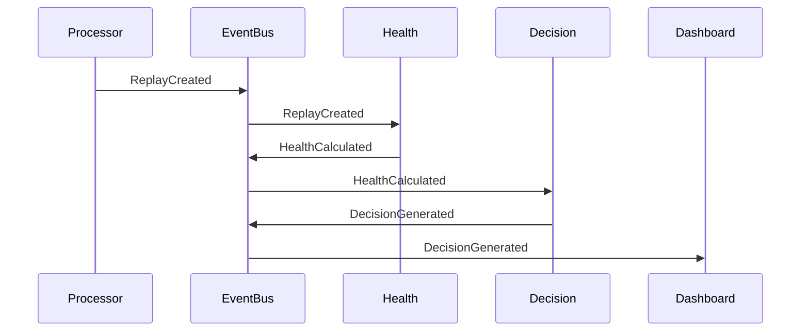

# TelemetryHealth Architecture Documentation

**Document ID:** TH-ARCH-009
**Title:** Event-Driven Architecture
**Status:** Approved
**Version:** 1.0
**Owner:** TelemetryHealth Core Team
**Related Documents:**
- TH-ARCH-003 Bounded Contexts
- TH-ARCH-004 Domain Model
- TH-ARCH-005 Clean Architecture
- TH-ARCH-007 System Workflow
- TH-ARCH-008 Plugin Architecture

---

# 1. Purpose

This document defines the Event-Driven Architecture (EDA) of TelemetryHealth.

Rather than tightly coupling services through synchronous calls, bounded contexts communicate by publishing and consuming immutable domain events.

This architecture improves scalability, resilience, extensibility, and fault isolation.

---

# 2. Goals

The Event-Driven Architecture SHALL provide:

- Loose coupling
- Independent scalability
- Event replay
- Fault isolation
- Extensibility
- Asynchronous processing
- Event sourcing compatibility

The architecture SHALL NOT:

- Replace direct API calls where synchronous interaction is required.
- Allow events to modify Domain objects directly.
- Introduce hidden dependencies between bounded contexts.

---

# 3. Event Flow Overview

```mermaid
graph TD;
    "Telemetry" --> "ReplayCreated";
    "ReplayCreated" --> "BehaviorGenerated";
    "BehaviorGenerated" --> "HealthCalculated";
    "HealthCalculated" --> "RootCauseDetected";
    "RootCauseDetected" --> "DecisionGenerated";
    "DecisionGenerated" --> "RemediationGenerated";
    "RemediationGenerated" --> "AlertPublished";
```

Every event represents something that **has already happened**.

Events are immutable facts.

---

# 4. Event Types

TelemetryHealth defines three categories of events.

## Domain Events

Represent business facts.

Examples:

- ReplayCreated
- HealthCalculated
- DecisionGenerated

---

## Integration Events

Used between independent services.

Examples:

- ReplayStored
- AlertSent
- ReportExported

---

## System Events

Describe platform state.

Examples:

- WorkerStarted
- WorkerStopped
- PluginLoaded
- ConfigurationReloaded

---

# 5. Event Lifecycle

```mermaid
graph TD;
    "Business Action" --> "Domain Event Created";
    "Domain Event Created" --> "Validation";
    "Validation" --> "Event Bus";
    "Event Bus" --> "Subscribers";
    "Subscribers" --> "Processing";
    "Processing" --> "Acknowledgement";
```

Events are immutable after publication.

---

# 6. Event Bus

The Event Bus is responsible for delivering events.

Responsibilities:

- Registration
- Dispatching
- Retry
- Fan-out
- Ordering (where required)

The Event Bus does not contain business logic.

---

# 7. Event Structure

Every event SHALL contain:

```json
{
  "id": "uuid",
  "type": "HealthCalculated",
  "version": "1.0",
  "timestamp": "2026-07-17T10:15:00Z",
  "tenant_id": "tenant-123",
  "source": "health-engine",
  "correlation_id": "trace-abc",
  "payload": {}
}
```

---

# 8. Event Metadata

Mandatory metadata:

| Field | Purpose |
|--------|----------|
| id | Unique identifier |
| type | Event type |
| version | Schema version |
| timestamp | Creation time |
| tenant_id | Multi-tenant isolation |
| correlation_id | Request tracing |
| source | Event producer |

---

# 9. Event Naming

Events use the format:

```
<Entity><PastTenseVerb>
```

Examples:

Good:

- ReplayCreated
- HealthCalculated
- AlertPublished

Avoid:

- CreateReplay
- DoHealth
- ExecuteAlert

Events describe completed facts.

---

# 10. Event Ownership

Each bounded context owns its own events.

| Context | Owned Events |
|----------|--------------|
| Replay | ReplayCreated |
| Health | HealthCalculated |
| Behavior | BehaviorGenerated |
| Root Cause | RootCauseDetected |
| Decision | DecisionGenerated |
| Remediation | RemediationGenerated |
| Alerting | AlertPublished |

Other contexts may consume but must not redefine them.

---

# 11. Event Consumers

Multiple consumers may subscribe to the same event.

Example:

```mermaid
graph TD;
    "HealthCalculated" --> "Dashboard";
    "Dashboard" --> "Alert Engine";
    "Alert Engine" --> "Reporting";
    "Reporting" --> "MCP";
    "MCP" --> "Analytics";
```

Publishers remain unaware of subscribers.

---

# 12. Event Ordering

Ordering is required only within a logical aggregate.

Example:

```mermaid
graph TD;
    "ReplayCreated" --> "ReplayUpdated";
    "ReplayUpdated" --> "ReplayArchived";
```

Ordering across unrelated aggregates is not guaranteed.

---

# 13. Event Versioning

Events evolve independently.

Versioning rules:

- Additive changes are preferred.
- Breaking changes require a new version.
- Consumers should tolerate unknown fields.

Example:

```mermaid
graph TD;
    "HealthCalculated v1" --> "HealthCalculated v2";
```

Both may coexist during migration.

---

# 14. Idempotency

Consumers SHALL be idempotent.

Receiving the same event multiple times must produce the same result.

Duplicate delivery should not create duplicate domain state.

---

# 15. Retry Strategy

Recoverable failures:

- Retry with exponential backoff.
- Preserve ordering where necessary.

Non-recoverable failures:

- Send to Dead Letter Queue (DLQ).
- Record diagnostic information.

---

# 16. Dead Letter Queue

Events that repeatedly fail processing are moved to a DLQ.

Responsibilities:

- Preserve failed events.
- Enable investigation.
- Allow replay after correction.

DLQ processing should never block the main event stream.

---

# 17. Event Replay

Historical events may be replayed for:

- Debugging
- Testing
- Disaster recovery
- Model improvements

Replay must preserve original timestamps and ordering within aggregates.

---

# 18. Event Contracts

Events are public contracts.

Changing an event requires:

- Compatibility review
- Version update
- Documentation update
- Consumer validation

---

# 19. Event Security

Sensitive information SHALL NOT be included in events unless explicitly required.

Events should:

- Minimize payload size.
- Avoid secrets.
- Respect tenant boundaries.

Transport security is handled by infrastructure.

---

# 20. Event Monitoring

The event system itself should expose metrics.

Examples:

- Events Published
- Events Consumed
- Failed Deliveries
- Retry Count
- DLQ Size
- Processing Latency

TelemetryHealth should observe its own event infrastructure.

---

# 21. Example Sequence



---

# 22. Benefits

The Event-Driven Architecture provides:

- Loose coupling
- Independent deployment
- Horizontal scalability
- Improved fault tolerance
- Easier feature expansion
- Better observability

It aligns naturally with the bounded contexts defined in TH-ARCH-003.

---

# 23. Summary

Event-Driven Architecture enables TelemetryHealth to evolve into a modular platform where independent bounded contexts communicate through immutable business events.

This model supports scalable processing, easier integration, and long-term architectural flexibility.

---

## Related Documents

- TH-ARCH-003 Bounded Contexts
- TH-ARCH-004 Domain Model
- TH-ARCH-007 System Workflow
- TH-ARCH-008 Plugin Architecture
- TH-ARCH-010 API Design Guidelines

---

**End of Document**