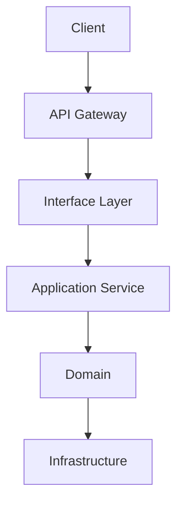

# TelemetryHealth Architecture Documentation

**Document ID:** TH-ARCH-010
**Title:** API Design Guidelines
**Status:** Approved
**Version:** 1.0
**Owner:** TelemetryHealth Core Team
**Related Documents:**
- TH-ARCH-004 Domain Model
- TH-ARCH-005 Clean Architecture
- TH-ARCH-007 System Workflow
- TH-ARCH-009 Event-Driven Architecture

---

# 1. Purpose

This document defines the standards governing every public API exposed by TelemetryHealth.

The term API includes:

- REST APIs
- MCP Tools
- Future gRPC Services
- Internal Service APIs
- WebSocket APIs

The objective is to ensure consistency, discoverability, backward compatibility, and long-term maintainability.

---

# 2. Design Principles

Every API SHALL be:

- Resource-oriented
- Predictable
- Versioned
- Self-descriptive
- Stateless
- Secure by default

Every API SHOULD:

- Return structured errors
- Support pagination where appropriate
- Provide filtering
- Support future extension without breaking compatibility

---

# 3. API Architecture



Business logic SHALL exist only in the Application and Domain layers.

---

# 4. Resource Naming

Resources use nouns.

Good

```
/health

/replays

/behaviors

/root-causes

/remediations

/alerts
```

Avoid

```
/calculateHealth

/getReplay

/runAnalysis

/doRootCause
```

Operations are expressed through HTTP methods.

---

# 5. HTTP Methods

| Method | Meaning |
|---------|----------|
| GET | Retrieve |
| POST | Create |
| PUT | Replace |
| PATCH | Partial Update |
| DELETE | Remove |

Examples

```
GET /health

GET /health/{id}

POST /replays

DELETE /alerts/{id}
```

---

# 6. API Versioning

Versioning SHALL occur at the URI level.

Example

```
/api/v1/health

/api/v1/replays

/api/v2/health
```

Breaking changes require a new major version.

Non-breaking additions do not.

---

# 7. Request Format

Request bodies SHALL use JSON.

Example

```json
{
  "tenantId": "tenant-001",
  "timeRange": {
    "from": "2026-07-01T00:00:00Z",
    "to": "2026-07-02T00:00:00Z"
  }
}
```

---

# 8. Response Format

Responses SHALL follow a common envelope.

```json
{
  "success": true,
  "data": {},
  "metadata": {
    "requestId": "...",
    "timestamp": "..."
  }
}
```

---

# 9. Error Format

Errors SHALL be standardized.

```json
{
  "success": false,
  "error": {
    "code": "HEALTH_NOT_FOUND",
    "message": "Health snapshot not found.",
    "details": {}
  }
}
```

---

# 10. HTTP Status Codes

| Code | Usage |
|------|-------|
| 200 | Success |
| 201 | Resource Created |
| 204 | No Content |
| 400 | Validation Error |
| 401 | Unauthorized |
| 403 | Forbidden |
| 404 | Not Found |
| 409 | Conflict |
| 422 | Business Rule Violation |
| 429 | Rate Limited |
| 500 | Internal Error |

---

# 11. Pagination

Large collections SHALL support pagination.

Request

```
GET /replays?page=2&pageSize=50
```

Response

```json
{
  "items": [],
  "page": 2,
  "pageSize": 50,
  "totalItems": 1200,
  "totalPages": 24
}
```

---

# 12. Filtering

Filtering SHOULD use query parameters.

Example

```
GET /health?tenantId=t1

GET /alerts?severity=critical

GET /replays?status=completed
```

---

# 13. Sorting

Sorting SHALL use a common syntax.

```
GET /health?sort=-timestamp

GET /alerts?sort=severity
```

Prefix `-` indicates descending order.

---

# 14. Idempotency

Operations that create resources SHOULD support idempotency.

Example

```
Idempotency-Key:
9f68d5ab...
```

Duplicate requests with the same key must not create duplicate resources.

---

# 15. Authentication

Authentication SHALL be handled before the Application Layer.

Supported mechanisms may include:

- JWT
- OAuth2
- API Keys
- mTLS (service-to-service)

Domain logic must remain unaware of authentication implementation.

---

# 16. Authorization

Authorization SHALL be policy-based.

Examples

- Tenant access
- Role-based access control (RBAC)
- Future attribute-based access control (ABAC)

Authorization failures return **403 Forbidden**.

---

# 17. Rate Limiting

Public APIs SHOULD support configurable rate limits.

Typical limits may vary by:

- User
- Tenant
- API Key
- IP Address

---

# 18. Observability

Every API request SHALL produce telemetry.

Captured metadata includes:

- Request ID
- Trace ID
- Latency
- Response Code
- Error Count

TelemetryHealth should monitor its own APIs.

---

# 19. MCP Guidelines

MCP tools SHALL:

- Expose business capabilities
- Avoid transport-specific concepts
- Return structured responses
- Preserve backward compatibility

Example tools:

- GetTelemetryHealth
- AnalyzeReplay
- GenerateRemediation
- ExplainRootCause

---

# 20. Future APIs

Future interfaces may include:

- GraphQL
- gRPC
- Streaming APIs
- WebSockets
- Server-Sent Events

These interfaces SHALL conform to the same domain and application boundaries defined in earlier architecture documents.

---

# 21. API Documentation

Every public endpoint MUST include:

- Purpose
- Request schema
- Response schema
- Error responses
- Authentication requirements
- Example requests
- Example responses

OpenAPI specifications SHOULD be generated automatically where applicable.

---

# 22. Summary

A consistent API design is essential for long-term maintainability.

By enforcing common conventions across all interfaces, TelemetryHealth remains predictable for developers, easier to integrate, and simpler to evolve without breaking existing clients.

---

## Related Documents

- TH-ARCH-004 Domain Model
- TH-ARCH-005 Clean Architecture
- TH-ARCH-007 System Workflow
- TH-ARCH-009 Event-Driven Architecture
- TH-ARCH-011 Configuration Management

---

**End of Document**