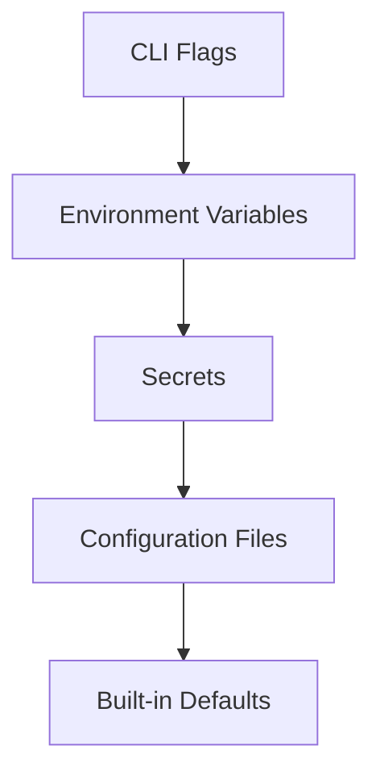

# TelemetryHealth Architecture Documentation

**Document ID:** TH-ARCH-011
**Title:** Configuration Management
**Status:** Approved
**Version:** 1.0
**Owner:** TelemetryHealth Core Team
**Related Documents:**
- TH-ARCH-005 Clean Architecture
- TH-ARCH-006 Repository Structure
- TH-ARCH-008 Plugin Architecture
- TH-ARCH-012 Deployment Architecture

---

# 1. Purpose

This document defines how configuration is managed throughout the TelemetryHealth platform.

Configuration controls platform behavior without requiring source code changes.

The architecture separates configuration from implementation and ensures reproducible deployments across development, testing, staging, and production environments.

---

# 2. Design Goals

The configuration system SHALL be:

- Declarative
- Version controlled
- Environment aware
- Secure
- Validatable
- Observable

Configuration SHALL NOT contain business logic.

---

# 3. Configuration Philosophy

The platform follows the principle:

> **Build Once. Configure Everywhere.**

Application binaries remain identical across environments.

Only configuration changes.

---

# 4. Configuration Sources

Configuration may originate from:

| Source | Purpose |
|---------|---------|
| YAML | Primary configuration |
| Environment Variables | Secrets and overrides |
| CLI Flags | Local development |
| Kubernetes ConfigMaps | Cluster configuration |
| Kubernetes Secrets | Sensitive values |
| Vault (Future) | Secret management |

Configuration precedence:



---

# 5. Configuration Categories

Configuration is divided into logical sections.

```
Server

Database

Streaming

Plugins

Authentication

Observability

Logging

AI

Dashboard

Feature Flags
```

Each category owns its own schema.

---

# 6. Directory Structure

```
config/

default.yaml

development.yaml

testing.yaml

staging.yaml

production.yaml

plugins/

dashboard/

collector/
```

No configuration files should contain secrets.

---

# 7. Example Configuration

```yaml
server:
  host: 0.0.0.0
  port: 8080

database:
  provider: clickhouse
  host: clickhouse
  port: 9000

streaming:
  provider: redpanda
  brokers:
    - redpanda:9092

plugins:
  backend:
    provider: signoz

observability:
  metrics: true
  tracing: true
```

---

# 8. Environment Variables

Sensitive values SHALL be supplied through environment variables.

Examples:

```
CLICKHOUSE_PASSWORD

JWT_SECRET

OPENAI_API_KEY

SLACK_TOKEN
```

Secrets must never be committed to version control.

---

# 9. Configuration Validation

Every configuration file SHALL be validated during startup.

Validation includes:

- Required fields
- Type checking
- Range validation
- Cross-field validation
- Plugin compatibility

The application SHALL fail fast if configuration is invalid.

---

# 10. Feature Flags

Experimental functionality should be controlled through feature flags.

Example:

```yaml
features:
  aiReplay: true
  remediationEngine: false
  wasmPlugins: false
```

Feature flags enable gradual rollout without recompilation.

---

# 11. Plugin Configuration

Each plugin owns its own configuration namespace.

Example:

```yaml
plugins:

  signoz:
    endpoint: http://signoz:8080

  slack:
    webhook: ${SLACK_WEBHOOK}

  openai:
    model: gpt-5
```

The core platform must not parse plugin-specific settings.

---

# 12. Environment Profiles

Supported deployment profiles include:

- Development
- Testing
- Staging
- Production

Profiles inherit from the default configuration and override only necessary values.

---

# 13. Secret Management

Secrets SHALL NOT be stored in:

- Git repositories
- Docker images
- Helm charts
- Default configuration files

Future integrations may include:

- HashiCorp Vault
- AWS Secrets Manager
- Azure Key Vault
- Kubernetes External Secrets

---

# 14. Runtime Reloading

Some configuration may be reloaded without restarting services.

Examples:

- Logging levels
- Alert thresholds
- Feature flags

Critical configuration changes (database, streaming, authentication) require service restart.

---

# 15. Configuration Schema

Every configuration section SHALL define:

- Name
- Type
- Required/Optional
- Default value
- Validation rules
- Documentation

Configuration schemas should be versioned.

---

# 16. Observability

Configuration loading SHALL produce telemetry.

Metrics include:

- Configuration version
- Load duration
- Validation failures
- Active profile
- Reload count

Configuration changes should be traceable.

---

# 17. Failure Handling

Invalid configuration SHALL:

- Prevent startup
- Produce actionable error messages
- Identify invalid fields
- Suggest corrective actions where possible

The platform should never continue with partially valid configuration.

---

# 18. Best Practices

- Keep configuration minimal.
- Use sensible defaults.
- Separate secrets from configuration.
- Validate early.
- Document every setting.
- Version configuration schemas.

---

# 19. Future Evolution

Future enhancements may include:

- Dynamic configuration service
- Centralized configuration registry
- Configuration UI
- Policy-based validation
- Signed configuration bundles

---

# 20. Summary

Configuration is a first-class architectural concern.

A consistent configuration strategy ensures reproducible deployments, safer operations, and easier platform evolution while maintaining clear separation between code and environment-specific settings.

---

## Related Documents

- TH-ARCH-005 Clean Architecture
- TH-ARCH-008 Plugin Architecture
- TH-ARCH-012 Deployment Architecture
- TH-ARCH-013 Observability of TelemetryHealth

---

**End of Document**