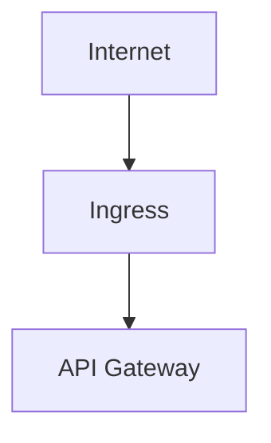
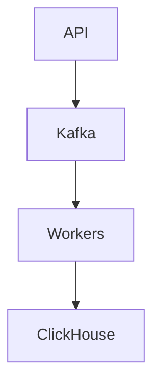
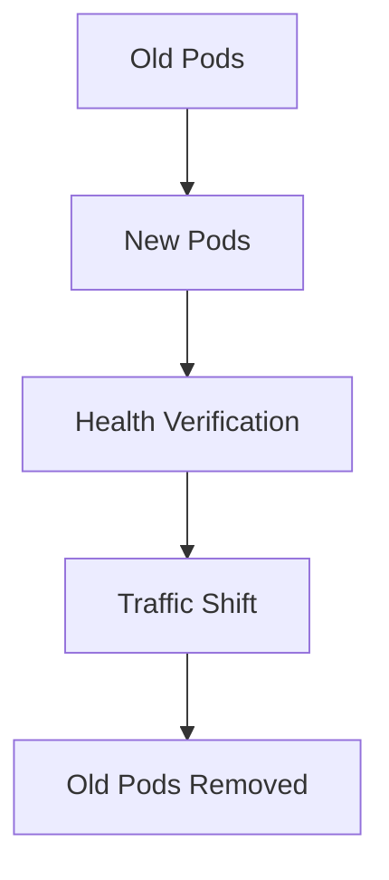
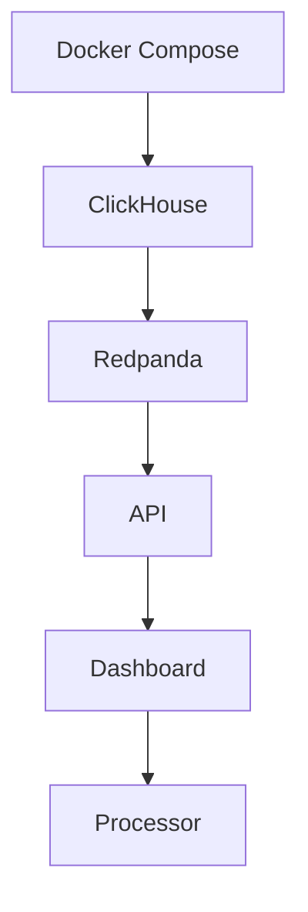

# TelemetryHealth Architecture Documentation

**Document ID:** TH-ARCH-012
**Title:** Deployment Architecture
**Status:** Approved
**Version:** 1.0
**Owner:** TelemetryHealth Core Team
**Related Documents:**
- TH-ARCH-007 System Workflow
- TH-ARCH-008 Plugin Architecture
- TH-ARCH-011 Configuration Management
- TH-ARCH-013 Observability of TelemetryHealth

---

# 1. Purpose

This document defines the deployment architecture of TelemetryHealth.

It describes how platform components are deployed, communicate, scale, and recover from failures across development and production environments.

The deployment architecture is designed around cloud-native principles while remaining deployable on a single machine for local development.

---

# 2. Deployment Goals

The deployment architecture SHALL provide:

- Horizontal scalability
- High availability
- Fault isolation
- Vendor neutrality
- Cloud-native compatibility
- Local development support

Deployment architecture SHALL remain independent of any single cloud provider.

---

# 3. Deployment Models

TelemetryHealth supports multiple deployment models.

### Local Development

Single Docker Compose stack.

Suitable for:

- Development
- Testing
- Demos

---

### Small Production

Single Kubernetes cluster.

Suitable for:

- Small teams
- Internal deployments

---

### Enterprise

Multiple Kubernetes clusters.

Suitable for:

- Multi-region
- High availability
- Large-scale telemetry

---

# 4. High-Level Deployment

```
                    Internet
                        │
                        ▼
               ┌───────────────────┐
               │ Ingress Controller │
               └─────────┬─────────┘
                         │
      ┌──────────────────┼──────────────────┐
      ▼                  ▼                  ▼
 API Gateway      Dashboard         MCP Server
      │
      ▼
 Application Services
      │
      ▼
 Event Bus (Kafka / Redpanda)
      │
      ▼
 Worker Services
      │
      ▼
 ClickHouse
```

---

# 5. Core Services

Every deployment consists of the following logical services.

| Service | Responsibility |
|----------|----------------|
| API Gateway | External REST API |
| Dashboard | Web UI |
| MCP Server | AI Interface |
| Ingest Gateway | Receive telemetry |
| Worker Services | Analysis |
| Event Bus | Streaming |
| ClickHouse | Analytics Storage |
| Processor | OTel Collector Processor |

---

# 6. Service Boundaries

Each service owns its own lifecycle.

Services communicate through:

- REST
- gRPC (future)
- Event Bus
- OTLP

Direct database sharing is prohibited.

---

# 7. Kubernetes Layout

```
Namespace

telemetryhealth

├── api
├── dashboard
├── mcp
├── ingest
├── workers
├── clickhouse
├── kafka
└── monitoring
```

Each service SHOULD run in its own Deployment.

---

# 8. Networking

External traffic:



Internal communication:



Internal services SHOULD remain inaccessible from the public Internet.

---

# 9. Scaling Strategy

Different services scale independently.

| Component | Scaling Strategy |
|------------|------------------|
| Dashboard | Stateless Horizontal |
| API | Stateless Horizontal |
| Workers | Queue-based Horizontal |
| MCP | Stateless Horizontal |
| Kafka | Cluster Scaling |
| ClickHouse | Sharding & Replication |

---

# 10. Storage

Persistent storage includes:

- ClickHouse
- Configuration
- Logs
- Replay Metadata

Ephemeral storage includes:

- Worker cache
- Temporary files

Application containers should remain stateless.

---

# 11. High Availability

Critical services SHALL support redundancy.

Examples:

- Multiple API replicas
- Multiple workers
- Kafka replication
- ClickHouse replication

The failure of a single instance must not interrupt platform operation.

---

# 12. Health Checks

Every service SHALL expose:

- Liveness Probe
- Readiness Probe

Optional:

- Startup Probe

Example endpoints:

```
/health/live

/health/ready

/health/startup
```

---

# 13. Resource Management

Every deployment SHALL define:

- CPU Requests
- CPU Limits
- Memory Requests
- Memory Limits

Resource limits prevent noisy-neighbor problems.

---

# 14. Security

Deployment security includes:

- TLS
- mTLS (future)
- RBAC
- Network Policies
- Secret Management

Containers SHALL run as non-root wherever possible.

---

# 15. Rolling Updates

Deployments SHOULD support zero-downtime upgrades.

Typical strategy:



---

# 16. Disaster Recovery

Critical components should support:

- Automated backups
- Configuration recovery
- Database snapshots
- Infrastructure as Code

Recovery procedures should be documented and tested.

---

# 17. Logging

All services write structured logs.

Preferred format:

JSON

Logs are exported using OpenTelemetry.

---

# 18. Monitoring

Every service SHALL expose:

- Metrics
- Traces
- Logs
- Health endpoints

Deployment health is monitored continuously.

---

# 19. Development Environment

Local development stack:



One command should start the complete development environment.

---

# 20. Future Evolution

Potential future deployment enhancements include:

- Multi-region deployment
- Service Mesh
- Edge processing
- Auto-scaling
- GitOps
- Progressive delivery
- Blue/Green deployment
- Canary releases

---

# 21. Summary

The deployment architecture enables TelemetryHealth to scale from a local developer workstation to enterprise-grade production environments while maintaining operational consistency and architectural integrity.

---

## Related Documents

- TH-ARCH-007 System Workflow
- TH-ARCH-011 Configuration Management
- TH-ARCH-013 Observability of TelemetryHealth
- TH-ARCH-014 Security Architecture

---

**End of Document**