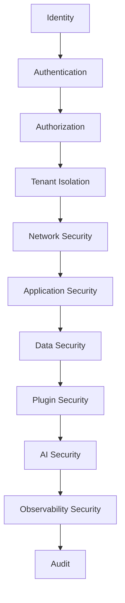
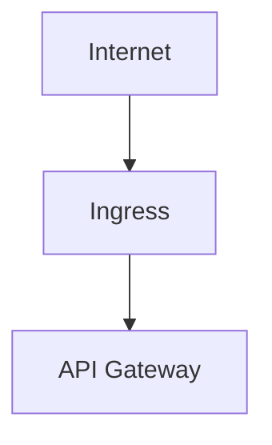
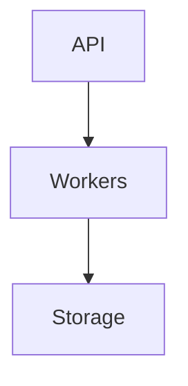
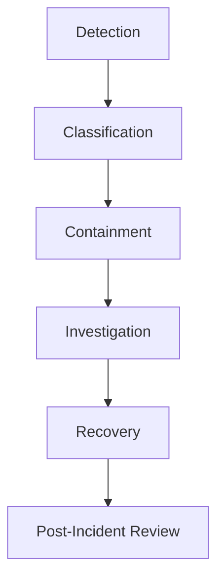

# TelemetryHealth Architecture Documentation

**Document ID:** TH-ARCH-014
**Title:** Security Architecture
**Status:** Approved
**Version:** 1.0
**Owner:** TelemetryHealth Core Team

**Related Documents**
- TH-ARCH-005 Clean Architecture
- TH-ARCH-008 Plugin Architecture
- TH-ARCH-010 API Design Guidelines
- TH-ARCH-012 Deployment Architecture
- TH-ARCH-013 Observability of TelemetryHealth
- TH-ARCH-015 Testing Strategy

---

# 1. Purpose

This document defines the Security Architecture of TelemetryHealth.

Security is treated as a cross-cutting architectural concern that influences every layer of the platform rather than an isolated subsystem.

The objective is to ensure confidentiality, integrity, availability, accountability, and tenant isolation while maintaining operational simplicity.

---

# 2. Security Principles

The architecture follows these principles.

## Security by Design

Security is designed into the platform from the beginning.

It is never added as an afterthought.

---

## Least Privilege

Every component receives only the permissions it requires.

Examples

- Worker → Worker permissions only
- Plugin → Plugin permissions only
- MCP → MCP permissions only

---

## Defense in Depth

Multiple independent security controls exist at different architectural layers.

Compromise of one layer must not compromise the entire platform.

---

## Zero Trust

No service automatically trusts another service.

Every request is authenticated and authorized.

---

## Secure Defaults

The default configuration should always be the safest configuration.

---

# 3. Security Domains



---

# 4. Identity Management

Every actor has an identity.

Actors include

- Users
- Services
- Plugins
- AI Providers
- API Clients
- Workers

Identities must be unique and verifiable.

---

# 5. Authentication

Supported mechanisms may include

- JWT
- OAuth2
- OpenID Connect
- API Keys
- mTLS (future)

Authentication occurs before business logic execution.

---

# 6. Authorization

Authorization is policy-based.

Examples

- Tenant Administrator
- Organization User
- Read Only
- System Administrator

Future support may include Attribute-Based Access Control (ABAC).

---

# 7. Tenant Isolation

TelemetryHealth is designed for multi-tenant deployments.

Isolation applies to:

- Data
- Queries
- Alerts
- Dashboards
- AI Context
- API Access

A tenant must never access another tenant's resources.

---

# 8. Network Security

External traffic



Internal communication



Future enhancements include:

- Service Mesh
- mTLS
- Network Policies

---

# 9. API Security

Every API request shall include

- Authentication
- Authorization
- Validation
- Rate Limiting
- Request Tracing

Input validation occurs before reaching the Application Layer.

---

# 10. Plugin Security

Plugins operate within defined trust boundaries.

Plugins SHALL NOT

- Access internal domain state directly
- Modify aggregates
- Read arbitrary files
- Execute unrestricted commands

Future roadmap

- Plugin sandboxing
- WASM execution
- Digital signatures
- Capability permissions

---

# 11. AI Security

AI integrations introduce additional risks.

Controls include

- Prompt validation
- Output validation
- Context filtering
- Model abstraction
- Secret redaction
- Tool permission checks

Prompt injection resistance should be considered throughout AI workflows.

---

# 12. Secret Management

Secrets SHALL NEVER be stored in

- Source code
- Git repositories
- Docker images
- Configuration files

Secrets should be provided through secure secret-management systems.

---

# 13. Data Security

Data protection includes

- Encryption in transit
- Encryption at rest (where supported)
- Integrity verification
- Backup encryption
- Secure deletion

Sensitive telemetry should be classified before storage.

---

# 14. Supply Chain Security

Every dependency represents a potential attack surface.

Practices include

- Dependency scanning
- Image signing
- SBOM generation
- Vulnerability scanning
- Trusted artifact repositories

Releases should use reproducible build processes where feasible.

---

# 15. Container Security

Containers SHOULD

- Run as non-root
- Use read-only root filesystems where possible
- Drop unnecessary Linux capabilities
- Minimize installed packages
- Define resource limits

---

# 16. Audit Logging

Security-relevant actions SHALL generate immutable audit records.

Examples

- Login
- Configuration changes
- Plugin installation
- Permission changes
- Secret rotation
- Administrative actions

Audit logs are separate from application logs.

---

# 17. Security Monitoring

Security telemetry includes

- Failed authentication attempts
- Authorization failures
- Rate limit violations
- Suspicious API usage
- Plugin failures
- Unexpected privilege escalation

Security events are observable through TelemetryHealth itself.

---

# 18. Incident Response

Security incidents should follow a documented workflow.



Security telemetry supports forensic analysis.

---

# 19. Compliance Readiness

The architecture should facilitate compliance with common security frameworks.

Examples include

- ISO 27001
- SOC 2
- NIST Cybersecurity Framework
- CIS Controls

Compliance requirements may vary by deployment.

---

# 20. Future Enhancements

Potential roadmap

- Service Mesh
- SPIFFE/SPIRE identities
- Hardware-backed secrets
- Runtime threat detection
- Continuous authorization
- Confidential computing
- AI-assisted threat detection

---

# 21. Security Architecture Overview

```
                    User

                     │

                     ▼

             Authentication

                     │

                     ▼

              Authorization

                     │

                     ▼

               API Gateway

                     │

                     ▼

          Application Services

                     │

        ┌────────────┼────────────┐

        ▼            ▼            ▼

   Plugins      Event Bus     AI Engine

        │            │            │

        └────────────┼────────────┘

                     ▼

                 Storage

                     │

                     ▼

            Audit & Monitoring
```

Security controls exist at every architectural layer.

---

# 22. Summary

Security in TelemetryHealth is an architectural responsibility shared across every subsystem.

By embedding identity, authorization, tenant isolation, secure communication, observability, and auditing into the platform, TelemetryHealth provides a foundation for secure and trustworthy operation in both single-tenant and multi-tenant environments.

---

## Related Documents

- TH-ARCH-010 API Design Guidelines
- TH-ARCH-012 Deployment Architecture
- TH-ARCH-013 Observability of TelemetryHealth
- TH-ARCH-015 Testing Strategy

---

**End of Document**