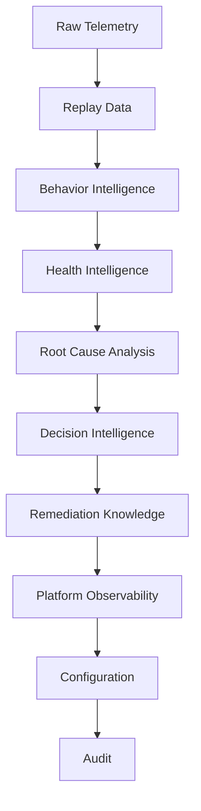
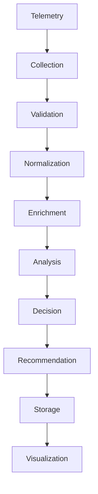
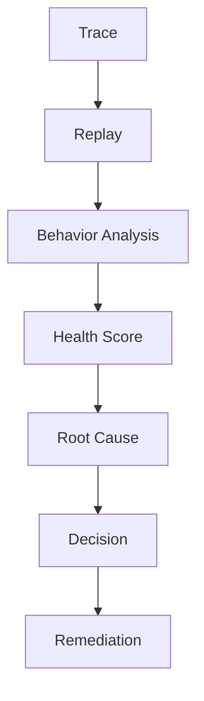
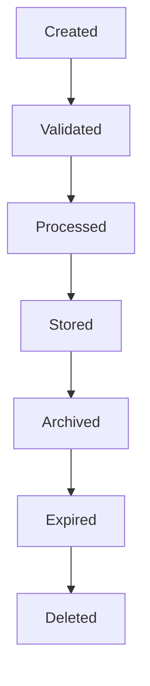
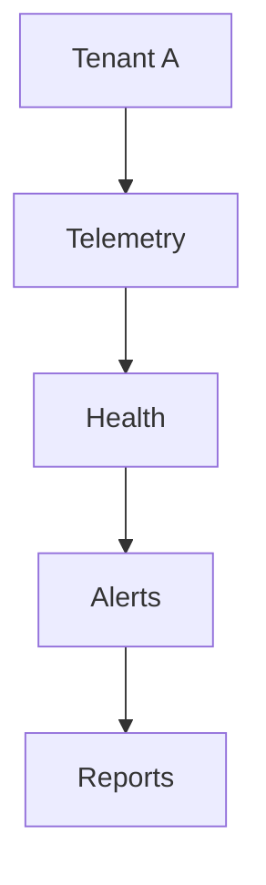
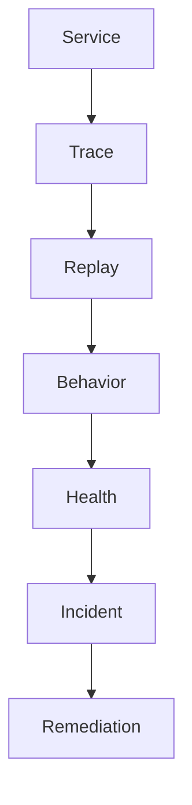

# TelemetryHealth Architecture Documentation

**Document ID:** TH-ARCH-016
**Title:** Data Architecture
**Status:** Approved
**Version:** 1.0
**Owner:** TelemetryHealth Core Team

**Related Documents**
- TH-ARCH-003 Bounded Contexts
- TH-ARCH-004 Domain Model
- TH-ARCH-007 System Workflow
- TH-ARCH-009 Event-Driven Architecture
- TH-ARCH-017 Storage Architecture

---

# 1. Purpose

This document defines the conceptual data architecture of TelemetryHealth.

It describes the platform's data domains, ownership, lifecycle, governance, relationships, and architectural principles independently of any storage technology.

Implementation details such as ClickHouse schemas, Kafka topics, and object storage are intentionally excluded and documented separately.

---

# 2. Data Philosophy

Data is the primary product of TelemetryHealth.

Every metric, trace, log, replay, health score, recommendation, and remediation represents knowledge generated from telemetry.

The architecture follows five principles:

- Data has a single owner.
- Data is immutable whenever practical.
- Data has an explicit lifecycle.
- Data is observable.
- Data evolves through versioned schemas.

---

# 3. Core Data Domains

TelemetryHealth manages several distinct data domains.



Each domain owns its own lifecycle and schema.

---

# 4. Data Ownership

Each bounded context owns its data.

| Domain | Owner |
|---------|-------|
| Raw Telemetry | Ingestion Context |
| Replay | Replay Context |
| Behavior | Behavior Context |
| Health | Health Context |
| Root Cause | Root Cause Context |
| Decision | Decision Context |
| Remediation | Remediation Context |
| Platform Metrics | Observability Context |
| Audit | Security Context |

No bounded context modifies another context's internal data directly.

Communication occurs through APIs or events.

---

# 5. Data Classification

Every dataset is classified.

### Operational Data

Supports runtime execution.

Examples

- Active replay jobs
- Queue state
- Worker status

---

### Analytical Data

Supports intelligence.

Examples

- Health scores
- Trends
- Cardinality analysis
- Pipeline statistics

---

### Configuration Data

Controls platform behavior.

Examples

- Plugin settings
- Feature flags
- Thresholds

---

### Audit Data

Supports accountability.

Examples

- Authentication logs
- Configuration changes
- Administrative actions

---

### Knowledge Data

Generated by AI.

Examples

- Root cause explanations
- Remediation plans
- Confidence scores
- AI summaries

---

# 6. Canonical Data Flow



Each transformation produces new information while preserving lineage.

---

# 7. Data Lineage

Every derived artifact maintains lineage to its source.

Example



Lineage supports traceability, debugging, and explainability.

---

# 8. Data Relationships

```
Telemetry
     │
     ├── Metrics
     ├── Traces
     └── Logs
            │
            ▼
      Replay
            │
            ▼
     Behavior Analysis
            │
            ▼
      Health Score
            │
            ▼
      Root Cause
            │
            ▼
      Decision
            │
            ▼
      Remediation
```

Each stage enriches rather than replaces earlier data.

---

# 9. Data Lifecycle

Every data type has a lifecycle.



Retention policies are defined separately in the Storage Architecture.

---

# 10. Immutability

Where practical, records are immutable.

Examples

Immutable

- Trace
- Metric
- Log
- Replay Result
- Root Cause Report

Mutable

- Configuration
- Feature Flags
- User Preferences

Immutability improves reproducibility and auditability.

---

# 11. Schema Evolution

Schemas evolve through versioning.

Rules

- Additive changes are preferred.
- Breaking changes require new versions.
- Deprecated fields follow a defined sunset policy.

Consumers should tolerate unknown fields.

---

# 12. Multi-Tenant Data Model

Every tenant owns a logically isolated dataset.



Cross-tenant access is prohibited unless explicitly authorized.

---

# 13. Data Quality

Every dataset should satisfy quality dimensions.

- Accuracy
- Completeness
- Consistency
- Timeliness
- Validity
- Uniqueness

Quality metrics should be observable.

---

# 14. Data Governance

Governance defines:

- Ownership
- Classification
- Retention
- Access
- Compliance
- Versioning

Every major dataset should have a documented owner.

---

# 15. Data Security

Data protections include:

- Encryption in transit
- Encryption at rest
- Tenant isolation
- Integrity verification
- Access auditing

Sensitive data should be classified before storage.

---

# 16. AI Knowledge Model

AI-generated artifacts are treated as first-class data.

Examples

- Confidence Score
- Explanation
- Recommendation
- Decision
- Generated YAML
- Risk Assessment

Every AI artifact records:

- Model
- Prompt version
- Context version
- Timestamp
- Confidence

This enables reproducibility and auditing.

---

# 17. Platform Knowledge Graph (Future)

Future versions may model relationships between entities as a knowledge graph.

Example relationships



This enables advanced reasoning and dependency analysis.

---

# 18. Data Architecture Principles

The platform follows these principles:

- Single source of truth
- Data ownership
- Event-driven synchronization
- Immutable historical records
- Explicit lifecycle management
- Versioned schemas
- Tenant isolation

---

# 19. Future Evolution

Potential enhancements include:

- Data catalog
- Metadata service
- Knowledge graph
- Data contracts
- Semantic layer
- Automated lineage tracking
- Data quality scoring

---

# 20. Summary

The Data Architecture defines the conceptual foundation for every piece of information managed by TelemetryHealth.

By separating data concepts from storage technology, the platform remains adaptable to future implementation changes while preserving consistent ownership, governance, lineage, and lifecycle management.

---

## Related Documents

- TH-ARCH-004 Domain Model
- TH-ARCH-007 System Workflow
- TH-ARCH-009 Event-Driven Architecture
- TH-ARCH-017 Storage Architecture
- TH-ARCH-019 AI Intelligence Architecture

---

**End of Document**