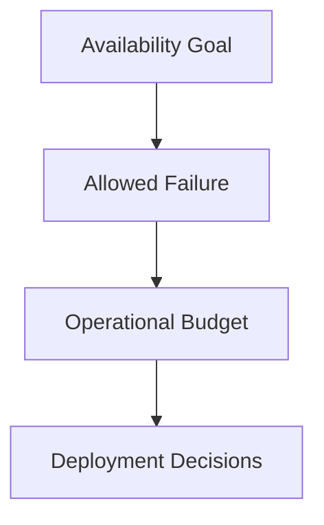
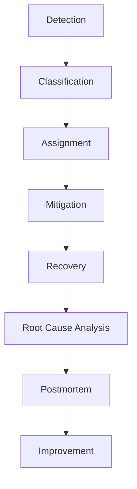

# TelemetryHealth Architecture Documentation

**Document ID:** TH-ARCH-022
**Title:** Operational Excellence
**Status:** Approved
**Version:** 1.0
**Owner:** TelemetryHealth Core Team

**Related Documents**
- TH-ARCH-012 Deployment Architecture
- TH-ARCH-013 Observability of TelemetryHealth
- TH-ARCH-014 Security Architecture
- TH-ARCH-015 Testing Strategy
- TH-ARCH-018 Performance Architecture
- TH-ARCH-021 Extensibility Architecture

---

# 1. Purpose

This document defines the Operational Excellence Architecture for TelemetryHealth.

Operational excellence ensures that the platform can be deployed, operated, monitored, maintained, and evolved reliably throughout its lifecycle.

The objective is not only to build reliable software but to operate it reliably in production.

---

# 2. Operational Philosophy

Operational excellence is founded on five principles.

- Reliability First
- Automation Before Manual Intervention
- Observability by Default
- Continuous Improvement
- Learning from Failure

Operations are considered an architectural concern rather than a post-deployment activity.

---

# 3. Operational Goals

The platform should provide:

- High availability
- Predictable deployments
- Fast incident response
- Reliable recovery
- Continuous monitoring
- Controlled change management
- Measurable operational health

---

# 4. Operational Architecture

```
                 Users

                    │

                    ▼

             TelemetryHealth

                    │

      ┌─────────────┼─────────────┐

      ▼             ▼             ▼

 Monitoring     Alerting      Automation

      │             │             │

      └─────────────┼─────────────┘

                    ▼

            Incident Response

                    │

                    ▼

               Continuous Learning
```

Operations are continuous rather than reactive.

---

# 5. Reliability Engineering

Reliability is designed into the platform.

Key principles include:

- Fault tolerance
- Graceful degradation
- Redundancy
- Automatic recovery
- Failure isolation

Every critical service should tolerate component failures.

---

# 6. Service Level Indicators (SLIs)

Representative SLIs include:

### Availability

- API uptime
- Dashboard availability
- MCP availability

### Latency

- API response time
- Dashboard load time
- Health computation time

### Throughput

- Telemetry ingestion rate
- Events processed per second
- Replay jobs completed

### Quality

- Telemetry processing success rate
- AI validation success
- Alert delivery success

---

# 7. Service Level Objectives (SLOs)

Examples:

| Service | Objective |
|----------|-----------|
| Platform Availability | 99.9% |
| API Availability | 99.95% |
| Dashboard Availability | 99.9% |
| Health Engine | 99.9% |
| Event Processing | 99.9% |
| Alert Delivery | 99% |

These objectives should evolve with operational maturity.

---

# 8. Error Budgets

Error budgets balance innovation and reliability.



If the error budget is exhausted:

- Reduce deployment frequency
- Prioritize reliability work
- Delay non-critical features

---

# 9. Incident Management

Every production incident follows a standard lifecycle.



Incidents should produce long-term improvements rather than temporary fixes.

---

# 10. Severity Levels

### SEV-1

Complete platform outage

### SEV-2

Major feature unavailable

### SEV-3

Partial degradation

### SEV-4

Minor operational issue

Each severity level defines expected response times.

---

# 11. Operational Runbooks

Critical services should have documented runbooks.

Examples:

- Collector unavailable
- Kafka backlog
- ClickHouse failure
- High cardinality explosion
- AI provider outage
- MCP unavailable
- Plugin failure

Runbooks should be executable by operators with minimal ambiguity.

---

# 12. Change Management

Changes should be:

- Reviewed
- Tested
- Observable
- Reversible

Deployment should never be the first validation of a change.

---

# 13. Release Strategy

Supported deployment strategies include:

- Rolling Update
- Blue-Green Deployment
- Canary Release
- Feature Flags

The chosen strategy depends on deployment risk.

---

# 14. Disaster Recovery

Disaster recovery objectives include:

- Service restoration
- Data integrity
- Controlled failover
- Backup restoration
- Operational continuity

Recovery plans should be tested regularly.

---

# 15. Backup Verification

Backups are only considered successful after restoration testing.

Verification includes:

- Data restoration
- Configuration recovery
- Platform startup
- Health validation

Unverified backups should not be considered reliable.

---

# 16. Capacity Management

Capacity planning includes:

- Storage growth
- Telemetry volume
- Active tenants
- AI workload
- Worker utilization

Operational decisions should be supported by measurable trends.

---

# 17. Automation

Operational tasks should be automated whenever practical.

Examples:

- Deployment
- Health checks
- Scaling
- Backup execution
- Certificate renewal
- Configuration validation

Manual operations should be minimized.

---

# 18. Operational Security

Operational activities include:

- Access auditing
- Secret rotation
- Certificate management
- Vulnerability scanning
- Compliance verification

Operations should follow the principle of least privilege.

---

# 19. Continuous Improvement

Operational improvements should originate from:

- Incidents
- Performance reviews
- Security findings
- Customer feedback
- Postmortems
- Operational metrics

Every operational event is an opportunity to improve the platform.

---

# 20. Operational Maturity Model

Level 1 — Reactive

Manual operations

---

Level 2 — Managed

Basic monitoring and documented procedures

---

Level 3 — Automated

Automated deployments and operational workflows

---

Level 4 — Predictive

Capacity forecasting and proactive alerting

---

Level 5 — Autonomous

Self-healing infrastructure and AI-assisted operations

---

# 21. Operational Dashboard

The platform should expose a unified operational dashboard.

Key indicators include:

- Platform Health Score
- Availability
- Active incidents
- Queue depth
- Resource utilization
- Deployment status
- Storage health
- AI health
- Security health
- Error budget consumption

The dashboard provides a single operational view of the platform.

---

# 22. Operational Excellence Overview

```
                    Users

                       │

                       ▼

               TelemetryHealth

                       │

        ┌──────────────┼──────────────┐

        ▼              ▼              ▼

   Monitoring      Alerting      Automation

        │              │              │

        ▼              ▼              ▼

   Incident Mgmt  Recovery      Deployment

        │              │              │

        └──────────────┼──────────────┘

                       ▼

             Continuous Improvement
```

Operational excellence is a continuous feedback loop.

---

# 23. Future Evolution

Potential future capabilities include:

- AI-assisted incident response
- Autonomous remediation
- Predictive capacity planning
- Intelligent deployment orchestration
- Automated operational audits
- Self-healing infrastructure

Future enhancements should preserve transparency and operator control.

---

# 24. Summary

Operational Excellence defines how TelemetryHealth is operated reliably throughout its lifecycle.

By combining reliability engineering, observability, automation, disciplined change management, and continuous improvement, the platform provides a resilient operational model capable of supporting production-scale deployments.

---

## Related Documents

- TH-ARCH-012 Deployment Architecture
- TH-ARCH-013 Observability of TelemetryHealth
- TH-ARCH-014 Security Architecture
- TH-ARCH-015 Testing Strategy
- TH-ARCH-018 Performance Architecture
- TH-ARCH-021 Extensibility Architecture

---

**End of Document**