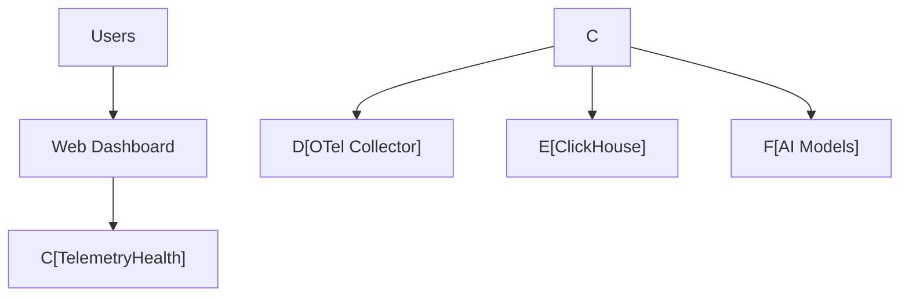
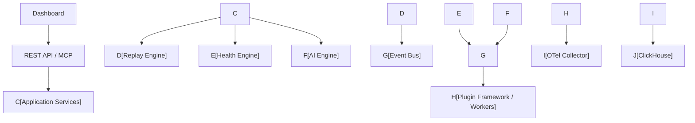
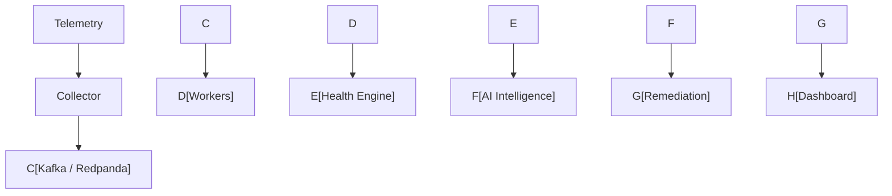
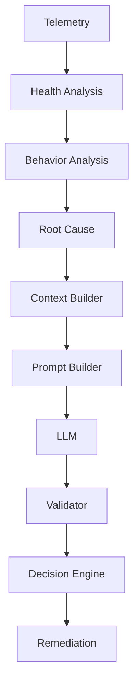

# 📖 TH-ARCH-026 — Reference Architecture

This is **the most important document in the entire repository**.

Everything else points to this.

Think of it as the **constitution of TelemetryHealth**.

---

# TH-ARCH-026

# Reference Architecture

```markdown
# TelemetryHealth Architecture Documentation

Document ID: TH-ARCH-026
Title: Reference Architecture
Status: Draft v1.0
Version: 1.0
Owner: TelemetryHealth Architecture Team

Related Documents

TH-ARCH-001 to TH-ARCH-025
```

---

# 1. Purpose

The Reference Architecture provides the authoritative blueprint for the TelemetryHealth platform.

It consolidates the architectural principles, system structure, runtime behavior, deployment models, operational practices, and engineering standards into a single cohesive specification.

This document serves as the primary entry point for architects, developers, contributors, and reviewers seeking to understand how the platform is designed as a whole.

---

# 2. Vision

TelemetryHealth transforms raw telemetry into actionable operational intelligence.

The platform continuously analyzes the health of the observability pipeline itself, detects anomalies, identifies root causes, generates explainable recommendations, and enables intelligent remediation.

Its architecture is designed to be:

* Observable
* Extensible
* Secure
* AI-native
* Cloud-native
* Event-driven
* Production-ready

---

# 3. Architectural Goals

The architecture is guided by the following goals:

* High availability
* Horizontal scalability
* Clean separation of concerns
* Strong observability
* Vendor neutrality
* AI provider independence
* Modular evolution
* Operational excellence

---

# 4. System Context



TelemetryHealth sits between telemetry producers and operational intelligence consumers.

---

# 5. High-Level Architecture



---

# 6. Architectural Layers

The platform is organized into distinct architectural layers:

* Presentation Layer
* API Layer
* Application Layer
* Domain Layer
* Infrastructure Layer
* Data Layer

Each layer depends only on the layer directly beneath it, following Clean Architecture principles.

---

# 7. Core Domains

The primary bounded contexts are:

* Telemetry Ingestion
* Replay
* Health Analysis
* Root Cause Analysis
* AI Intelligence
* Remediation
* Plugin Management
* Configuration
* Operations

Each domain owns its data and business logic.

---

# 8. Runtime Workflow



---

# 9. Data Flow

The platform processes telemetry through the following stages:

1. Collection
2. Validation
3. Enrichment
4. Storage
5. Health Analysis
6. Root Cause Detection
7. AI Reasoning
8. Recommendation
9. Visualization

---

# 10. Intelligence Pipeline



---

# 11. Event-Driven Model

All major platform components communicate through events where appropriate.

Benefits include:

* Loose coupling
* Horizontal scalability
* Independent deployment
* Failure isolation
* Asynchronous processing

---

# 12. Storage Architecture

Primary storage technologies include:

* ClickHouse (analytical telemetry)
* Redpanda/Kafka (event streaming)
* Object Storage (future archival)
* Configuration Store
* Secret Store

The platform follows a polyglot persistence strategy.

---

# 13. Security Model

Security is implemented through:

* Authentication
* Role-Based Access Control
* Tenant isolation
* Secret management
* Audit logging
* Encryption in transit
* Encryption at rest

---

# 14. Performance Model

Performance objectives include:

* Low-latency telemetry ingestion
* Parallel event processing
* Efficient analytical queries
* Horizontal worker scaling

Performance budgets are defined in TH-ARCH-018.

---

# 15. Observability

The platform observes itself using:

* Metrics
* Logs
* Traces
* Health Scores
* Internal telemetry

TelemetryHealth is self-observing by design.

---

# 16. Deployment Models

Supported deployment models include:

* Local Development
* Docker Compose
* Kubernetes
* Cloud-native deployments
* Air-gapped enterprise environments

---

# 17. Plugin Ecosystem

The platform supports extension through plugins.

Supported extension points include:

* Health rules
* AI providers
* Notification channels
* Storage adapters
* Exporters
* MCP tools

Plugins interact through stable contracts and dependency inversion.

---

# 18. Quality Attributes

The architecture prioritizes:

* Availability
* Reliability
* Performance
* Scalability
* Security
* Maintainability
* Extensibility
* Observability
* Testability
* Portability

These attributes guide all architectural decisions.

---

# 19. Technology Stack

| Layer      | Technology           |
| ---------- | -------------------- |
| Frontend   | React                |
| Backend    | Go                   |
| Storage    | ClickHouse           |
| Streaming  | Redpanda / Kafka     |
| Telemetry  | OpenTelemetry        |
| AI         | Provider Abstraction |
| Deployment | Docker / Kubernetes  |

Technologies may evolve while preserving architectural principles.

---

# 20. Architectural Governance

The architecture evolves through:

* Architecture Decision Records (ADRs)
* Code Reviews
* Architecture Reviews
* Testing
* Continuous Documentation

Major architectural changes require documented decisions.

---

# 21. Reference Documents

This document is supported by:

* TH-ARCH-001: Architecture Principles
* TH-ARCH-004: Domain Model
* TH-ARCH-007: System Workflow
* TH-ARCH-009: Event-Driven Architecture
* TH-ARCH-012: Deployment Architecture
* TH-ARCH-013: Observability
* TH-ARCH-014: Security
* TH-ARCH-018: Performance
* TH-ARCH-019: AI Intelligence
* TH-ARCH-020: MCP Architecture
* TH-ARCH-022: Operational Excellence
* TH-ARCH-025: Architecture Decision Records

---

# 22. Summary

The TelemetryHealth Reference Architecture is the authoritative architectural specification of the platform.

It unifies the principles, structures, workflows, and engineering practices defined throughout the architecture handbook into a single coherent blueprint.

As the platform evolves, this document should remain the primary architectural reference, ensuring that all future development aligns with the long-term vision of an intelligent, observable, extensible, and production-ready telemetry health platform.

---

End of Document

