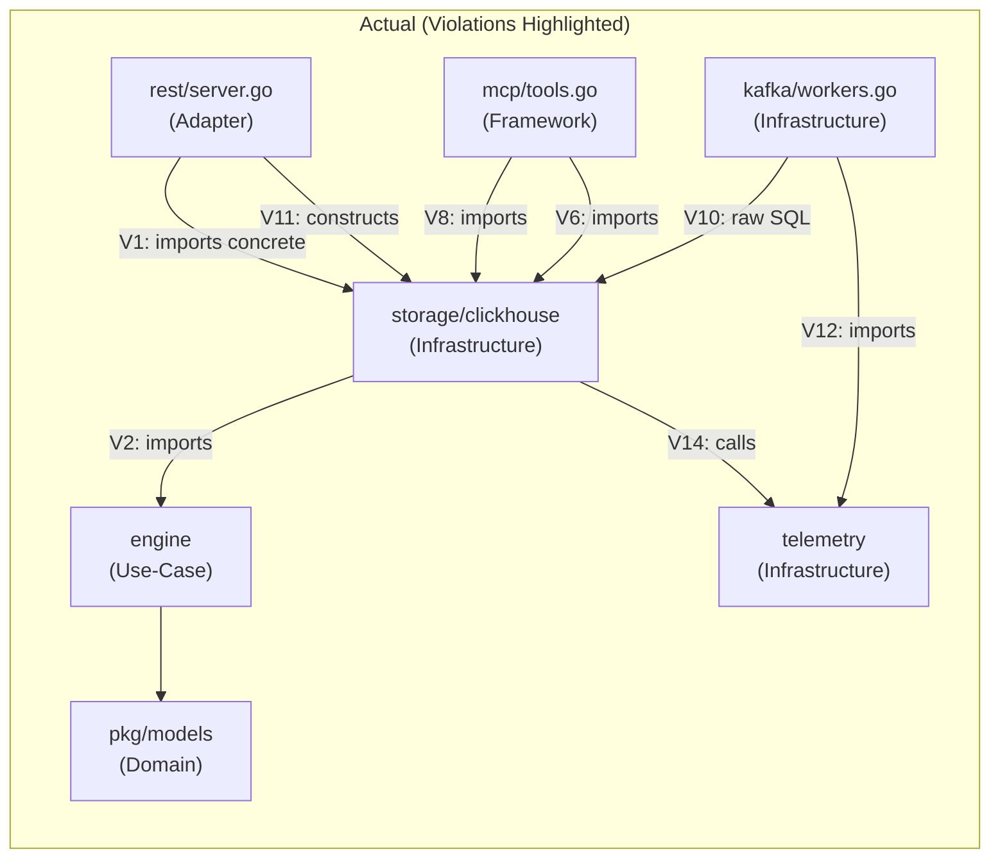
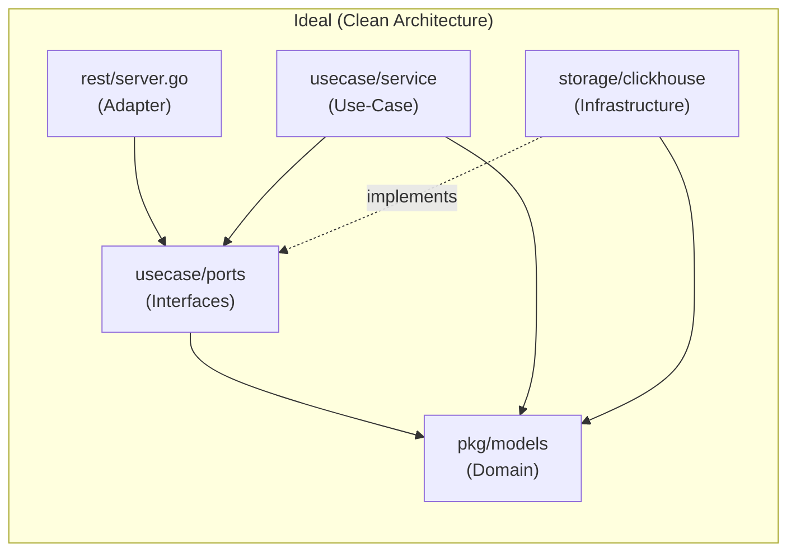

# TelemetryHealth — Clean Architecture Audit

Date: 2026-07-17
Method: Source-traced actual import chains, struct field types, constructor signatures, and interface usage across the entire `control-plane/` codebase.
Constraint: Read-only review — no code changes.

---

## Architecture Layer Map (As Implemented)

Before listing violations, here is the actual layer layout of the codebase:

```
┌──────────────────────────────────────────────────────────┐
│  FRAMEWORK / DRIVER (Outermost)                          │
│  ├─ cmd/*                   (entrypoints)                │
│  ├─ internal/storage/clickhouse/*  (ClickHouse driver)   │
│  ├─ internal/kafka/*        (Kafka producer/consumer)    │
│  ├─ internal/ingest/*       (gRPC OTLP receiver)         │
│  ├─ internal/mcp/*          (MCP server/client)          │
│  ├─ internal/alerting/*     (Slack/PD/SigNoz bridges)    │
│  └─ internal/telemetry/*    (Prometheus + OTel SDK)      │
├──────────────────────────────────────────────────────────┤
│  INTERFACE ADAPTER (Controller / Gateway)                 │
│  └─ internal/api/rest/*     (HTTP handlers, router)      │
├──────────────────────────────────────────────────────────┤
│  APPLICATION / USE CASE                                   │
│  ├─ internal/engine/*       (graph generation logic)     │
│  ├─ internal/behavior/*     (behavior reconstruction)    │
│  ├─ internal/decision/*     (decision reconstruction)    │
│  ├─ internal/rootcause/*    (root cause analysis)        │
│  ├─ internal/remediation/*  (YAML generation/validation) │
│  └─ internal/streaming/*    (streaming jobs — dead code) │
├──────────────────────────────────────────────────────────┤
│  DOMAIN / ENTITY (Innermost)                              │
│  └─ pkg/models/*            (domain types)               │
└──────────────────────────────────────────────────────────┘
```

In Clean Architecture, dependencies must flow **inward only**: Framework → Adapter → Use Case → Domain. The inner layers must never import the outer layers.

---

## Summary of Violations

| # | Category | Severity | Location | Short Description |
|---|---|---|---|---|
| V1 | Dependency Direction | 🔴 Critical | `rest/server.go` → `clickhouse` | Controller imports concrete infrastructure |
| V2 | Dependency Direction | 🔴 Critical | `replay_repository.go` → `engine` | Infrastructure imports use-case types |
| V3 | Repository Abstraction | 🔴 Critical | `Server.healthRepo` | Concrete `*clickhouse.HealthRepository` not an interface |
| V4 | Repository Abstraction | 🟠 High | `Server` constructor | Constructs `clickhouse.NewReplayRepository` inside adapter |
| V5 | Interface Segregation | 🟠 High | `HealthRepository` | God repository with 7+ unrelated methods |
| V6 | Interface Segregation | 🟠 High | `mcp.Toolset` | Concrete types in struct fields |
| V7 | Domain Isolation | 🔴 Critical | `rest/server.go` handlers | Business logic (scoring, remediation) inline in HTTP handlers |
| V8 | Domain Isolation | 🟠 High | `mcp/tools.go` → `clickhouse`, `remediation` | MCP tool layer directly imports infrastructure |
| V9 | Domain Isolation | 🟡 Medium | `engine/graph.go` DTO coupling | Use-case layer defines React Flow presentation DTOs |
| V10 | Infrastructure Coupling | 🔴 Critical | `kafka/workers.go` | Raw SQL strings embedded in message handler |
| V11 | Infrastructure Coupling | 🟠 High | `rest/server.go` L729 | Handler constructs `clickhouse.NewHealthRepository(nil)` |
| V12 | Infrastructure Coupling | 🟡 Medium | `kafka/consumer.go` → `telemetry` | Generic consumer coupled to Prometheus metrics |
| V13 | Dependency Direction | 🟡 Medium | `behavior`, `decision`, `rootcause` | Duplicate domain types vs `engine` package |
| V14 | Domain Isolation | 🟡 Medium | `health_repository.go` | Domain scoring logic called inside repository |

---

## Detailed Violations

---

### V1 — Controller Directly Imports Concrete Infrastructure

> **Category:** Dependency Direction
> **Severity:** 🔴 Critical

**Files:**
- [server.go L33](file:///c:/Users/sunanda.AMFIIND/Desktop/SHUBHAM%20PROJECT/TelemetryHealth_/control-plane/internal/api/rest/server.go#L33) — `import "internal/storage/clickhouse"`
- [server.go L42](file:///c:/Users/sunanda.AMFIIND/Desktop/SHUBHAM%20PROJECT/TelemetryHealth_/control-plane/internal/api/rest/server.go#L42) — `import "clickhouse-go/v2/lib/driver"`
- [server.go L59](file:///c:/Users/sunanda.AMFIIND/Desktop/SHUBHAM%20PROJECT/TelemetryHealth_/control-plane/internal/api/rest/server.go#L59) — `healthRepo *clickhouse.HealthRepository`

**Current:**
```go
// rest/server.go
import (
    "github.com/frag2win/TelemetryHealth/control-plane/internal/storage/clickhouse"
    "github.com/ClickHouse/clickhouse-go/v2/lib/driver"
)

type Server struct {
    healthRepo  *clickhouse.HealthRepository   // ← concrete ClickHouse type
    // ...
}
```

The HTTP controller (interface adapter layer) imports and holds a direct reference to `*clickhouse.HealthRepository` (infrastructure/driver layer). This violates the Dependency Rule: adapters must depend on **interfaces defined in inner layers**, never on concrete infrastructure.

**Ideal:**
```go
// rest/server.go
type Server struct {
    healthRepo  usecase.HealthQuerier   // ← interface from use-case layer
    // ...
}
```
The controller holds an interface defined in the use-case or domain layer. No import of `internal/storage/clickhouse` or `clickhouse-go` driver appears anywhere in `rest/`.

**Refactor:**
1. Define a `HealthQuerier` interface in `internal/usecase/` (or `internal/domain/`) with only the methods the REST handlers actually call.
2. Change `Server.healthRepo` from `*clickhouse.HealthRepository` to that interface.
3. Remove the `import "internal/storage/clickhouse"` and `import "clickhouse-go/v2/lib/driver"` from `rest/server.go`.
4. Wire the concrete implementation in `cmd/api-server/main.go` (composition root).

---

### V2 — Infrastructure Imports Use-Case Package

> **Category:** Dependency Direction
> **Severity:** 🔴 Critical

**File:** [replay_repository.go L10](file:///c:/Users/sunanda.AMFIIND/Desktop/SHUBHAM%20PROJECT/TelemetryHealth_/control-plane/internal/storage/clickhouse/replay_repository.go#L10)

**Current:**
```go
// storage/clickhouse/replay_repository.go
import (
    "github.com/frag2win/TelemetryHealth/control-plane/internal/engine"
)

func (r *ClickhouseReplayRepository) GetReplay(...) ([]engine.ReplayEvent, error) {
```

The infrastructure layer (`storage/clickhouse`) imports the use-case layer (`internal/engine`) to return `engine.ReplayEvent`. Dependency flows **outward** — infrastructure depends on use-case — exactly backwards from the Clean Architecture rule.

**Ideal:**
```go
// Domain layer: pkg/models/replay.go
type ReplayEvent struct { ... }

// Infrastructure: storage/clickhouse/replay_repository.go
import "github.com/frag2win/TelemetryHealth/control-plane/pkg/models"
func (r *...) GetReplay(...) ([]models.ReplayEvent, error) { ... }

// Use-case: engine/types.go
import "github.com/frag2win/TelemetryHealth/control-plane/pkg/models"
type ReplayRepository interface {
    GetReplay(ctx context.Context, tenantID, traceID string) ([]models.ReplayEvent, error)
}
```

Both the infrastructure and use-case layers depend only on the domain layer (innermost). Neither imports the other.

**Refactor:**
1. Move `engine.ReplayEvent` struct to `pkg/models/replay_event.go`.
2. Update `engine.ReplayRepository` interface to use `models.ReplayEvent`.
3. Update `clickhouse.ClickhouseReplayRepository` to return `models.ReplayEvent`.
4. Remove `import "internal/engine"` from `replay_repository.go`.

---

### V3 — No Repository Interface for HealthRepository

> **Category:** Repository Abstraction
> **Severity:** 🔴 Critical

**File:** [server.go L59](file:///c:/Users/sunanda.AMFIIND/Desktop/SHUBHAM%20PROJECT/TelemetryHealth_/control-plane/internal/api/rest/server.go#L59)

**Current:**
```go
type Server struct {
    healthRepo *clickhouse.HealthRepository   // concrete struct pointer
}
```

`HealthRepository` is a 555-line concrete struct with 7 public methods. No interface exists for it. Every consumer must import the ClickHouse package directly. This makes the system untestable without a running ClickHouse instance and makes swapping storage backends impossible.

**Ideal:**
```go
// internal/domain/ports.go (or internal/usecase/ports.go)
type HealthQuerier interface {
    QueryHealthMetrics(ctx context.Context, tenantID string) (*HealthMetrics, error)
    GetTenantWeights(ctx context.Context, tenantID string) (TenantWeights, error)
}

type HealthWriter interface {
    SaveTenantConfig(ctx context.Context, tenantID string, weights TenantWeights) error
    LogRemediationEvent(ctx context.Context, ...) error
}
```

**Refactor:**
1. Extract interfaces for each logical responsibility (see also V5).
2. `*clickhouse.HealthRepository` implements these interfaces.
3. All consumers (REST server, MCP toolset) depend on the interface, not the concrete type.
4. Mock implementations become trivial for unit tests.

---

### V4 — Adapter Layer Constructs Infrastructure Objects

> **Category:** Repository Abstraction
> **Severity:** 🟠 High

**File:** [server.go L67-71](file:///c:/Users/sunanda.AMFIIND/Desktop/SHUBHAM%20PROJECT/TelemetryHealth_/control-plane/internal/api/rest/server.go#L66-L71)

**Current:**
```go
func NewServer(logger *zap.Logger, healthRepo *clickhouse.HealthRepository) *Server {
    var conn driver.Conn
    if healthRepo != nil {
        conn = healthRepo.DB()           // ← reaches into infra internals
    }
    replayRepo := clickhouse.NewReplayRepository(conn, logger)  // ← constructs infra
    return &Server{
        graphEngine: engine.NewEngine(replayRepo),
        // ...
    }
}
```

The REST server constructor reaches into the ClickHouse `healthRepo` to extract a raw `driver.Conn`, then constructs a second ClickHouse repository. This leaks infrastructure concerns into the adapter layer.

**Ideal:**
```go
func NewServer(logger *zap.Logger, healthRepo HealthQuerier, graphEngine *engine.Engine) *Server {
    // No infrastructure construction here — all injected from composition root
}
```

**Refactor:**
1. Move all `clickhouse.New*()` construction into `cmd/api-server/main.go` (the composition root).
2. Inject `*engine.Engine` as a pre-constructed dependency.
3. Remove `healthRepo.DB()` accessor — it exists solely to support this anti-pattern.
4. Remove `import "clickhouse-go/v2/lib/driver"` from `rest/server.go`.

---

### V5 — HealthRepository Is a God Object (Interface Segregation)

> **Category:** Interface Segregation
> **Severity:** 🟠 High

**File:** [health_repository.go](file:///c:/Users/sunanda.AMFIIND/Desktop/SHUBHAM%20PROJECT/TelemetryHealth_/control-plane/internal/storage/clickhouse/health_repository.go)

**Current:**
```go
type HealthRepository struct { ... }

func (r *HealthRepository) QueryHealthMetrics(...)    // health dashboard reads
func (r *HealthRepository) GetTenantWeights(...)      // config reads
func (r *HealthRepository) SaveTenantConfig(...)      // config writes
func (r *HealthRepository) LogRemediationEvent(...)   // audit writes
func (r *HealthRepository) QueryAgentTraces(...)      // LLM agent trace reads
func (r *HealthRepository) QuerySpansByTraceID(...)   // span/trace reads
func (r *HealthRepository) DB() driver.Conn           // raw connection accessor
```

Seven unrelated responsibilities in one struct. The `GetTenantHealth` handler needs only `QueryHealthMetrics` + `GetTenantWeights`, but receives all 7 methods. Violates ISP: clients are forced to depend on methods they don't use.

**Ideal:**
```go
type HealthQuerier interface {
    QueryHealthMetrics(ctx context.Context, tenantID string) (*HealthMetrics, error)
    GetTenantWeights(ctx context.Context, tenantID string) (TenantWeights, error)
}

type TenantConfigWriter interface {
    SaveTenantConfig(ctx context.Context, tenantID string, weights TenantWeights) error
}

type AuditLogger interface {
    LogRemediationEvent(ctx context.Context, ...) error
}

type AgentTraceQuerier interface {
    QueryAgentTraces(ctx context.Context) ([]AgentTrace, error)
}

type SpanQuerier interface {
    QuerySpansByTraceID(ctx context.Context, traceID string) ([]SpanData, error)
}
```

**Refactor:**
1. Define 5 focused interfaces in the use-case or domain layer.
2. `*clickhouse.HealthRepository` implicitly implements all 5 (Go duck typing).
3. Each handler receives only the interface it needs.
4. Remove `DB() driver.Conn` entirely — it only exists to leak the connection to the adapter.

---

### V6 — MCP Toolset Uses Concrete Infrastructure Types

> **Category:** Interface Segregation
> **Severity:** 🟠 High

**File:** [tools.go L40-44](file:///c:/Users/sunanda.AMFIIND/Desktop/SHUBHAM%20PROJECT/TelemetryHealth_/control-plane/internal/mcp/tools.go#L40-L44)

**Current:**
```go
import (
    "github.com/frag2win/TelemetryHealth/control-plane/internal/remediation"
    "github.com/frag2win/TelemetryHealth/control-plane/internal/storage/clickhouse"
)

type Toolset struct {
    HealthRepo *clickhouse.HealthRepository   // ← concrete infra
    Generator  *remediation.Generator          // ← concrete use-case
    Validator  *remediation.Validator          // ← concrete use-case
    Logger     *zap.Logger
}
```

The MCP package (a separate framework/driver layer) directly imports both infrastructure (`clickhouse`) and concrete use-case types (`remediation`). It should depend on interfaces.

**Ideal:**
```go
type Toolset struct {
    HealthQuerier  HealthQuerier     // interface
    Remediator     Remediator        // interface
    Logger         *zap.Logger
}
```

**Refactor:**
1. Define `HealthQuerier` and `Remediator` interfaces in the use-case layer.
2. Replace concrete struct pointers with interface fields.
3. Remove `import "internal/storage/clickhouse"` from `mcp/tools.go`.

---

### V7 — Business Logic Embedded in HTTP Handlers

> **Category:** Domain Isolation
> **Severity:** 🔴 Critical

**File:** [server.go L409-490](file:///c:/Users/sunanda.AMFIIND/Desktop/SHUBHAM%20PROJECT/TelemetryHealth_/control-plane/internal/api/rest/server.go#L409-L490) (GetTenantHealth handler)

**Current:**
```go
func (s *Server) GetTenantHealth(w http.ResponseWriter, r *http.Request) {
    // ... validation ...
    metrics, err := s.healthRepo.QueryHealthMetrics(r.Context(), tenantID)
    // ... error handling ...

    // BUSINESS LOGIC inline in handler:
    issueType := metrics.RemediationIssue
    remediation := ""
    if issueType != "" {
        remediation, _ = s.generator.Generate(r.Context(), issueType)
        validated, _ = s.validator.Validate(r.Context(), remediation)
    }

    // DTO ASSEMBLY inline in handler:
    resp := mcp.HealthResponse{
        HealthScore: metrics.CompositeScore,
        Metrics: mcp.MetricsPayload{ ... },
        Remediation: mcp.RemediationPayload{ ... },
    }
    json.NewEncoder(w).Encode(resp)
}
```

The handler directly orchestrates health querying, remediation generation, remediation validation, DTO assembly, and score formatting. This is use-case logic that should live in a dedicated service/interactor.

**Ideal:**
```go
// internal/usecase/health_service.go
type HealthService struct { ... }
func (s *HealthService) GetTenantHealth(ctx context.Context, tenantID string) (*HealthReport, error) {
    // all orchestration logic here
}

// rest/server.go — thin HTTP adapter
func (s *Server) GetTenantHealth(w http.ResponseWriter, r *http.Request) {
    tenantID := chi.URLParam(r, "tenant_id")
    report, err := s.healthService.GetTenantHealth(r.Context(), tenantID)
    // marshal and write
}
```

**Refactor:**
1. Create `internal/usecase/health_service.go` with a `HealthService` struct.
2. Move the orchestration (query → generate → validate → assemble) into `HealthService.GetTenantHealth`.
3. The REST handler becomes a thin adapter: parse request → call service → write response.
4. This also decouples the MCP toolset from duplicating the same orchestration logic (see [tools.go L54-93](file:///c:/Users/sunanda.AMFIIND/Desktop/SHUBHAM%20PROJECT/TelemetryHealth_/control-plane/internal/mcp/tools.go#L54-L93), which is a near-copy).

---

### V8 — MCP Tool Layer Directly Imports Infrastructure

> **Category:** Domain Isolation
> **Severity:** 🟠 High

**File:** [tools.go L7-8](file:///c:/Users/sunanda.AMFIIND/Desktop/SHUBHAM%20PROJECT/TelemetryHealth_/control-plane/internal/mcp/tools.go#L7-L8)

**Current:**
```go
import (
    "github.com/frag2win/TelemetryHealth/control-plane/internal/remediation"
    "github.com/frag2win/TelemetryHealth/control-plane/internal/storage/clickhouse"
)
```

And `tools.go:54-92` duplicates the exact same orchestration logic that exists in the REST handler (`GetTenantHealth`). Both call `HealthRepo.QueryHealthMetrics → generator.Generate → validator.Validate`. This is a domain isolation violation: two separate framework layers independently contain the same business logic.

**Ideal:**
Both the REST handler and the MCP tool call the same `HealthService.GetTenantHealth()` use-case method. Neither directly imports infrastructure.

**Refactor:**
1. After V7's `HealthService` is created, inject it into both `rest.Server` and `mcp.Toolset`.
2. `mcp.Toolset.GetTelemetryHealth` becomes a one-liner: `return s.healthService.GetTenantHealth(ctx, tenantID)`.
3. Remove infrastructure imports from `mcp/tools.go`.

---

### V9 — Use-Case Layer Defines Presentation DTOs

> **Category:** Domain Isolation
> **Severity:** 🟡 Medium

**File:** [engine/graph.go L8-38](file:///c:/Users/sunanda.AMFIIND/Desktop/SHUBHAM%20PROJECT/TelemetryHealth_/control-plane/internal/engine/graph.go#L8-L38)

**Current:**
```go
// engine/graph.go — USE-CASE LAYER
type GraphNode struct {
    ID       string        `json:"id"`
    Position NodePosition  `json:"position"`   // ← React Flow x/y coordinates
    Data     GraphNodeData `json:"data"`
    Type     string        `json:"type,omitempty"` // "For custom react flow nodes"
}
```

The `engine` package (use-case layer) defines `GraphNode` with `Position{X, Y}` fields and a comment explicitly referencing "custom react flow nodes." These are **presentation-layer** concerns (how the React frontend renders the graph). The use-case layer should output a logical graph; the adapter layer should map it to React Flow's specific format.

**Ideal:**
```go
// engine/graph.go — pure domain graph
type Graph struct {
    Nodes []LogicalNode
    Edges []LogicalEdge
}

// rest/dto/react_flow.go — adapter transforms to React Flow format
func ToReactFlowGraph(g engine.Graph) ReactFlowGraph { ... }
```

**Refactor:**
1. Remove `Position`, React Flow `Type` field, and x/y coordinate logic from `engine.Graph`.
2. Have the engine return a pure logical graph.
3. Create a `rest/dto/` or `rest/presenter/` package that transforms the logical graph into React Flow JSON.

---

### V10 — Raw SQL in Kafka Worker (Infrastructure Coupling)

> **Category:** Infrastructure Coupling
> **Severity:** 🔴 Critical

**File:** [workers.go](file:///c:/Users/sunanda.AMFIIND/Desktop/SHUBHAM%20PROJECT/TelemetryHealth_/control-plane/internal/kafka/workers.go)

**Current:**
```go
// kafka/workers.go
func (ws *WorkerSet) handleCardinalityBatch(ctx context.Context, events []CardinalityEvent) error {
    batch, err := ws.chConn.PrepareBatch(ctx, `
        INSERT INTO telemetry_health.cardinality_signal
        (tenant_id, service, attribute_key, window_start, unique_estimate)
        VALUES (?, ?, ?, ?, ?)`)
    // ... iterate and append ...
}
```

The Kafka worker (a message-handling concern) contains raw ClickHouse SQL and direct `driver.Conn` batch operations. Two separate infrastructure concerns (Kafka + ClickHouse) are fused into one package, making it impossible to test Kafka message processing without a ClickHouse connection.

**Ideal:**
```go
// kafka/workers.go — only message consumption
func (ws *WorkerSet) handleCardinalityBatch(ctx context.Context, events []CardinalityEvent) error {
    return ws.signalWriter.WriteCardinality(ctx, events)
}

// internal/storage/clickhouse/signal_writer.go — only persistence
type SignalWriter struct { conn driver.Conn }
func (w *SignalWriter) WriteCardinality(ctx context.Context, events []CardinalityEvent) error {
    // SQL here
}
```

**Refactor:**
1. Define a `SignalWriter` interface in the use-case layer.
2. Move all `PrepareBatch` / `INSERT INTO` code into `storage/clickhouse/signal_writer.go`.
3. `WorkerSet` receives a `SignalWriter` interface, not `driver.Conn`.
4. This also enables testing Kafka workers with a mock writer.

---

### V11 — Handler Constructs Infrastructure Inline

> **Category:** Infrastructure Coupling
> **Severity:** 🟠 High

**File:** [server.go L729](file:///c:/Users/sunanda.AMFIIND/Desktop/SHUBHAM%20PROJECT/TelemetryHealth_/control-plane/internal/api/rest/server.go#L729)

**Current:**
```go
func (s *Server) GetBehaviorGraph(w http.ResponseWriter, r *http.Request) {
    // ...
    } else {
        // Mock mode
        dummyRepo := clickhouse.NewHealthRepository(nil, s.logger)  // ← constructs infra in handler!
        spans, _ = dummyRepo.QuerySpansByTraceID(r.Context(), traceID)
    }
    engine := behavior.NewEngine()   // ← constructs use-case in handler!
    graph, err := engine.Reconstruct(traceID, spans)
```

An HTTP handler constructs a `clickhouse.NewHealthRepository` with `nil` and also creates `behavior.NewEngine()` inline. This fuses infrastructure construction, use-case construction, and HTTP handling in a single function.

**Ideal:**
```go
func (s *Server) GetBehaviorGraph(w http.ResponseWriter, r *http.Request) {
    graph, err := s.behaviorService.ReconstructBehavior(r.Context(), traceID)
    // marshal and write
}
```

**Refactor:**
1. Inject `behavior.Engine` at server construction time (via `NewServer`).
2. Move mock/fallback logic to the repository layer (it already has `generateMockSpans`).
3. Handler becomes a pure HTTP adapter: parse → delegate → serialize.

---

### V12 — Generic Consumer Coupled to Prometheus

> **Category:** Infrastructure Coupling
> **Severity:** 🟡 Medium

**File:** [consumer.go L145](file:///c:/Users/sunanda.AMFIIND/Desktop/SHUBHAM%20PROJECT/TelemetryHealth_/control-plane/internal/kafka/consumer.go#L145)

**Current:**
```go
// kafka/consumer.go — generic batch consumer
import "github.com/frag2win/TelemetryHealth/control-plane/internal/telemetry"

func (c *Consumer[T]) flush(ctx context.Context, batch []T, msgs []kafkago.Message) {
    // ...
    telemetry.KafkaMessagesProcessedTotal.WithLabelValues(c.reader.Config().Topic).Add(float64(len(batch)))
}
```

The generic `Consumer[T]` is a reusable infrastructure component, but it hard-codes a call to a specific Prometheus counter from the `telemetry` package. This couples a generic framework component to a specific observability implementation.

**Ideal:**
```go
type Consumer[T any] struct {
    onFlush func(topic string, count int)   // ← callback, no Prometheus import
}
```

**Refactor:**
1. Accept a metrics callback function or an `ObservabilityHook` interface.
2. Wire the Prometheus counter in the composition root (`cmd/worker/main.go`).
3. Remove `import "internal/telemetry"` from the generic consumer.

---

### V13 — Duplicate Domain Type Systems

> **Category:** Dependency Direction
> **Severity:** 🟡 Medium

**Files:**
- [engine/behavior.go](file:///c:/Users/sunanda.AMFIIND/Desktop/SHUBHAM%20PROJECT/TelemetryHealth_/control-plane/internal/engine/behavior.go) — defines `BehaviorNode`, `BehaviorGraph`, `BehaviorEdge`
- [engine/decision.go](file:///c:/Users/sunanda.AMFIIND/Desktop/SHUBHAM%20PROJECT/TelemetryHealth_/control-plane/internal/engine/decision.go) — defines `DecisionNode`, `DecisionGraph`, `DecisionEdge`
- [engine/rootcause.go](file:///c:/Users/sunanda.AMFIIND/Desktop/SHUBHAM%20PROJECT/TelemetryHealth_/control-plane/internal/engine/rootcause.go) — defines `RootCauseNode`, `RootCauseGraph`
- [pkg/models/domain.go](file:///c:/Users/sunanda.AMFIIND/Desktop/SHUBHAM%20PROJECT/TelemetryHealth_/control-plane/pkg/models/domain.go) — defines `BehaviorNode`, `BehaviorGraph`, `DecisionNode`, `DecisionGraph`, `RootCause`
- [behavior/engine.go](file:///c:/Users/sunanda.AMFIIND/Desktop/SHUBHAM%20PROJECT/TelemetryHealth_/control-plane/internal/behavior/engine.go) — uses `models.BehaviorGraph`
- [decision/engine.go](file:///c:/Users/sunanda.AMFIIND/Desktop/SHUBHAM%20PROJECT/TelemetryHealth_/control-plane/internal/decision/engine.go) — uses `models.DecisionGraph`

**Current:**
Two parallel type systems exist:
1. `engine.BehaviorNode` / `engine.DecisionNode` / `engine.RootCauseNode` — used by the `engine` package's topology graph generation.
2. `models.BehaviorNode` / `models.DecisionNode` / `models.RootCause` — used by the `behavior`, `decision`, `rootcause` packages for agent trace reconstruction.

These are **different structs with different fields** but semantically overlapping names. This creates confusion and prevents interoperability.

**Ideal:**
A single canonical set of domain types in `pkg/models/` (or a dedicated `internal/domain/`). All packages reference the same types.

**Refactor:**
1. Audit which fields are needed by each consumer.
2. Unify into one `models.BehaviorGraph` with a superset of required fields.
3. The `engine` package uses the shared types instead of defining its own parallel hierarchy.
4. If presentation-specific fields are needed (React Flow positions), those go in a separate DTO layer (per V9).

---

### V14 — Repository Computes Domain Logic

> **Category:** Domain Isolation
> **Severity:** 🟡 Medium

**File:** [health_repository.go L98-110](file:///c:/Users/sunanda.AMFIIND/Desktop/SHUBHAM%20PROJECT/TelemetryHealth_/control-plane/internal/storage/clickhouse/health_repository.go#L98-L110)

**Current:**
```go
func (r *HealthRepository) QueryHealthMetrics(ctx context.Context, tenantID string) (*HealthMetrics, error) {
    // ... SQL queries ...

    // DOMAIN LOGIC inside repository:
    weights, _ := r.GetTenantWeights(ctx, tenantID)
    metrics.CompositeScore = telemetry.CalculateHealthScore(
        metrics.CardinalityMax, metrics.OrphanCount, metrics.ActiveServices, weights)

    if metrics.CardinalityMax > 1_000_000 {
        metrics.RemediationIssue = fmt.Sprintf("High cardinality detected: %d unique values", ...)
    } else if metrics.OrphanCount > 100 {
        metrics.RemediationIssue = fmt.Sprintf("Elevated orphan spans: %d in last 30m", ...)
    }
}
```

The repository (infrastructure layer) calls `telemetry.CalculateHealthScore` (a domain function) and applies remediation issue detection rules (business logic). Repositories should only fetch and persist data; scoring and issue classification are domain/use-case concerns.

**Ideal:**
```go
// Repository: only data access
func (r *HealthRepository) QueryHealthMetrics(ctx context.Context, tenantID string) (*RawHealthMetrics, error) {
    // SELECT queries only, return raw data
}

// Use-case: scoring and classification
func (s *HealthService) GetHealth(ctx context.Context, tenantID string) (*HealthReport, error) {
    raw, _ := s.repo.QueryHealthMetrics(ctx, tenantID)
    weights, _ := s.repo.GetTenantWeights(ctx, tenantID)
    score := telemetry.CalculateHealthScore(raw.CardinalityMax, raw.OrphanCount, ...)
    issue := classifyIssue(raw)
    return &HealthReport{Score: score, Issue: issue, Metrics: raw}, nil
}
```

**Refactor:**
1. `QueryHealthMetrics` returns raw metrics only (no score, no issue classification).
2. Move `CalculateHealthScore` call and the remediation issue `if/else` chain into a use-case service.
3. Remove `import "internal/telemetry"` from `health_repository.go`.

---

## Dependency Direction Map (Actual vs. Ideal)





---

## Refactoring Priority Matrix

| Priority | Violations | Impact | Effort |
|---|---|---|---|
| **P0 — Must Fix** | V1, V3, V7 | Controller → infra coupling blocks all testing and portability | Medium |
| **P1 — High** | V2, V4, V5, V10 | Circular/reversed dependencies, god object | Medium |
| **P2 — Should Fix** | V6, V8, V11, V14 | Duplicated logic, leaked construction | Low-Medium |
| **P3 — Nice to Have** | V9, V12, V13 | Presentation coupling, naming confusion | Low |

### Recommended Refactoring Order

```
Step 1: Create internal/usecase/ package
        └─ Define port interfaces (HealthQuerier, SignalWriter, etc.)
        └─ Fixes: V1, V3, V5, V6

Step 2: Move domain types to single canonical location
        └─ Unify engine.* and models.* types
        └─ Fixes: V2, V13

Step 3: Extract HealthService use-case interactor
        └─ Move orchestration from handler and MCP tool
        └─ Fixes: V7, V8, V14

Step 4: Extract SignalWriter from Kafka workers
        └─ Separate message handling from persistence
        └─ Fixes: V10

Step 5: Clean up constructor leaks and presentation coupling
        └─ Fixes: V4, V9, V11, V12
```
