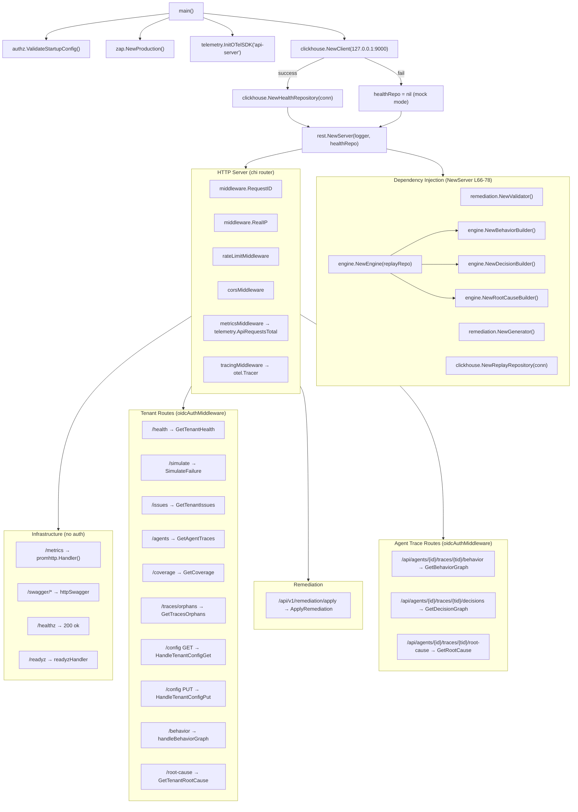
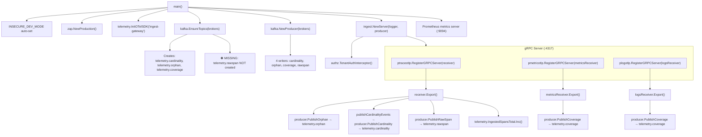
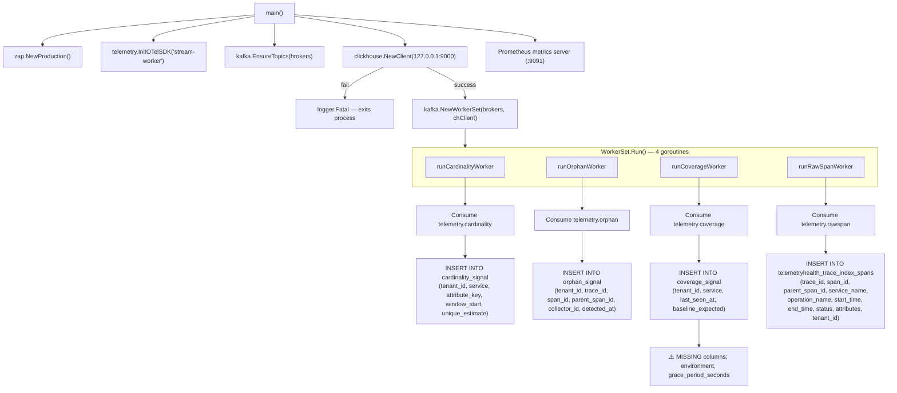
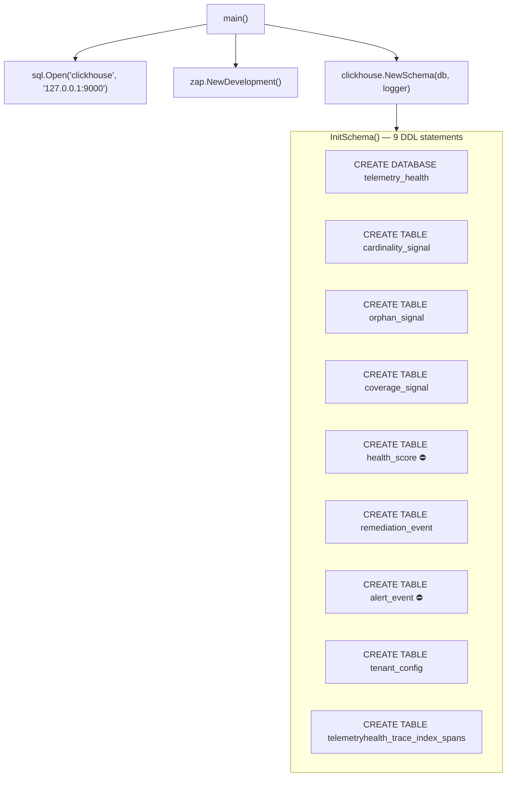
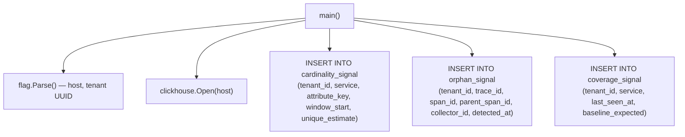
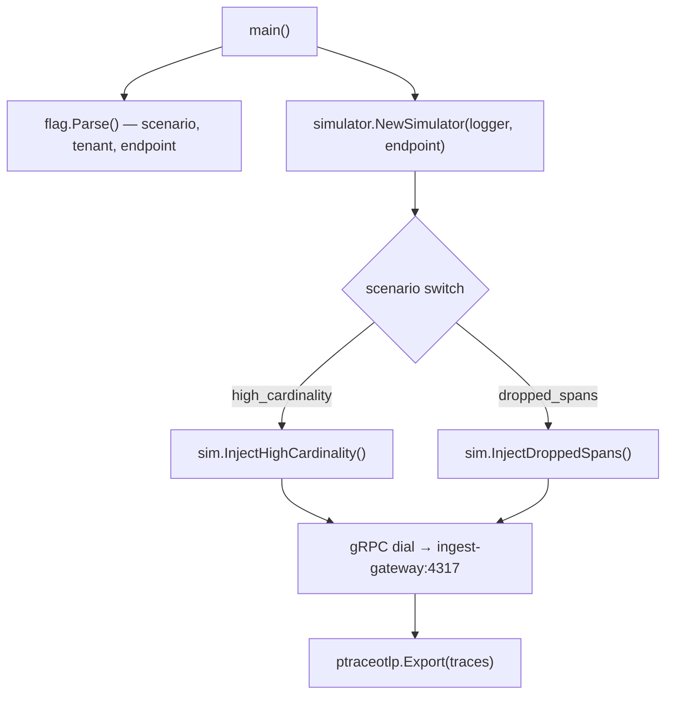
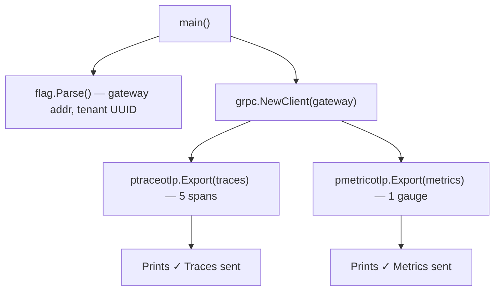
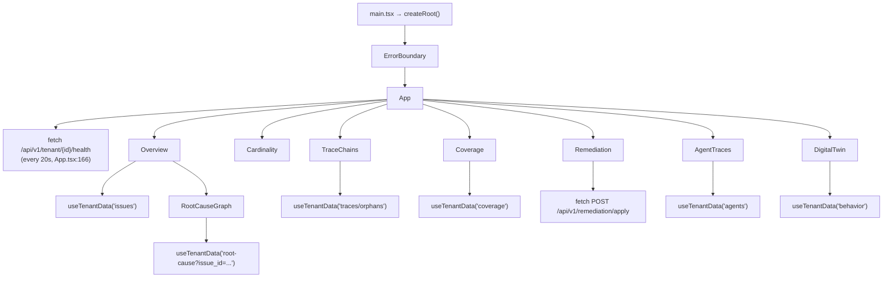

# TelemetryHealth Complete Execution Graph

Date: 2026-07-17
Scope: Every executable under `control-plane/cmd/`, plus `processor/`, `tools/docs-bot/`, and `dashboard/`.
Method: Source-traced actual `import` chains, constructor calls, and runtime invocations — no assumptions.

---

## Master Subsystem Reachability Matrix

| Subsystem | api-server | ingest-gateway | worker | init-db | seeder | simulator | e2e-test | dashboard | processor | docs-bot |
|---|:---:|:---:|:---:|:---:|:---:|:---:|:---:|:---:|:---:|:---:|
| `internal/api/rest` | ✅ | — | — | — | — | — | — | — | — | — |
| `internal/ingest` | — | ✅ | — | — | — | — | — | — | — | — |
| `internal/kafka` (Producer) | — | ✅ | — | — | — | — | — | — | — | — |
| `internal/kafka` (WorkerSet) | — | — | ✅ | — | — | — | — | — | — | — |
| `internal/kafka` (EnsureTopics) | — | ✅ | ✅ | — | — | — | — | — | — | — |
| `internal/storage/clickhouse` (Client) | ✅ | — | ✅ | — | — | — | — | — | — | — |
| `internal/storage/clickhouse` (Schema) | — | — | — | ✅ | — | — | — | — | — | — |
| `internal/storage/clickhouse` (HealthRepo) | ✅ | — | — | — | — | — | — | — | — | — |
| `internal/storage/clickhouse` (ReplayRepo) | ✅ | — | — | — | — | — | — | — | — | — |
| `internal/authz` | ✅ | ✅ | — | — | — | — | — | — | — | — |
| `internal/telemetry` (Prometheus) | ✅ | ✅ | ✅ | — | — | — | — | — | — | — |
| `internal/telemetry` (OTel SDK) | ✅ | ✅ | ✅ | — | — | — | — | — | — | — |
| `internal/telemetry` (HealthScore) | ✅ | — | — | — | — | — | — | — | — | — |
| `internal/remediation` | ✅ | — | — | — | — | — | — | — | — | — |
| `internal/engine` (Graph) | ✅ | — | — | — | — | — | — | — | — | — |
| `internal/behavior` | ✅ | — | — | — | — | — | — | — | — | — |
| `internal/decision` | ✅ | — | — | — | — | — | — | — | — | — |
| `internal/rootcause` | ✅ | — | — | — | — | — | — | — | — | — |
| `internal/simulator` | ✅ | — | — | — | — | ✅ | — | — | — | — |
| `internal/mcp` (DTOs only) | ✅† | — | — | — | — | — | — | — | — | — |
| `pkg/models` | ✅ | — | — | — | — | — | — | — | — | — |
| `dashboard` (React) | — | — | — | — | — | — | — | ✅ | — | — |
| **`internal/alerting`** | ⛔ | ⛔ | ⛔ | ⛔ | ⛔ | ⛔ | ⛔ | ⛔ | ⛔ | ⛔ |
| **`internal/streaming`** | ⛔ | ⛔ | ⛔ | ⛔ | ⛔ | ⛔ | ⛔ | ⛔ | ⛔ | ⛔ |
| **`internal/mcp` (Server/Tools)** | ⛔ | ⛔ | ⛔ | ⛔ | ⛔ | ⛔ | ⛔ | ⛔ | ⛔ | ⛔ |
| **`internal/mcp` (Client)** | ⛔ | ⛔ | ⛔ | ⛔ | ⛔ | ⛔ | ⛔ | ⛔ | ⛔ | ⛔ |
| **`processor/`** | ⛔ | ⛔ | ⛔ | ⛔ | ⛔ | ⛔ | ⛔ | ⛔ | ⛔‡ | ⛔ |

> ✅ = reached  — = not applicable  ⛔ = **NEVER REACHED**
> † = `mcp.HealthResponse` DTO imported but `mcp.NewServer`/`HandleToolCall` never called
> ‡ = processor module has `NewFactory()` but no binary in this repo imports it

---

## Executable 1: `cmd/api-server`

> [main.go](file:///c:/Users/sunanda.AMFIIND/Desktop/SHUBHAM%20PROJECT/TelemetryHealth_/control-plane/cmd/api-server/main.go)



### Route → Repository → ClickHouse Table Mapping

| Route | Handler | Repository Method | ClickHouse Table | Status |
|---|---|---|---|---|
| `/health` | `GetTenantHealth` | `HealthRepo.QueryHealthMetrics` | `cardinality_signal`, `orphan_signal`, `coverage_signal`, `tenant_config` | ✅ Live |
| `/health` | `GetTenantHealth` | `HealthRepo.GetTenantWeights` | `tenant_config` | ✅ Live |
| `/health` | `GetTenantHealth` | `generator.Generate` + `validator.Validate` | — (in-memory) | ✅ Live |
| `/issues` | `GetTenantIssues` | — (hardcoded JSON) | — | ⚠️ Mock only |
| `/agents` | `GetAgentTraces` | `HealthRepo.QueryAgentTraces` | `signoz_traces.signoz_index_v2` (fallback: mock) | ⚠️ Fallback mock |
| `/coverage` | `GetCoverage` | — (hardcoded JSON) | — | ⚠️ Mock only |
| `/traces/orphans` | `GetTracesOrphans` | — (hardcoded JSON) | — | ⚠️ Mock only |
| `/config GET` | `HandleTenantConfigGet` | `HealthRepo.GetTenantWeights` | `tenant_config` | ✅ Live |
| `/config PUT` | `HandleTenantConfigPut` | `HealthRepo.SaveTenantConfig` | `tenant_config` | ✅ Live |
| `/behavior` | `handleBehaviorGraph` | `engine.GenerateBehaviorGraph` → `ReplayRepo.GetRecentReplays` | `telemetryhealth_trace_index_spans` | ✅ Live |
| `/root-cause` | `GetTenantRootCause` | `engine.GenerateRootCause` → `ReplayRepo.GetReplay` | `telemetryhealth_trace_index_spans` | ✅ Live |
| `/simulate` | `SimulateFailure` | `simulator.NewSimulator` → gRPC to ingest-gateway | — (sends OTLP) | ✅ Live |
| `/remediation/apply` | `ApplyRemediation` | `HealthRepo.LogRemediationEvent` | `remediation_event` | ✅ Live |
| `/agents/.../behavior` | `GetBehaviorGraph` | `HealthRepo.QuerySpansByTraceID` → `behavior.NewEngine().Reconstruct` | `signoz_traces.signoz_index_v2` (fallback: mock) | ⚠️ Fallback mock |
| `/agents/.../decisions` | `GetDecisionGraph` | spans → `behavior.Reconstruct` → `decision.Reconstruct` | `signoz_traces.signoz_index_v2` (fallback: mock) | ⚠️ Fallback mock |
| `/agents/.../root-cause` | `GetRootCause` | spans → `behavior` → `decision` → `rootcause.Analyze` | `signoz_traces.signoz_index_v2` (fallback: mock) | ⚠️ Fallback mock |

---

## Executable 2: `cmd/ingest-gateway`

> [main.go](file:///c:/Users/sunanda.AMFIIND/Desktop/SHUBHAM%20PROJECT/TelemetryHealth_/control-plane/cmd/ingest-gateway/main.go)



### Kafka Topics Produced

| Topic | Producer Method | Source Signal |
|---|---|---|
| `telemetry.cardinality` | `PublishCardinality` | Per-attribute-key from trace spans |
| `telemetry.orphan` | `PublishOrphan` | Per-span structural tuple (trace/span/parent) |
| `telemetry.coverage` | `PublishCoverage` | Per-service heartbeat from metrics & logs |
| `telemetry.rawspan` | `PublishRawSpan` | Full span tuple for trace index |

---

## Executable 3: `cmd/worker`

> [main.go](file:///c:/Users/sunanda.AMFIIND/Desktop/SHUBHAM%20PROJECT/TelemetryHealth_/control-plane/cmd/worker/main.go)



### ClickHouse Tables Written

| Table | Writer | Columns Written | Schema Columns | Mismatch |
|---|---|---|---|---|
| `cardinality_signal` | `runCardinalityWorker` | 5 | 6 (`hll_sketch` not written) | ⚠️ `hll_sketch` dead |
| `orphan_signal` | `runOrphanWorker` | 6 | 6 | ✅ |
| `coverage_signal` | `runCoverageWorker` | 4 | 6 | ⚠️ `environment`, `grace_period_seconds` missing |
| `telemetryhealth_trace_index_spans` | `runRawSpanWorker` | 10 | 10 | ✅ |

---

## Executable 4: `cmd/init-db`

> [main.go](file:///c:/Users/sunanda.AMFIIND/Desktop/SHUBHAM%20PROJECT/TelemetryHealth_/control-plane/cmd/init-db/main.go)



> ⛔ `health_score` and `alert_event` tables are created but **never read or written** by any runtime path.

---

## Executable 5: `cmd/seeder`

> [main.go](file:///c:/Users/sunanda.AMFIIND/Desktop/SHUBHAM%20PROJECT/TelemetryHealth_/control-plane/cmd/seeder/main.go)



> Standalone utility. Directly inserts into ClickHouse. No Kafka, no REST, no dependency injection.

---

## Executable 6: `cmd/simulator`

> [main.go](file:///c:/Users/sunanda.AMFIIND/Desktop/SHUBHAM%20PROJECT/TelemetryHealth_/control-plane/cmd/simulator/main.go)



> Sends OTLP traces to the ingest-gateway. No direct ClickHouse or Kafka access.

---

## Executable 7: `cmd/e2e-test`

> [main.go](file:///c:/Users/sunanda.AMFIIND/Desktop/SHUBHAM%20PROJECT/TelemetryHealth_/control-plane/cmd/e2e-test/main.go)



> End-to-end test client. Sends OTLP to ingest-gateway and prints results. No assertion on downstream ClickHouse.

---

## Frontend: `dashboard/`

> [main.tsx](file:///c:/Users/sunanda.AMFIIND/Desktop/SHUBHAM%20PROJECT/TelemetryHealth_/dashboard/src/main.tsx) → [App.tsx](file:///c:/Users/sunanda.AMFIIND/Desktop/SHUBHAM%20PROJECT/TelemetryHealth_/dashboard/src/App.tsx)



### Dashboard → API Server Route Mapping

| Dashboard Component | API Call via `useTenantData` | Matched Server Route | Handler |
|---|---|---|---|
| `App.tsx` | `GET /api/v1/tenant/{id}/health` | ✅ `/health` | `GetTenantHealth` |
| `Overview` | `GET /api/v1/tenant/{id}/issues` | ✅ `/issues` | `GetTenantIssues` |
| `Overview → RootCauseGraph` | `GET /api/v1/tenant/{id}/root-cause?issue_id=...` | ✅ `/root-cause` | `GetTenantRootCause` |
| `TraceChains` | `GET /api/v1/tenant/{id}/traces/orphans` | ✅ `/traces/orphans` | `GetTracesOrphans` |
| `Coverage` | `GET /api/v1/tenant/{id}/coverage` | ✅ `/coverage` | `GetCoverage` |
| `AgentTraces` | `GET /api/v1/tenant/{id}/agents` | ✅ `/agents` | `GetAgentTraces` |
| `DigitalTwin` | `GET /api/v1/tenant/{id}/behavior` | ✅ `/behavior` | `handleBehaviorGraph` |
| `Remediation` | `POST /api/v1/remediation/apply` | ✅ `/remediation/apply` | `ApplyRemediation` |

### Registered Routes NOT Called by Dashboard

| Route | Handler | Evidence |
|---|---|---|
| `POST /api/v1/tenant/{id}/simulate` | `SimulateFailure` | ⛔ No dashboard component calls `/simulate` |
| `GET /api/v1/tenant/{id}/config` | `HandleTenantConfigGet` | ⛔ No dashboard component calls `/config` |
| `PUT /api/v1/tenant/{id}/config` | `HandleTenantConfigPut` | ⛔ No dashboard component calls `/config` |
| `GET /api/agents/{id}/traces/{tid}/behavior` | `GetBehaviorGraph` | ⛔ No dashboard component calls agent-trace routes |
| `GET /api/agents/{id}/traces/{tid}/decisions` | `GetDecisionGraph` | ⛔ No dashboard component calls agent-trace routes |
| `GET /api/agents/{id}/traces/{tid}/root-cause` | `GetRootCause` | ⛔ No dashboard component calls agent-trace routes |

---

## Library Module: `processor/`

> [factory.go](file:///c:/Users/sunanda.AMFIIND/Desktop/SHUBHAM%20PROJECT/TelemetryHealth_/processor/factory.go)

```
processor.NewFactory()
    ↓
    No binary in this repository imports it.
    No cmd/ executable references the processor Go module.
    No otelcol-builder config exists.
    ⛔ NEVER REACHED from any executable.
```

Has working unit tests (`cardinality/`, `failopen/`, `tracechain/`, `coverage/`) but is a library-only module.

---

## Standalone Tool: `tools/docs-bot/`

> [main.go](file:///c:/Users/sunanda.AMFIIND/Desktop/SHUBHAM%20PROJECT/TelemetryHealth_/tools/docs-bot/main.go)

Separate Go module (`go.mod`). Contains `changelog.go`, `commitlog.go`, `status.go`. Has tests.

```
docs-bot main()
    ↓
    Standalone CLI tool for documentation generation.
    Does NOT import control-plane packages.
    Does NOT connect to Kafka, ClickHouse, or the dashboard.
    Isolated utility.
```

---

## ⛔ NEVER-REACHED Subsystems — Detailed Evidence

### 1. `internal/alerting` — Completely Dead

> Files: [signoz_bridge.go](file:///c:/Users/sunanda.AMFIIND/Desktop/SHUBHAM%20PROJECT/TelemetryHealth_/control-plane/internal/alerting/signoz_bridge.go), [slack_bridge.go](file:///c:/Users/sunanda.AMFIIND/Desktop/SHUBHAM%20PROJECT/TelemetryHealth_/control-plane/internal/alerting/slack_bridge.go), [pagerduty_bridge.go](file:///c:/Users/sunanda.AMFIIND/Desktop/SHUBHAM%20PROJECT/TelemetryHealth_/control-plane/internal/alerting/pagerduty_bridge.go)

- **Constructors:** `NewSigNozBridge`, `NewSlackBridge`, `NewPagerDutyBridge`
- **Interface:** `AlertBridge` with `FireAlert` method
- **Proof of absence:** No `cmd/` binary, no REST handler, no worker, and no other internal package imports `internal/alerting`. Zero call sites outside the package itself.
- **Broken chain:** Worker writes to ClickHouse → stops. No code converts health changes → `AlertPayload` → bridge → `FireAlert`.

### 2. `internal/streaming` — Test-Only, Not Wired

> Files: [cardinality_job.go](file:///c:/Users/sunanda.AMFIIND/Desktop/SHUBHAM%20PROJECT/TelemetryHealth_/control-plane/internal/streaming/cardinality_job.go), [tracechain_job.go](file:///c:/Users/sunanda.AMFIIND/Desktop/SHUBHAM%20PROJECT/TelemetryHealth_/control-plane/internal/streaming/tracechain_job.go), [coverage_job.go](file:///c:/Users/sunanda.AMFIIND/Desktop/SHUBHAM%20PROJECT/TelemetryHealth_/control-plane/internal/streaming/coverage_job.go), [healthscore_job.go](file:///c:/Users/sunanda.AMFIIND/Desktop/SHUBHAM%20PROJECT/TelemetryHealth_/control-plane/internal/streaming/healthscore_job.go), [ai_health_job.go](file:///c:/Users/sunanda.AMFIIND/Desktop/SHUBHAM%20PROJECT/TelemetryHealth_/control-plane/internal/streaming/ai_health_job.go)

- **Constructors:** `NewCardinalityJob`, `NewTraceChainJob`, `NewCoverageJob`, `NewHealthScoreJob`, `NewAIAgentHealthJob`
- **Proof of absence:** `cmd/worker/main.go:63` calls `kafka.NewWorkerSet`, which calls `runCardinalityWorker`/`runOrphanWorker`/`runCoverageWorker`/`runRawSpanWorker` in [workers.go](file:///c:/Users/sunanda.AMFIIND/Desktop/SHUBHAM%20PROJECT/TelemetryHealth_/control-plane/internal/kafka/workers.go#L31-L46). Those functions do direct ClickHouse batch inserts. They never instantiate `streaming.New*Job`.
- **`NewAIAgentHealthJob`** has zero callers even in tests. Completely orphaned.
- **Broken chain:** Production Kafka worker → direct batch insert → ClickHouse. The `streaming` jobs (with HLL merging, trace chain correlation, health score computation) are bypassed entirely.

### 3. `internal/mcp` Server & Tools — No Transport

> Files: [server.go](file:///c:/Users/sunanda.AMFIIND/Desktop/SHUBHAM%20PROJECT/TelemetryHealth_/control-plane/internal/mcp/server.go), [tools.go](file:///c:/Users/sunanda.AMFIIND/Desktop/SHUBHAM%20PROJECT/TelemetryHealth_/control-plane/internal/mcp/tools.go)

- **Functions:** `NewServer`, `NewToolset`, `HandleToolCall`
- **Proof of absence:** No `cmd/mcp-server` binary exists. No REST route starts an MCP server. No `cmd/*` binary imports `mcp.NewServer` or `mcp.NewToolset`. The REST server imports `mcp` but only uses `mcp.HealthResponse` and `mcp.MetricsPayload` as DTO structs (response models), not the server/tools functions.
- **Broken chain:** In-process tool handlers exist but have no stdio, HTTP, SSE, or websocket transport.

### 4. `internal/mcp` Client — Never Called

> File: [client.go](file:///c:/Users/sunanda.AMFIIND/Desktop/SHUBHAM%20PROJECT/TelemetryHealth_/control-plane/internal/mcp/client.go)

- **Function:** `QueryAgentTraces` (returns `[SIMULATED]` data), `InjectTraceContext`
- **Proof of absence:** Dashboard agent traces path is: `AgentTraces.tsx` → `useTenantData('agents')` → `GET /api/v1/tenant/{id}/agents` → `GetAgentTraces` → `HealthRepository.QueryAgentTraces`. This goes to `HealthRepository`, not `mcp.QueryAgentTraces`.
- `InjectTraceContext` is tested but has no runtime caller.

### 5. `processor/` Module — No Collector Binary

- **Entrypoint:** `processor.NewFactory()` creates a valid OTel Collector processor factory.
- **Proof of absence:** No Go binary in `control-plane/cmd/` imports `github.com/frag2win/TelemetryHealth/processor`. No `otelcol-builder` config exists. The processor module is a separate `go.mod`. It has unit tests but is unreachable from any executable in this repository.

---

## ClickHouse Tables: Created vs. Used

| Table | Created By | Written By | Read By | Status |
|---|---|---|---|---|
| `cardinality_signal` | `init-db` | `worker`, `seeder` | `api-server (QueryHealthMetrics)` | ✅ Active |
| `orphan_signal` | `init-db` | `worker`, `seeder` | `api-server (QueryHealthMetrics)` | ✅ Active |
| `coverage_signal` | `init-db` | `worker`, `seeder` | `api-server (QueryHealthMetrics)` | ✅ Active (⚠️ column mismatch) |
| `telemetryhealth_trace_index_spans` | `init-db` | `worker` | `api-server (ReplayRepo, QuerySpansByTraceID)` | ✅ Active |
| `tenant_config` | `init-db` | `api-server (SaveTenantConfig)` | `api-server (GetTenantWeights)` | ✅ Active |
| `remediation_event` | `init-db` | `api-server (LogRemediationEvent)` | — | ⚠️ Write-only audit |
| **`health_score`** | `init-db` | ⛔ Never | ⛔ Never | ⛔ **Dead table** |
| **`alert_event`** | `init-db` | ⛔ Never | ⛔ Never | ⛔ **Dead table** |

---

## Kafka Topics: Produced vs. Consumed vs. Bootstrapped

| Topic | Produced By | Consumed By | Bootstrapped (EnsureTopics) | Status |
|---|---|---|---|---|
| `telemetry.cardinality` | `ingest-gateway` | `worker` | ✅ | ✅ Full path |
| `telemetry.orphan` | `ingest-gateway` | `worker` | ✅ | ✅ Full path |
| `telemetry.coverage` | `ingest-gateway` | `worker` | ✅ | ✅ Full path |
| `telemetry.rawspan` | `ingest-gateway` | `worker` | ⛔ **NOT bootstrapped** | ⚠️ Works only with Kafka auto-create |

---

## Dashboard Assets: Reachable vs. Dead

| Asset | Imported By | Status |
|---|---|---|
| `src/assets/hero.png` | Nothing | ⛔ Dead |
| `src/assets/react.svg` | Nothing | ⛔ Dead |
| `src/assets/vite.svg` | Nothing | ⛔ Dead |

---

## End-to-End Data Flow (Actual Runtime Path)

The actual working pipeline when all services are running:

```
OTLP Client (collector/simulator/e2e-test)
    │
    │ gRPC :4317
    ▼
┌──────────────────────────┐
│  cmd/ingest-gateway      │
│  ├─ authz.TenantAuth     │
│  ├─ receiver.Export()    │
│  │  ├─ PublishOrphan     ├──→ Kafka: telemetry.orphan
│  │  ├─ PublishCardinality├──→ Kafka: telemetry.cardinality
│  │  └─ PublishRawSpan   ├──→ Kafka: telemetry.rawspan
│  ├─ metricsReceiver     │
│  │  └─ PublishCoverage  ├──→ Kafka: telemetry.coverage
│  └─ logsReceiver        │
│     └─ PublishCoverage  ├──→ Kafka: telemetry.coverage
└──────────────────────────┘
                               │
                               ▼
┌──────────────────────────────────────────┐
│  cmd/worker                              │
│  ├─ runCardinalityWorker                 │
│  │  └─ INSERT → cardinality_signal       │
│  ├─ runOrphanWorker                      │
│  │  └─ INSERT → orphan_signal            │
│  ├─ runCoverageWorker                    │
│  │  └─ INSERT → coverage_signal          │
│  └─ runRawSpanWorker                     │
│     └─ INSERT → trace_index_spans        │
└──────────────────────────────────────────┘
                               │
                               ▼
                          ClickHouse
                               │
                               ▼
┌──────────────────────────────────────────┐
│  cmd/api-server                          │
│  ├─ HealthRepo.QueryHealthMetrics        │
│  │  └─ SELECT cardinality/orphan/coverage│
│  ├─ HealthRepo.QueryAgentTraces          │
│  │  └─ SELECT signoz_traces (fallback)   │
│  ├─ ReplayRepo.GetRecentReplays          │
│  │  └─ SELECT trace_index_spans          │
│  └─ REST routes → JSON responses         │
└──────────────────────────────────────────┘
                               │
                               │ HTTP :8080
                               ▼
┌──────────────────────────────────────────┐
│  dashboard (React, Vite)                 │
│  ├─ App.tsx polls /health every 20s      │
│  ├─ Overview → /issues, /root-cause      │
│  ├─ TraceChains → /traces/orphans        │
│  ├─ Coverage → /coverage                 │
│  ├─ AgentTraces → /agents                │
│  ├─ DigitalTwin → /behavior              │
│  └─ Remediation → POST /remediation/apply│
└──────────────────────────────────────────┘
```

### Subsystems Outside This Path (Never Reached)

```
⛔ internal/alerting        — No caller from any executable
⛔ internal/streaming       — Bypassed by direct worker batch inserts
⛔ internal/mcp (server)    — No transport, no binary
⛔ internal/mcp (client)    — HealthRepo used instead
⛔ processor/               — No collector binary imports it
⛔ health_score table       — Created, never used
⛔ alert_event table        — Created, never used
⛔ hll_sketch column        — In schema, never written or read
⛔ signoz_implementations/  — Legacy SQL, never executed
⛔ sdk-clients/             — Demo docs, not runtime
⛔ dashboard assets         — hero.png, react.svg, vite.svg unused
```
