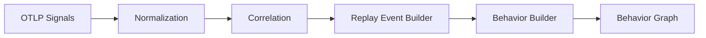
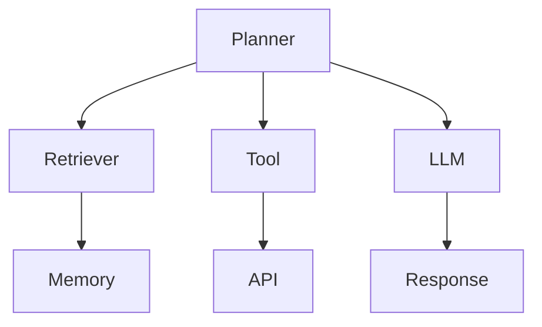

# Section 06
# Behavior Reconstruction Engine (BRE)

Version: 1.0

---

# Overview

The Behavior Reconstruction Engine (BRE) is the core intelligence component of TelemetryHealth.

Its responsibility is to transform low-level OpenTelemetry signals into high-level behavioral representations that describe how an AI system executed.

Unlike traditional observability systems that visualize telemetry directly, the BRE reconstructs semantic behaviors from distributed telemetry events.

It is the first stage in converting telemetry into explainable intelligence.

---

# Purpose

Input

```
Spans

Metrics

Logs

Events
```

Output

```
Replay Events

↓

Behaviors

↓

Behavior Graph
```

The BRE acts as a semantic compiler.

Telemetry is the source code.

Behavior is the compiled representation.

---

# Design Philosophy

Telemetry describes execution.

Behavior describes intention expressed through execution.

The BRE bridges this gap.

It converts thousands of unrelated telemetry signals into meaningful engineering concepts.

---

# High-Level Pipeline



---

# Stage 1

## Signal Normalization

Purpose

Normalize telemetry from different sources into a common representation.

Supported Signals

- Spans
- Metrics
- Logs
- Events

Output

NormalizedEvent

Example

```
Raw Span

↓

Normalized Event

{
 actor,
 timestamp,
 action,
 metadata,
 attributes
}
```

---

# Stage 2

## Correlation Engine

Purpose

Determine which telemetry belongs together.

Correlation Keys

- Trace ID
- Span ID
- Parent Span
- Session ID
- Conversation ID
- Agent ID
- Request ID
- Deployment Version

Result

Replay Event Groups

---

# Stage 3

## Replay Event Builder

Replay Events are immutable.

Every observable action becomes one Replay Event.

Examples

```
Prompt Created

Retriever Started

Retriever Completed

Tool Selected

Tool Returned

Retry Started

Retry Finished

Memory Read

Memory Miss

LLM Started

LLM Finished
```

Replay Events become the atomic units of replay.

---

# Replay Event Schema

```json
{
  "event_id": "...",
  "timestamp": "...",
  "actor": "Planner",
  "action": "Tool Selected",
  "trace_id": "...",
  "span_id": "...",
  "metadata": {}
}
```

---

# Stage 4

## Behavior Builder

Replay Events alone are insufficient.

The Behavior Builder groups related Replay Events into higher-level behaviors.

Example

```
Replay Events

↓

Tool Selected

↓

HTTP Request

↓

Timeout

↓

Retry

↓

Success
```

↓

Behavior

```
Tool Retry
```

The user sees one behavior instead of dozens of telemetry events.

---

# Behavior Categories

Planner

Retriever

Memory

Prompt

Tool

LLM

Collector

Queue

Storage

Infrastructure

Recovery

Incident

---

# Stage 5

## Behavior Graph Construction

Each Behavior becomes a node.

Relationships become edges.

Example



Unlike traces,

Behavior Graphs are semantic.

---

# Behavior Detection Rules

Example

## Tool Retry

Condition

```
Tool Timeout

+

Retry Span

+

Same Tool

+

Same Session
```

↓

Behavior

```
Tool Retry
```

---

## Prompt Expansion

Condition

```
Prompt v1

↓

Prompt v2

↓

Token Count Increased
```

↓

Behavior

```
Prompt Expansion
```

---

## Retrieval Failure

Condition

```
Retriever Started

↓

Zero Documents

↓

LLM Continues
```

↓

Behavior

```
Retrieval Failure
```

---

## Memory Degradation

Condition

```
Memory Query

↓

Latency Increase

↓

Context Missing
```

↓

Behavior

```
Memory Degradation
```

---

# Behavior Graph Schema

Node

```
Behavior ID

Type

Actor

Duration

Confidence

Replay Events

Metadata
```

Edge

```
Source

Destination

Relationship

Confidence
```

---

# Design Rules

Every Replay Event belongs to exactly one Behavior.

Every Behavior belongs to one Replay Session.

Behaviors never overlap.

Replay Events remain immutable.

Behavior Graphs are deterministic.

---

# Why Behaviors?

Traditional traces expose infrastructure.

Behavior exposes intent expressed through execution.

This dramatically reduces cognitive load.

Instead of reading

```
148 spans
```

Engineers inspect

```
11 Behaviors
```

---

# Error Handling

If telemetry is missing

↓

Behavior confidence decreases.

If timestamps conflict

↓

BRE reorders events.

If spans disappear

↓

Behavior is marked partial.

Missing telemetry never causes silent failures.

---

# Performance Goals

Replay Event creation

< 5 ms

Behavior grouping

< 20 ms

Graph generation

< 50 ms

Replay Session construction

< 100 ms

---

# Output

The Behavior Reconstruction Engine produces three artifacts.

1. Replay Events

2. Behavior Graph

3. Replay Timeline

These become the input to the Decision Reconstruction Engine.

---

# Success Criteria

The BRE is successful when:

- Every Replay Event is deterministic.
- Behaviors accurately summarize execution.
- Behavior Graphs remain explainable.
- Replay generation is reproducible.
- Output is independent of the underlying telemetry vendor.

---

# Architectural Significance

The Behavior Reconstruction Engine is the first semantic layer above OpenTelemetry.

It transforms telemetry into behavior while preserving traceability back to the original evidence.

Every higher-level capability within TelemetryHealth—including Decision Reconstruction, Root Cause Analysis, Flight Recorder, Benchmarking, and AI Explanations—depends on the correctness of the BRE.