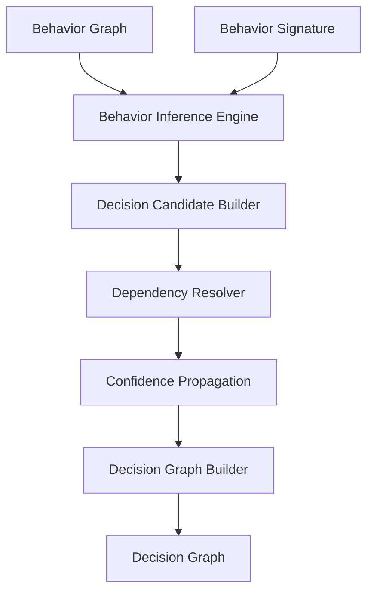
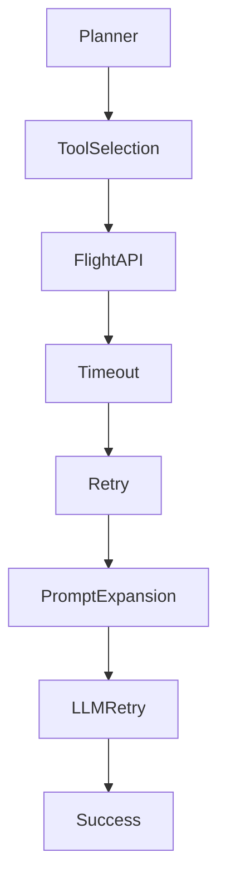
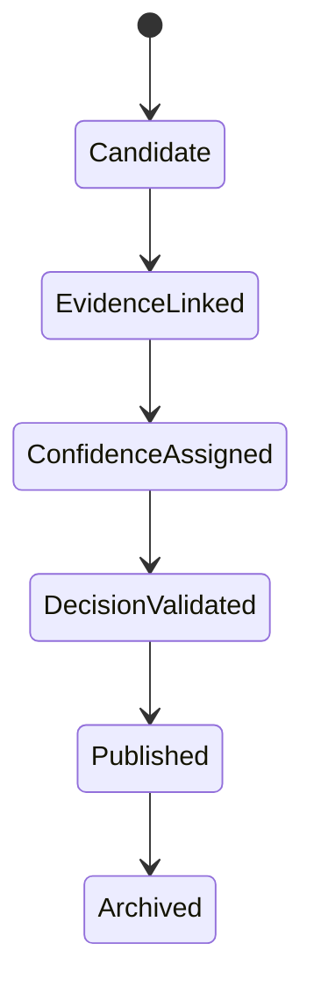

# Section 08
# Decision Reconstruction Engine (DRE)

Version: 1.0

---

# Overview

The Decision Reconstruction Engine (DRE) transforms inferred behavioral intelligence into an explainable decision graph that represents the observable decision flow of an AI system.

Unlike traditional observability platforms that visualize telemetry or execution traces, the DRE reconstructs the sequence of operational decisions inferred from observable evidence.

The DRE does **not** reconstruct hidden model reasoning or chain-of-thought.

Instead, it reconstructs **observable decision flow** derived from telemetry, behavior, and deterministic inference.

The DRE produces the primary artifact consumed by the Flight Recorder, Root Cause Engine, Narrative Engine, and Benchmark Suite.

---

# Design Philosophy

Behavior describes execution.

Decision describes why execution followed a particular path.

The Decision Reconstruction Engine bridges these two layers.

Every decision generated by the DRE must satisfy three principles.

- Explainable
- Deterministic
- Evidence-backed

No decision may exist without supporting telemetry.

---

# Responsibilities

The DRE is responsible for:

- Constructing Decision Graphs
- Ordering decision flow
- Establishing decision dependencies
- Linking decisions to evidence
- Tracking confidence propagation
- Recording alternative decision paths
- Producing replay-ready decision structures

The DRE is **not** responsible for:

- Root cause analysis
- Natural language generation
- Telemetry ingestion
- Replay visualization

These responsibilities belong to other subsystems.

---

# Inputs

The Decision Reconstruction Engine consumes:

- Behavior Graph
- Behavior Signature
- Behavior Inference Results
- Replay Metadata
- Historical Replay Sessions
- Deployment Metadata
- Agent Metadata

---

# Outputs

The DRE produces:

- Decision Graph
- Decision Nodes
- Decision Edges
- Decision Confidence
- Decision Timeline
- Decision Metadata

These outputs become the input for:

- Root Cause Engine
- Evidence Engine
- Flight Recorder
- Narrative Engine
- Benchmark Suite

---

# Decision Reconstruction Pipeline



---

# Decision Model

Every Decision represents an observable operational choice inferred from behavior.

Examples include:

- Planner selected Tool A
- Planner retried request
- Retrieval fallback activated
- Memory lookup skipped
- Prompt expanded
- Supervisor delegated execution
- Tool timeout triggered retry
- Context window exceeded
- Recovery path activated

The Decision Model intentionally avoids claiming knowledge of hidden LLM reasoning.

Instead, it reconstructs decisions supported by observable telemetry.

---

# Decision Node Schema

```json
{
  "decision_id": "dec_001",
  "decision_type": "Tool Selection",
  "timestamp": "2026-07-15T11:42:03Z",
  "actor": "Planner",
  "confidence": 0.96,
  "supporting_behaviors": [
    "behavior_018",
    "behavior_022"
  ],
  "evidence_count": 8,
  "status": "Completed"
}
```

---

# Decision Edge Schema

Decision Graph edges describe causal relationships.

Properties include:

- Source Decision
- Destination Decision
- Relationship Type
- Confidence
- Temporal Order

Relationship types include:

- Triggered
- Depends On
- Retries
- Delegates
- Recovers
- Escalates
- Cancels
- Completes

---

# Decision Categories

## Planning Decisions

Examples

- Intent Classification
- Goal Selection
- Tool Selection
- Agent Routing

---

## Retrieval Decisions

Examples

- Query Reformulation
- Document Selection
- Retrieval Retry
- Retrieval Skip

---

## Memory Decisions

Examples

- Memory Read
- Memory Ignore
- Context Merge
- Context Truncation

---

## Tool Decisions

Examples

- Tool Invocation
- Tool Retry
- Tool Timeout
- Tool Failure
- Tool Recovery

---

## Prompt Decisions

Examples

- Prompt Expansion
- Prompt Compression
- Prompt Retry
- Prompt Version Change

---

## Recovery Decisions

Examples

- Retry Strategy
- Fallback Activation
- Escalation
- Circuit Breaker

---

# Decision Graph

The Decision Graph represents the observable operational decision flow.



Unlike traces,

Decision Graphs describe operational choices rather than infrastructure execution.

---

# Confidence Model

Every Decision receives a confidence score.

Confidence is calculated from:

- Rule certainty
- Evidence completeness
- Telemetry quality
- Missing telemetry
- Historical similarity
- Behavior confidence

Confidence is expressed as a value between:

```
0.0

↓

1.0
```

Confidence never exceeds the confidence of supporting evidence.

---

# Decision Lifecycle



---

# Explainability

Every Decision must answer:

What decision was made?

Why was it inferred?

Which telemetry supports it?

Which behaviors contributed?

How confident is the inference?

Could another explanation exist?

This information is mandatory.

---

# Deterministic Design Principle

The Decision Reconstruction Engine SHALL NOT use a Large Language Model to infer operational decisions.

All decisions MUST be reconstructed using deterministic rule evaluation, graph traversal, evidence correlation, and confidence propagation.

Natural language generation occurs only after Decision Graph construction.

This guarantees:

- Reproducibility
- Auditability
- Explainability

---

# Error Handling

If Behavior Graph is incomplete

↓

Decision confidence decreases.

If evidence conflicts

↓

Alternative Decision Candidates are retained.

If telemetry is missing

↓

Decision status becomes Partial.

If no rule matches

↓

Decision Type becomes Unknown.

No decision is silently discarded.

---

# Interfaces

Consumes

- Behavior Graph
- Behavior Signature
- Behavior Inference Results

Produces

- Decision Graph
- Decision Timeline
- Decision Metadata

Dependencies

- Behavior Inference Engine
- Replay Store
- Rule Registry

Failure Modes

- Missing telemetry
- Invalid graph
- Circular dependencies
- Incomplete behavior reconstruction

---

# Non-functional Requirements

Latency

< 50 ms

Memory

< 64 MB

Thread Safe

Yes

Deterministic

Yes

Stateless

Yes

Replayable

Yes

Vendor Independent

Yes

---

# Extensibility

The DRE supports future extensions through:

- Custom Decision Rules
- Plugin-based Rule Packs
- Industry-specific Decision Libraries
- AI Agent Framework Adapters
- Custom Confidence Models

The core decision model remains stable while inference capabilities evolve over time.

---

# Architectural Decisions

Decision reconstruction is deterministic.

Decision reconstruction is explainable.

Decision reconstruction is evidence-backed.

Decision reconstruction never relies on hidden model reasoning.

Decision reconstruction remains independent of any specific LLM provider.

---

# Exit Criteria

The Decision Reconstruction Engine is considered complete when:

- Every Replay Session produces a Decision Graph.
- Every Decision references observable evidence.
- Every Decision includes a confidence score.
- Decision Graphs are deterministic and reproducible.
- Engineers can navigate from any Decision back to the originating telemetry without ambiguity.

The DRE establishes the semantic decision layer of TelemetryHealth and serves as the primary bridge between reconstructed behavior and higher-level incident intelligence.