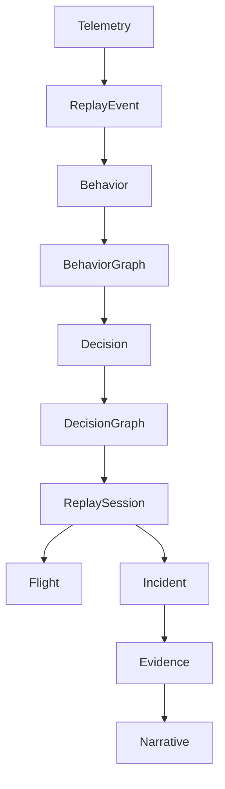

# Section 05
# Domain Model

Version: 1.0

---

# Introduction

TelemetryHealth does not operate directly on telemetry.

Telemetry is treated as evidence.

The platform reconstructs higher-level abstractions from telemetry.

These abstractions form the domain language of the Agent Replay Engine.

Every subsystem within TelemetryHealth operates on these concepts rather than raw spans or metrics.

---

# Domain Hierarchy

```
Telemetry

↓

Replay Event

↓

Behavior

↓

Decision

↓

Replay Session

↓

Incident

↓

Evidence

↓

Narrative
```

Every layer adds semantic meaning.

---

# Core Principle

TelemetryHealth follows one design rule.

> Raw telemetry is never shown directly unless explicitly requested.

Instead,

telemetry is transformed into progressively richer representations.

---

# Entity 1

## Replay Event

Replay Event is the smallest immutable unit within Agent Replay Engine.

It represents one observable action that occurred during an AI execution.

Examples

```
LLM Started

Tool Selected

Memory Read

Retriever Query

Prompt Created

Retry Started

Prompt Expanded

Tool Timeout

Span Dropped

Collector Warning

Request Completed
```

Properties

```
Event ID

Timestamp

Actor

Action

Source

Span ID

Trace ID

Metadata

Severity
```

Characteristics

- Immutable
- Ordered
- Timestamped
- Replayable

Replay Events never change after creation.

---

# Entity 2

## Actor

An Actor represents any participant capable of generating behavior.

Examples

```
Planner

Retriever

Memory

LLM

Tool

Supervisor

Human

Collector

Queue

Database

Worker
```

Each Replay Event belongs to exactly one Actor.

---

# Entity 3

## Behavior

Behavior is a logical grouping of Replay Events.

Example

```
Replay Events

↓

Tool Selected

↓

HTTP Request

↓

Timeout

↓

Retry

↓

Success
```

becomes

```
Behavior

Tool Retry
```

Behavior is what engineers inspect.

Not individual spans.

---

# Entity 4

## Behavior Graph

Behavior Graph connects all Behaviors together.

Example

```
Planner

↓

Retriever

↓

Memory

↓

Tool

↓

LLM

↓

Response
```

Unlike traces,

Behavior Graphs are semantic.

Nodes represent behaviors.

Edges represent relationships.

---

# Entity 5

## Decision

A Decision represents an inferred choice made during execution.

Unlike Replay Events,

Decisions are not directly observed.

They are reconstructed.

Examples

```
Planner chose Weather Tool

Planner retried request

Agent escalated

Memory ignored

Fallback activated
```

Every Decision contains

- Confidence
- Supporting Evidence
- Alternative Explanations

---

# Entity 6

## Decision Graph

Decision Graph explains

WHY

Behavior occurred.

Example

```
Travel Intent

↓

Weather Tool

↓

HTTP 500

↓

Retry

↓

Prompt Expansion

↓

Timeout
```

Decision Graph is generated by the Decision Reconstruction Engine.

---

# Entity 7

## Replay Session

Replay Session represents one complete AI execution.

Example

```
User Prompt

↓

Planner

↓

Retriever

↓

Memory

↓

Tool

↓

LLM

↓

Response
```

Everything belonging to one execution is grouped into one Replay Session.

Replay Session is the primary object opened inside Flight Recorder.

---

# Entity 8

## Flight

A Flight is the user-facing representation of a Replay Session.

Every AI request becomes one Flight.

Example

```
Flight #2031

Status

Failed

Duration

8.2 sec

Actors

7

Events

148

Incident

Timeout
```

Flight Recorder visualizes Flights.

---

# Entity 9

## Incident

An Incident represents any execution whose observed behavior deviates from expected behavior.

Incidents are generated automatically.

Severity

- Low
- Medium
- High
- Critical

Every Incident contains

- Root Cause
- Evidence
- Confidence
- Suggested Repair

---

# Entity 10

## Evidence

Evidence is the foundation of explainability.

Evidence includes

- Spans
- Metrics
- Logs
- Replay Events
- Deployment Metadata
- Configuration
- Agent Metadata

Every explanation shown by TelemetryHealth must reference one or more Evidence objects.

No explanation should exist without evidence.

---

# Entity 11

## Narrative

Narrative transforms telemetry into human language.

Instead of

```
Span Timeout
```

Narrative becomes

```
The Flight API failed to respond.

The planner retried three times.

Prompt size increased.

Latency exceeded timeout.

Collector dropped two spans.

Telemetry integrity decreased.
```

Narratives are generated automatically from Replay Sessions.

---

# Entity 12

## Replay Timeline

Replay Timeline is the ordered sequence of Replay Events.

Timeline powers

- Playback
- Pause
- Fast Forward
- Reverse
- Bookmarks
- Incident Navigation

Replay Timeline is immutable.

---

# Entity Relationships



---

# Why This Model Exists

Traditional observability stores telemetry.

TelemetryHealth stores understanding.

The domain model separates

Observation

from

Interpretation.

This separation allows future AI models, replay engines, and analytics components to evolve without changing the underlying telemetry pipeline.

---

# Design Rules

Replay Events are immutable.

Behaviors are deterministic.

Decision Graphs are probabilistic.

Evidence is mandatory.

Narratives are explainable.

Flights are replayable.

Incidents are reproducible.

Every abstraction must map back to telemetry.

---

# Domain Philosophy

TelemetryHealth does not replace telemetry.

TelemetryHealth gives telemetry meaning.

The domain model transforms millions of low-level events into a coherent behavioral narrative that engineers can inspect, replay, and understand.

This domain model forms the conceptual foundation of every future component within the TelemetryHealth platform.