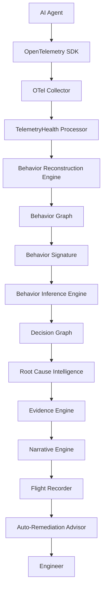
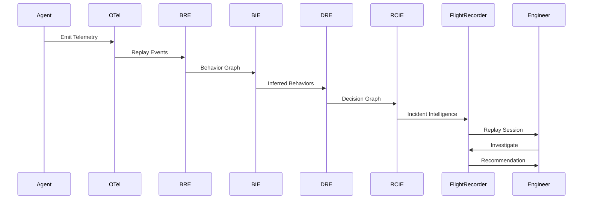

# Section 15
# End-to-End Incident Lifecycle

Version: 1.0

---

# Overview

This chapter describes how TelemetryHealth processes an AI system failure from the moment telemetry is generated until an engineer resolves the incident.

Rather than describing individual platform components, this chapter illustrates how every subsystem collaborates to transform raw telemetry into actionable engineering intelligence.

The lifecycle represents the canonical execution path through the TelemetryHealth platform.

---

# Design Philosophy

Every incident follows the same lifecycle.

```
Observe

↓

Understand

↓

Explain

↓

Recommend

↓

Resolve
```

Each stage builds upon the previous stage.

No stage skips evidence.

No stage invents information.

---

# Complete Lifecycle



---

# Stage 1

## Observation

The AI system executes normally.

OpenTelemetry instrumentation continuously emits

- Spans
- Metrics
- Logs
- Events

No TelemetryHealth-specific instrumentation is required.

TelemetryHealth consumes standard OpenTelemetry signals.

---

# Stage 2

## Telemetry Processing

Incoming telemetry is

- Validated
- Normalized
- Correlated

Replay Events are generated.

Replay Events remain immutable.

---

# Stage 3

## Behavior Reconstruction

Replay Events are grouped into Behaviors.

Examples

```
Planner

↓

Retriever

↓

Memory

↓

Tool

↓

Retry
```

Behavior Graphs are created.

Behavior Signatures are computed.

---

# Stage 4

## Behavioral Inference

The Behavior Inference Engine evaluates

- Behavior Graph
- Replay Timeline
- Historical Patterns

Deterministic inference rules produce

- Behavioral classifications
- Confidence scores
- Decision candidates

No Large Language Model participates in inference.

---

# Stage 5

## Decision Reconstruction

Decision candidates are transformed into a Decision Graph.

Every decision references

- Supporting Behaviors
- Replay Events
- Evidence
- Confidence

Alternative hypotheses remain available.

---

# Stage 6

## Root Cause Intelligence

The Root Cause Intelligence Engine reconstructs

- Failure propagation
- Dependency chain
- Root cause candidates
- Recovery path

Every candidate receives

- Confidence
- Evidence
- Severity

---

# Stage 7

## Evidence Aggregation

Evidence Engine collects

- Spans
- Logs
- Metrics
- Replay Events
- Configuration
- Deployment Metadata

Evidence is indexed for rapid retrieval.

Every conclusion references one or more evidence objects.

---

# Stage 8

## Narrative Generation

Narrative Engine transforms structured incident intelligence into human-readable summaries.

Example

```
The Flight API returned HTTP 500.

The Planner retried three times.

Prompt size increased by 183%.

Collector queue pressure increased.

Telemetry coverage decreased.

The incident was resolved after fallback activation.
```

Narratives summarize existing intelligence.

They never replace evidence.

---

# Stage 9

## Flight Recorder

Flight Recorder visualizes

- Replay Timeline
- Behavior Graph
- Decision Graph
- Root Cause Graph
- Evidence
- Narrative

Engineers replay the incident interactively.

Every visualization remains synchronized.

---

# Stage 10

## Auto-Remediation

The Auto-Remediation Advisor evaluates

- Incident
- Root Cause
- Evidence

Recommendations are generated.

Examples

- Collector tuning
- Retry configuration
- Prompt optimization
- Instrumentation improvements

Recommendations remain advisory.

Human approval is always required.

---

# Stage 11

## Resolution

The engineer reviews

Replay

↓

Root Cause

↓

Evidence

↓

Recommendation

↓

Deployment

The incident lifecycle concludes.

Historical replay remains available for future benchmarking and regression analysis.

---

# Sequence Diagram



---

# Failure Recovery

If telemetry becomes incomplete

↓

Replay continues

↓

Confidence decreases

↓

Evidence marked partial

↓

Engineer informed

The platform favors transparency over certainty.

---

# Lifecycle Principles

Every Replay Session is immutable.

Every Decision references evidence.

Every Root Cause is reproducible.

Every Recommendation is explainable.

Every Narrative is derived from observable telemetry.

Human operators remain responsible for production changes.

---

# Exit Criteria

The lifecycle is complete when an engineer can trace any production incident from

Raw Telemetry

↓

Replay Events

↓

Behavior

↓

Decision

↓

Root Cause

↓

Evidence

↓

Narrative

↓

Recommendation

↓

Resolution

without losing traceability.

This lifecycle defines the operational workflow of the TelemetryHealth platform and demonstrates how independent architectural components collaborate to provide explainable AI observability.