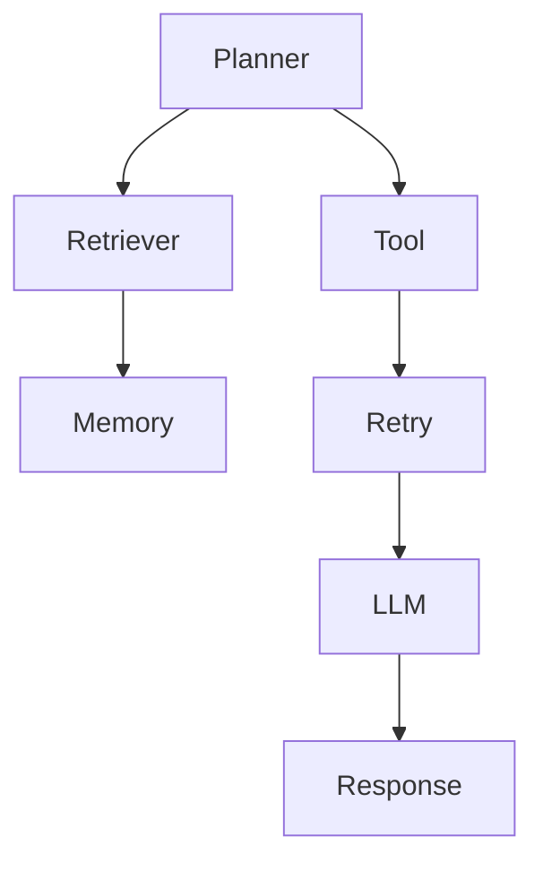

# Section 10
# Flight Recorder

Version: 1.0

---

# Overview

Flight Recorder is the flagship application of the TelemetryHealth platform.

It provides an interactive replay interface that reconstructs AI agent executions from telemetry and presents them as a chronological, explainable, evidence-backed timeline.

Unlike traditional observability dashboards that expose logs, traces, and metrics separately, Flight Recorder reconstructs an execution into a coherent narrative.

The objective is simple:

> Engineers should be able to watch an AI failure unfold rather than manually reconstruct it.

---

# Vision

Every AI execution should be replayable.

Every replay should be understandable.

Every conclusion should be explainable.

Every explanation should be backed by evidence.

---

# Design Philosophy

Flight Recorder is inspired by the flight data recorder used in aviation.

After an aircraft incident, investigators replay everything that happened.

TelemetryHealth applies the same philosophy to AI systems.

Every request becomes a recording.

Every recording can be replayed.

Every replay explains itself.

---

# Core Objectives

Flight Recorder should allow an engineer to:

- Replay an AI execution
- Pause execution
- Inspect every event
- Understand every decision
- Visualize behavior
- Understand propagation
- View evidence
- Generate explanations
- Compare executions
- Share incident recordings

---

# Replay Session

A Replay Session represents one complete execution.

Example

```
Replay Session

↓

Planner

↓

Retriever

↓

Memory

↓

Tool

↓

Retry

↓

LLM

↓

Response
```

Every replay is deterministic.

No information is generated during playback.

Replay only visualizes previously reconstructed intelligence.

---

# User Interface

Flight Recorder consists of six major panels.

```
+-----------------------------------------------------------+
| Replay Controls                                            |
+-----------------------------------------------------------+
|                                                           |
| Timeline                    Behavior Graph               |
|                                                           |
|                                                           |
|-----------------------------------------------------------|
|                                                           |
| Decision Panel             Evidence Panel                |
|                                                           |
|-----------------------------------------------------------|
| Narrative Panel            Root Cause Panel              |
|                                                           |
+-----------------------------------------------------------+
```

---

# Replay Controls

Supported controls

- Play
- Pause
- Resume
- Previous Event
- Next Event
- Jump to Incident
- Bookmark
- Variable Speed

Playback Speeds

- 0.25x
- 0.5x
- 1x
- 2x
- 4x
- 8x

Replay never modifies stored telemetry.

---

# Timeline

Timeline displays all Replay Events chronologically.

Example

```
10:42:01

Planner Started

↓

10:42:02

Retriever Query

↓

10:42:03

Memory Read

↓

10:42:04

Tool Selected

↓

10:42:06

HTTP 500

↓

10:42:08

Retry

↓

10:42:11

Prompt Expanded

↓

10:42:13

Timeout

↓

10:42:15

Recovery
```

Selecting an event synchronizes every panel.

---

# Behavior Graph Panel

Displays reconstructed behaviors.

Example



Selecting a behavior highlights:

- Supporting Replay Events
- Decision Nodes
- Evidence
- Timeline Position

---

# Decision Panel

Displays reconstructed decisions.

Each Decision includes

- Decision Type
- Confidence
- Supporting Behaviors
- Timestamp
- Alternative Decisions

Example

```
Decision

Retry Request

Confidence

96%

Evidence

Rule #18

Supporting Behaviors

4
```

---

# Evidence Panel

Every conclusion shown by Flight Recorder is backed by evidence.

Evidence Sources

- Spans
- Metrics
- Logs
- Replay Events
- Configuration
- Deployment Metadata

Selecting evidence highlights its origin in the replay.

---

# Narrative Panel

Narrative translates telemetry into human-readable language.

Example

```
The Flight API returned HTTP 500.

The planner retried three times.

Prompt size increased.

Latency exceeded timeout.

Collector queue pressure increased.

Telemetry integrity decreased.
```

Narratives never invent information.

Every sentence references observable evidence.

---

# Root Cause Panel

Displays

- Root Cause Graph
- Candidate Causes
- Confidence
- Recovery Chain

Example

```
HTTP500

↓

Retry

↓

Prompt Growth

↓

Timeout

↓

Collector Pressure

↓

Dropped Span

↓

Broken Trace
```

Selecting a node highlights related evidence.

---

# Incident Summary

Every Replay Session automatically generates a summary.

Example

```
Replay ID

replay_000241

Status

Failed

Duration

8.3 sec

Behaviors

18

Decisions

9

Evidence

61

Root Cause

Flight API Timeout

Confidence

96%

Recovery

Fallback Tool
```

---

# Search

Users can search by

- Actor
- Tool
- Prompt
- Event Type
- Replay Event
- Decision
- Root Cause
- Trace ID
- Span ID

Search synchronizes every visualization.

---

# Filters

Replay supports filtering by

Actors

Planner

Retriever

Memory

LLM

Tool

Collector

Queue

Storage

Severity

- Low
- Medium
- High
- Critical

Time

Replay Position

Decision Confidence

Evidence Confidence

---

# Compare Mode

Flight Recorder supports side-by-side replay comparison.

Example

```
Deployment A

↓

Replay

↓

Deployment B

↓

Replay
```

Behavior differences are highlighted automatically.

Example

```
Planner

Same

Retriever

Same

Tool

Different

Prompt

Expanded

Latency

+280 ms
```

This enables regression analysis after deployments.

---

# Export

Replay Sessions can be exported as

- JSON
- Markdown
- HTML
- PDF

Exports include

- Timeline
- Decisions
- Evidence
- Root Cause
- Narrative

---

# Security

Sensitive information is automatically redacted.

Examples

- API Keys
- Tokens
- Secrets
- Personal Data

Replay remains useful while preserving security.

---

# Accessibility

Flight Recorder supports

- Keyboard navigation
- Screen readers
- High contrast mode
- Reduced motion mode
- Responsive layout

---

# Non-functional Requirements

Initial Replay Load

< 300 ms

Timeline Rendering

60 FPS

Memory

< 150 MB

Replay Size

100,000+ events

Thread Safe

Yes

Offline Playback

Supported

---

# Design Decisions

Replay is read-only.

Replay is deterministic.

Replay never modifies telemetry.

Replay never fabricates evidence.

Every visualization synchronizes around the currently selected Replay Event.

---

# Exit Criteria

Flight Recorder is complete when an engineer can:

- Open any Replay Session.
- Watch the execution chronologically.
- Understand every decision.
- Inspect every piece of evidence.
- Identify the root cause.
- Export the incident.

Flight Recorder is the primary user experience of TelemetryHealth and represents the platform's flagship capability.

It transforms observability from static dashboards into interactive behavioral replay.