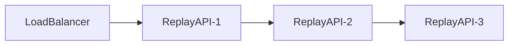

# Section 17
# Performance & Scalability

Version: 1.0

---

# Overview

TelemetryHealth is designed as a cloud-native, horizontally scalable observability platform capable of processing large volumes of AI telemetry while maintaining deterministic replay generation and low-latency incident analysis.

The platform separates telemetry ingestion, behavior reconstruction, inference, and replay into independent stateless services, allowing each subsystem to scale independently.

Scalability is a first-class architectural requirement rather than an implementation detail.

---

# Design Philosophy

The platform follows four scalability principles.

- Stateless Compute
- Immutable Data
- Horizontal Scaling
- Independent Components

Every service should scale independently without affecting the rest of the platform.

---

# Scalability Architecture

```mermaid
flowchart TD

OTelCollectors

↓

IngestGateway

↓

ReplayQueue

↓

BREWorkers

↓

BIEWorkers

↓

DREWorkers

↓

RCIEWorkers

↓

ClickHouse

↓

ReplayAPI

↓

FlightRecorder
```

Each processing stage may run on multiple replicas.

---

# Horizontal Scaling

TelemetryHealth services are horizontally scalable.

| Component | Scaling Strategy |
|-----------|------------------|
| Ingest Gateway | Horizontal |
| BRE | Horizontal |
| BIE | Horizontal |
| DRE | Horizontal |
| RCIE | Horizontal |
| Replay API | Horizontal |
| Flight Recorder | Horizontal |
| ClickHouse | Cluster |

No processing component requires sticky sessions.

---

# Stateless Services

The following components are stateless.

- BRE
- BIE
- DRE
- RCIE
- Replay API
- Recommendation Engine

State is stored only within persistent storage.

Workers may be added or removed without affecting replay correctness.

---

# Queue-Based Processing

Telemetry ingestion is asynchronous.

```
Telemetry

↓

Message Queue

↓

Worker Pool

↓

Replay Store
```

Benefits

- Burst tolerance
- Fault isolation
- Retry support
- Back-pressure handling

---

# Replay Generation

Replay generation occurs asynchronously.

```
Telemetry

↓

Replay Job

↓

Worker

↓

Replay Session

↓

Storage
```

The UI never waits for replay generation to complete synchronously.

---

# Worker Pools

Each engine operates using an independent worker pool.

```mermaid
flowchart LR

Queue

↓

BRE Worker Pool

↓

BIE Worker Pool

↓

DRE Worker Pool

↓

RCIE Worker Pool
```

Worker counts may be configured independently.

---

# Storage Scaling

Primary storage

ClickHouse Cluster

Scaling

- Horizontal sharding
- Replication
- Compression
- Partition pruning

Replay storage remains append-only.

---

# Caching Strategy

Frequently accessed objects

- Replay Sessions
- Incident Summaries
- Behavior Signatures
- Decision Graphs

Cache invalidation occurs only when replay generation completes.

---

# Resource Isolation

Each subsystem receives independent resource limits.

Example

BRE

- CPU
- Memory

BIE

- CPU
- Memory

Replay API

- CPU
- Memory

Independent resource limits prevent cascading failures.

---

# Failure Isolation

Failures remain isolated.

Example

```
Replay API Failure

↓

Replay Generation

Unaffected

↓

Telemetry Collection

Unaffected
```

Subsystems communicate through well-defined interfaces.

---

# Back Pressure

If ingestion exceeds processing capacity

↓

Replay Queue grows

↓

Workers scale

↓

Replay generation continues

↓

Telemetry is preserved

TelemetryHealth prioritizes data preservation over immediate processing.

---

# High Availability

Platform services support multiple replicas.



Replay services remain available during rolling deployments.

---

# Replay Performance Targets

| Operation | Target |
|-----------|--------|
| Replay Generation | <100 ms |
| Behavior Reconstruction | <50 ms |
| Decision Reconstruction | <50 ms |
| Root Cause Analysis | <100 ms |
| Replay Loading | <300 ms |
| Replay Search | <150 ms |

---

# Storage Targets

| Metric | Target |
|---------|--------|
| Compression | >70% |
| Insert Latency | <20 ms |
| Query Latency | <100 ms |
| Replay Export | <3 sec |

---

# Platform Capacity Targets

Target deployment

- 1000+ AI Agents
- Millions of Replay Events
- Millions of Decisions
- Millions of Replay Sessions
- Hundreds of concurrent users

The architecture is designed to scale beyond the requirements of the hackathon prototype.

---

# Observability

TelemetryHealth observes itself.

Every component exports

- Metrics
- Logs
- Traces

Platform health is continuously monitored.

Examples

- Replay Queue Depth
- Worker Utilization
- Replay Latency
- Decision Latency
- Incident Throughput

---

# Disaster Recovery

Recovery priorities

1. Replay Store
2. ClickHouse
3. Replay Queue
4. Worker Pools
5. Replay API

Replay Sessions remain recoverable because replay artifacts can be regenerated from stored telemetry.

---

# Design Decisions

Replay generation is asynchronous.

Workers remain stateless.

Replay Sessions are immutable.

Storage is append-only.

Queues provide fault tolerance.

Every subsystem scales independently.

---

# Non-functional Requirements

Availability

99.9%

Horizontal Scaling

Supported

Stateless Services

Required

Replay Determinism

100%

Queue Durability

Required

Thread Safe

Yes

Vendor Independent

Yes

---

# Exit Criteria

The platform is considered scalable when

- Processing components scale horizontally.
- Replay generation remains deterministic.
- Storage remains append-only.
- Replay latency meets defined targets.
- Platform failures remain isolated.

TelemetryHealth is designed to evolve from a hackathon prototype into a production-ready AI observability platform capable of supporting enterprise-scale workloads.