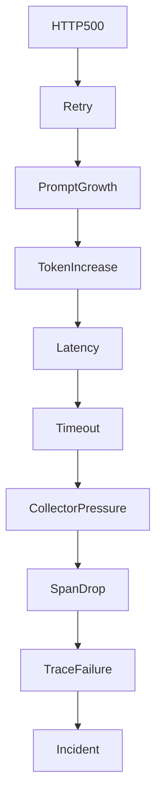

# Section 09
# Root Cause Intelligence Engine (RCIE)

Version: 1.0

---

# Overview

The Root Cause Intelligence Engine (RCIE) transforms reconstructed decision graphs into explainable incident intelligence.

Traditional observability platforms surface symptoms.

The RCIE identifies probable causes.

Rather than displaying isolated alerts or disconnected telemetry events, the RCIE reconstructs the causal chain that led to an observable failure.

The engine operates entirely on reconstructed behavioral intelligence and never analyzes raw telemetry directly.

Its output powers:

- Flight Recorder
- Incident Timeline
- AI Summary
- MCP Copilot
- Auto-Remediation Advisor
- Benchmark Suite

---

# Design Philosophy

Failures are rarely isolated.

Every production incident is the result of a chain of observable events.

The objective of RCIE is not to identify the first failure.

Its objective is to reconstruct the complete propagation chain.

Instead of asking

"What failed?"

TelemetryHealth asks

"How did this failure evolve?"

---

# Responsibilities

The Root Cause Intelligence Engine is responsible for

- Incident reconstruction
- Causal graph generation
- Root cause ranking
- Failure propagation analysis
- Confidence propagation
- Evidence aggregation
- Incident summarization
- Recovery path reconstruction

The engine is NOT responsible for

- Replay visualization
- Natural language generation
- Telemetry ingestion
- Rule execution

---

# Inputs

The RCIE consumes

- Decision Graph
- Behavior Graph
- Behavior Signature
- Replay Timeline
- Evidence Metadata
- Deployment Metadata
- Configuration Metadata

---

# Outputs

The RCIE produces

- Root Cause Graph
- Incident Graph
- Failure Timeline
- Confidence Score
- Candidate Root Causes
- Recovery Chain
- Evidence Bundle

These outputs are consumed by

- Flight Recorder
- Narrative Engine
- MCP Copilot
- Benchmark Suite

---

# Root Cause Reconstruction Pipeline

```mermaid
flowchart TD

DecisionGraph

↓

Failure Detector

↓

Candidate Generator

↓

Dependency Analysis

↓

Propagation Engine

↓

Confidence Engine

↓

Root Cause Graph

↓

Incident Summary
```

---

# Failure Propagation Model

Failures propagate through systems.

Example

```
Flight API

↓

HTTP 500

↓

Planner Retry

↓

Prompt Growth

↓

Latency

↓

Collector Queue

↓

Dropped Span

↓

Broken Trace

↓

Coverage Loss
```

TelemetryHealth reconstructs this chain automatically.

---

# Causal Graph

Unlike a trace graph,

a Root Cause Graph represents

cause

↓

effect

relationships.

Example



---

# Root Cause Categories

Infrastructure

Examples

- Collector Restart
- Queue Saturation
- Database Failure
- Storage Timeout

---

Telemetry

Examples

- Missing Spans
- Broken Parent
- High Cardinality
- Invalid Sampling

---

AI Agent

Examples

- Retry Storm
- Prompt Explosion
- Tool Thrashing
- Memory Starvation
- Retrieval Collapse
- Planner Oscillation
- Context Truncation

---

External Dependency

Examples

- HTTP 500
- DNS Failure
- Authentication Error
- API Timeout

---

Deployment

Examples

- New Release
- Configuration Drift
- Missing Instrumentation
- Version Regression

---

# Root Cause Candidate

Every incident may produce multiple possible explanations.

The RCIE maintains all candidates until confidence scoring is complete.

Example

```
Candidate A

Collector Restart

Confidence

94%

Candidate B

Kafka Lag

Confidence

72%

Candidate C

Sampling Change

Confidence

41%
```

Only after evidence propagation does the engine determine the most probable root cause.

---

# Confidence Propagation

Confidence propagates through the graph.

Strong evidence increases confidence.

Missing telemetry decreases confidence.

Conflicting evidence produces multiple hypotheses.

Confidence never exceeds the confidence of supporting evidence.

---

# Root Cause Graph Schema

Node

```
Root Cause ID

Category

Severity

Confidence

Evidence Count

Timestamp

Status
```

Edge

```
Source

Destination

Relationship

Propagation Type

Confidence
```

---

# Recovery Graph

Every incident also reconstructs

how the system recovered.

Example

```
Timeout

↓

Retry

↓

Fallback Tool

↓

Response

↓

Collector Recovery

↓

Healthy
```

Recovery is treated as first-class telemetry.

Understanding recovery is as valuable as understanding failure.

---

# Explainability

Every Root Cause must answer

What failed?

Where did it begin?

How did it propagate?

Why is this considered the root cause?

Which telemetry supports this conclusion?

How confident is the explanation?

Could another explanation exist?

---

# Root Cause Ranking

Ranking considers

- Confidence
- Evidence completeness
- Historical similarity
- Propagation depth
- Impact radius
- Incident severity

The highest ranked candidate becomes the primary explanation.

Remaining candidates remain visible for transparency.

---

# Error Handling

If no root cause can be established

↓

Incident Status

Unknown

If evidence conflicts

↓

Multiple candidates retained

If telemetry incomplete

↓

Confidence reduced

If Decision Graph incomplete

↓

Root Cause Graph marked partial

The RCIE never fabricates explanations.

---

# Interfaces

Consumes

- Decision Graph
- Replay Timeline
- Evidence Metadata

Produces

- Root Cause Graph
- Candidate List
- Incident Graph
- Recovery Graph

Dependencies

- Behavior Inference Engine
- Decision Reconstruction Engine
- Replay Store

Failure Modes

- Missing evidence
- Circular dependencies
- Partial telemetry
- Incomplete Decision Graph

---

# Non-functional Requirements

Latency

< 100 ms

Memory

< 128 MB

Deterministic

Yes

Thread Safe

Yes

Replayable

Yes

Stateless

Yes

Vendor Independent

Yes

---

# Extensibility

The RCIE supports

- Custom Root Cause Rules
- Domain-specific Rule Packs
- Industry Plugins
- AI Framework Plugins
- Future ML Ranking Models

The core reconstruction algorithm remains deterministic while allowing optional ranking enhancements.

---

# Architectural Decisions

Root cause analysis is deterministic.

Every explanation is evidence-backed.

Confidence is propagated, never invented.

Recovery is modeled explicitly.

Multiple hypotheses are preserved.

Transparency takes precedence over certainty.

---

# Exit Criteria

The Root Cause Intelligence Engine is complete when

- Every incident produces a Root Cause Graph.
- Every root cause references supporting evidence.
- Confidence is propagated through the graph.
- Recovery paths are reconstructed.
- Engineers can traverse from the incident back to the originating telemetry.

The RCIE establishes TelemetryHealth as an explainable incident intelligence platform rather than a traditional observability dashboard.