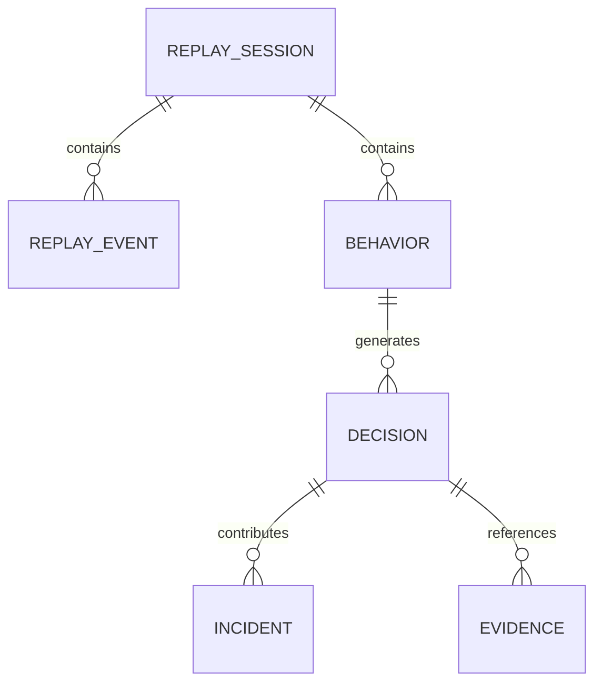

# Section 12
# Storage Architecture

Version: 1.0

---

# Overview

TelemetryHealth stores reconstructed behavioral intelligence separately from raw telemetry.

The storage architecture is designed around three principles:

- Preserve immutable telemetry
- Store semantic intelligence
- Optimize replay performance

Rather than modifying existing OpenTelemetry storage, TelemetryHealth builds a semantic layer above it.

This separation keeps the platform vendor-neutral while enabling advanced replay and behavioral analytics.

---

# Storage Philosophy

TelemetryHealth separates storage into two logical layers.

```
Raw Telemetry

↓

Semantic Intelligence

↓

Replay Artifacts
```

The platform never overwrites telemetry.

Telemetry remains the source of truth.

All reconstructed artifacts can be regenerated from telemetry.

---

# Storage Layers

```
+-------------------------------------------+
|              Flight Recorder              |
+-------------------------------------------+
                    │
                    ▼
+-------------------------------------------+
|         Semantic Intelligence Layer       |
+-------------------------------------------+
                    │
                    ▼
+-------------------------------------------+
|     ClickHouse / Replay Storage Layer     |
+-------------------------------------------+
                    │
                    ▼
+-------------------------------------------+
|       OpenTelemetry Telemetry Store       |
+-------------------------------------------+
```

---

# Storage Components

TelemetryHealth stores several domain objects.

| Object | Persistence |
|----------|------------|
| Replay Session | Yes |
| Replay Event | Yes |
| Behavior Graph | Yes |
| Behavior Signature | Yes |
| Decision Graph | Yes |
| Incident | Yes |
| Root Cause Graph | Yes |
| Evidence Index | Yes |
| Narratives | Optional Cache |

---

# Primary Database

Current implementation

```
ClickHouse
```

Reason

- Excellent analytical performance
- Columnar storage
- Compression
- Fast aggregation
- High ingestion throughput

---

# Future Storage Options

The architecture supports additional storage engines.

Examples

- PostgreSQL
- DuckDB
- BigQuery
- Snowflake
- Apache Druid

Storage implementation remains abstracted behind repositories.

---

# Storage Model

```
Telemetry

↓

Replay Events

↓

Replay Sessions

↓

Behavior Graphs

↓

Decision Graphs

↓

Incident Graphs
```

Each layer references the previous layer.

Nothing is duplicated unnecessarily.

---

# Replay Session Table

Table

```
replay_sessions
```

Columns

| Column | Description |
|---------|-------------|
| replay_id | Unique identifier |
| trace_id | Original trace |
| status | Success / Failure |
| started_at | Start timestamp |
| completed_at | End timestamp |
| duration_ms | Replay duration |
| behavior_signature | Behavioral fingerprint |
| incident_id | Related incident |
| created_at | Creation timestamp |

Primary Key

```
replay_id
```

---

# Replay Event Table

Table

```
replay_events
```

Columns

| Column | Description |
|---------|-------------|
| event_id | Replay Event ID |
| replay_id | Parent replay |
| timestamp | Event time |
| actor | Event actor |
| action | Action performed |
| span_id | OTel Span |
| trace_id | OTel Trace |
| metadata | JSON payload |

Partition

```
Replay Session
```

---

# Behavior Table

Table

```
behaviors
```

Columns

| Column | Description |
|---------|-------------|
| behavior_id | Identifier |
| replay_id | Parent replay |
| category | Planner / Tool / LLM |
| confidence | Behavior confidence |
| duration_ms | Duration |
| signature | Behavior Signature |

---

# Decision Table

Table

```
decisions
```

Columns

| Column | Description |
|---------|-------------|
| decision_id | Decision identifier |
| replay_id | Parent replay |
| type | Decision type |
| confidence | Confidence score |
| rule_id | Rule that fired |
| created_at | Timestamp |

---

# Incident Table

Table

```
incidents
```

Columns

| Column | Description |
|---------|-------------|
| incident_id | Identifier |
| replay_id | Replay Session |
| severity | Incident severity |
| root_cause | Primary cause |
| confidence | Confidence |
| status | Open / Closed |

---

# Evidence Table

Table

```
evidence
```

Columns

| Column | Description |
|---------|-------------|
| evidence_id | Identifier |
| decision_id | Related decision |
| source | Span / Log / Metric |
| reference | Original telemetry |
| confidence | Evidence confidence |

---

# Storage Relationships



---

# Retention Policy

Replay Events

90 Days

Behavior Graphs

180 Days

Decision Graphs

180 Days

Incidents

1 Year

Behavior Signatures

Permanent

Raw Telemetry

Managed by underlying observability platform.

---

# Compression

Replay Events

LZ4

Behavior Graph

Compressed JSON

Decision Graph

Compressed JSON

Narratives

Markdown

Large exports

ZIP Archive

---

# Indexing Strategy

Indexes

- Replay ID
- Trace ID
- Incident ID
- Behavior Signature
- Decision Type
- Timestamp

These indexes optimize replay loading and incident search.

---

# Caching

Frequently accessed data

- Recent Replays
- Active Incidents
- Root Cause Graphs
- Replay Timelines

Cache invalidation occurs only when replay generation completes.

Replay Sessions are immutable after creation.

---

# Storage Interfaces

The storage layer exposes repositories.

Examples

```
ReplayRepository

BehaviorRepository

DecisionRepository

IncidentRepository

EvidenceRepository
```

Business logic never accesses the database directly.

---

# Failure Recovery

If ClickHouse becomes unavailable

↓

Replay generation pauses.

Replay Events remain buffered.

Processing resumes automatically after storage recovery.

No replay data is discarded.

---

# Non-functional Requirements

Replay Load

<300 ms

Insert Latency

<20 ms

Storage Compression

>70%

Availability

99.9%

Horizontal Scaling

Supported

Thread Safe

Yes

---

# Design Decisions

Replay Sessions are immutable.

Behavior Graphs are deterministic.

Decision Graphs remain reproducible.

Storage is append-only.

Telemetry remains the source of truth.

Semantic intelligence can always be regenerated.

---

# Exit Criteria

The Storage Architecture is complete when:

- Every domain object has a persistence strategy.
- Replay loading remains deterministic.
- Storage remains vendor-neutral.
- Historical replay is reproducible.
- Raw telemetry remains immutable.

The storage layer provides a scalable, replay-oriented persistence model capable of supporting enterprise-scale AI observability workloads.