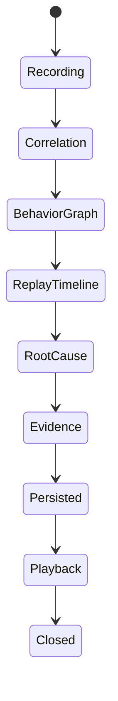
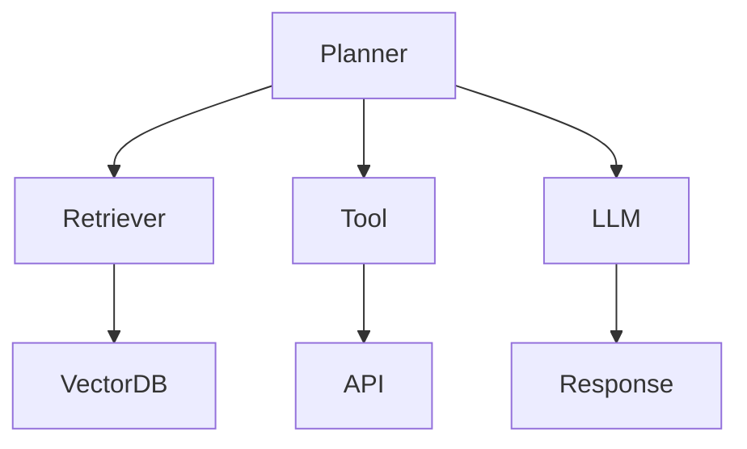

# Section 04
# System Architecture

Version: 0.1

---

# Introduction

The Agent Replay Engine (ARE) transforms raw telemetry into replayable AI behavior.

Unlike traditional observability systems that visualize traces directly, ARE introduces an intermediate intelligence layer that reconstructs behavioral execution from distributed telemetry events.

The architecture has been designed around one primary objective:

> Convert telemetry into explainable behavior.

---

# High-Level Architecture

```mermaid
flowchart LR

A[AI Agent]
B[OpenTelemetry SDK]
C[OTel Collector]
D[TelemetryHealth Processor]
E[Behavior Builder]
F[Replay Engine]
G[Root Cause Engine]
H[Evidence Engine]
I[ClickHouse]
J[Replay API]
K[Flight Recorder UI]

A --> B
B --> C
C --> D
D --> E
E --> F
F --> G
G --> H
H --> I
I --> J
J --> K
```



---

# Why another layer?

Today's architecture ends here:

```
Application

↓

Collector

↓

Storage

↓

Dashboard
```

TelemetryHealth inserts an intelligence layer.

```
Application

↓

Collector

↓

Telemetry Intelligence

↓

Replay

↓

Explanation

↓

Dashboard
```

Without this layer the platform can only display telemetry.

With it, the platform understands behavior.

---

# Core Components

The architecture consists of seven primary services.

---

# 1. Telemetry Processor

Responsibility

Receive OpenTelemetry spans, metrics and logs.

Tasks

- Validate OTLP payloads
- Normalize attributes
- Detect telemetry health issues
- Emit replay events

Input

OTLP

Output

ReplayEvent

---

# 2. Behavior Builder

Purpose

The Behavior Builder is the heart of ARE.

It converts independent telemetry into meaningful behavior.

Example

Raw telemetry

```
Span

↓

Span

↓

Metric

↓

Span
```

Behavior Builder

↓

```
Planner

↓

Retriever

↓

Tool

↓

Retry

↓

LLM
```

Instead of reconstructing traces,

it reconstructs decisions.

---

Responsibilities

- Correlate spans

- Merge logs

- Attach metrics

- Detect retries

- Detect loops

- Infer planner behavior

- Infer tool usage

- Infer memory retrieval

Output

Behavior Graph

---

# 3. Replay Engine

Purpose

Convert Behavior Graph into replayable timeline.

Responsibilities

- Timeline ordering

- Clock synchronization

- Replay speed

- Event playback

- Pause

- Resume

- Fast forward

- Reverse

Output

Replay Timeline

---

# 4. Root Cause Engine

Purpose

Generate causal explanation.

Input

Replay Timeline

Output

Incident Graph

Algorithm

Evidence propagation

Dependency analysis

Confidence scoring

---

Example

```
Tool Timeout

↓

Retry Loop

↓

Prompt Expansion

↓

Latency

↓

Collector Pressure

↓

Dropped Span

↓

Broken Trace
```

---

# 5. Evidence Engine

Purpose

Every explanation must be backed by telemetry.

Evidence Sources

Spans

Metrics

Logs

Events

Configuration

Deployments

Every insight includes

Evidence

Confidence

Alternative explanations

---

# 6. Replay Store

Current Storage

ClickHouse

Stores

Replay Sessions

Behavior Graphs

Incidents

Evidence

Replay Cache

Timeline

Future

Object storage

Compression

Replay snapshots

---

# 7. Flight Recorder

Purpose

Human interface.

Responsibilities

Playback

Inspection

Filtering

Searching

Timeline visualization

Root cause visualization

Evidence viewer

Natural language explanation

---

# Replay Session Lifecycle



---

# Internal Data Flow

```mermaid
flowchart TD

OTLP

↓

Processor

↓

Replay Event

↓

Behavior Builder

↓

Behavior Graph

↓

Replay Engine

↓

Timeline

↓

Root Cause

↓

Evidence

↓

ClickHouse

↓

Replay API

↓

Frontend
```

---

# Event Flow

Each telemetry event becomes a Replay Event.

Example

```
LLM_START

↓

Prompt Loaded

↓

Retriever Query

↓

Memory Read

↓

Tool Selected

↓

Tool Timeout

↓

Retry

↓

Prompt Expanded

↓

LLM Timeout

↓

Incident
```

These events are independent of vendor.

---

# Why Event-Based?

Traditional traces assume request execution.

Replay assumes behavioral execution.

Every behavior becomes an ordered sequence of immutable events.

Benefits

Replay

Versioning

Diffing

Simulation

Branching

Time Travel

Future ML

---

# Behavior Graph

Unlike traces,

Behavior Graphs are semantic.

Nodes

Planner

Retriever

Tool

Memory

LLM

Supervisor

Critic

Reflection

Edges

Calls

Depends On

Retry

Generated

Triggered

Recovered

---

Example



---

# Incident Graph

Every replay automatically generates an Incident Graph.

Purpose

Explain failure propagation.

Example

```mermaid
graph TD

HTTP500

↓

Retry

↓

PromptGrowth

↓

Latency

↓

Timeout

↓

DroppedSpan

↓

BrokenTrace
```

This graph becomes the explanation shown to users.

---

# Architectural Decisions

Decision

Behavior Graph instead of Trace Graph.

Reason

Behavior is easier for humans to understand.

---

Decision

Immutable Replay Events.

Reason

Supports replay, diffing and benchmarking.

---

Decision

Evidence-first architecture.

Reason

Every AI explanation must be verifiable.

---

Decision

Replay Session abstraction.

Reason

Engineers debug executions, not spans.

---

# Scalability

Replay Engine

Stateless

Behavior Builder

Stateless

Replay API

Stateless

ClickHouse

Horizontal

Collector

Horizontal

Processor

Horizontal

The system scales independently.

---

# Failure Handling

If spans are missing

↓

Behavior Builder estimates relationships.

If clocks drift

↓

Replay Engine reorders events.

If telemetry is incomplete

↓

Confidence decreases.

The platform should explain uncertainty rather than hide it.

---

# Exit Criteria

Section complete when another engineer understands

- Every major service.
- Data flow.
- Component boundaries.
- Replay lifecycle.
- Storage strategy.
- Why Behavior Graph replaces Trace Graph.